# The Architect's Return 🌌

*A 6-week journey to reclaim your power and master the new world of code.*

---

## Prologue: The Awakening

You were once a builder.

Years ago, you walked through the digital realm with confidence. You understood the ancient languages — the structured elegance of C#, the visual poetry of HTML and CSS, the dynamic pulse of JavaScript. You built things that *worked*. A fingerprint scanner that could read identity from five different surfaces. Decision trees that learned from data and made choices like a mind learning to think.

Then life pulled you away. The realm continued without you. New powers emerged. New tools. New ways of building.

Now you're back.

But the world has changed. There are **AI spirits** now — entities that can write code, explain systems, generate entire applications from a whisper of intent. Some builders have become lazy, letting the spirits do all the work. Others have learned to *direct* them, becoming more powerful than ever before.

You're not here to start over. You're here to **reclaim what you knew** and **master what's new**.

This is your story.

---

## The Three Forces

In the realm of systems, three fundamental forces shape everything:

```mermaid
graph TD
    subgraph FORCES["⚡ The Three Forces"]
        STONE["🪨 STONE<br/>Persistence & Memory"]
        LIGHTNING["⚡ LIGHTNING<br/>Flow & Transformation"]
        MAGNET["🧲 MAGNETISM<br/>Connection & Interface"]
    end
    
    STONE --> |"Data at rest"| LIGHTNING
    LIGHTNING --> |"Data in motion"| MAGNET
    MAGNET --> |"Systems united"| STONE
    
    style STONE fill:#8d6e63,color:#fff
    style LIGHTNING fill:#ffd54f,color:#000
    style MAGNET fill:#7986cb,color:#fff
```



**🪨 Stone** — The force of persistence. Variables that hold memory. Databases that remember. State that endures. Like the bedrock beneath a mountain, Stone is what remains when the lightning fades.

**⚡ Lightning** — The force of transformation. Data flowing through functions. Events triggering actions. APIs crackling with requests and responses. Lightning is energy — it moves, it changes, it *does*.

**🧲 Magnetism** — The force of connection. Interfaces that pull systems together. Contracts that bind components. The invisible attraction between a client and a server, a user and an application. Magnetism is how separate things become one.

Every system you'll ever build — every line of code, every architecture decision — is an interplay of these three forces.

Your journey will teach you to wield them all.

---

## Your Quest Map

```mermaid
graph LR
    A[🏔️ Chapter 1<br/>The Stone Remembers] --> B[⚡ Chapter 2<br/>Lightning Paths]
    B --> C[🧲 Chapter 3<br/>The Pull Between]
    C --> D[🌀 Chapter 4<br/>Reading the Ruins]
    D --> E[🔥 Capstone I<br/>The Living Archive]
    E --> F[🌟 Capstone II<br/>The Oracle Engine]
    
    style A fill:#8d6e63,color:#fff
    style B fill:#ffd54f,color:#000
    style C fill:#7986cb,color:#fff
    style D fill:#90a4ae,color:#000
    style E fill:#ef5350,color:#fff
    style F fill:#ab47bc,color:#fff
```



| Week | Chapter | Force | Mini-Project |
|------|---------|-------|--------------|
| 1 | The Stone Remembers | 🪨 Stone | Memory Keeper |
| 2 | Lightning Paths | ⚡ Lightning | Flow Tracker |
| 3 | The Pull Between | 🧲 Magnetism | Interface Bridge |
| 4 | Reading the Ruins | 🔮 All Three | Codebase Cartographer |
| 5 | **Capstone I** | 🔥 Integration | The Living Archive |
| 6 | **Capstone II** | 🌟 AI Mastery | The Oracle Engine |

---

## Chapter 1: The Stone Remembers 🪨

*Week 1*

> *"Before lightning can strike, before magnets can pull, there must be something solid to hold onto. The stone remembers what the storm forgets."*

You wake in a place you once knew. The syntax feels familiar, but dusty. Your first task is to remember — and to prove that you still understand the fundamentals.

### The Lesson

Stone is about **persistence** — things that stay. In code, this means:

- **Variables** — named containers that hold values across time
- **Data structures** — organized ways to store related information  
- **State** — the current "truth" of a system at any moment
- **Databases** — long-term memory that survives restarts

```mermaid
flowchart LR
    subgraph STONE_REALM["🪨 The Stone Realm"]
        VAR["Variables<br/><i>short-term memory</i>"]
        STRUCT["Structures<br/><i>organized memory</i>"]
        STATE["State<br/><i>current truth</i>"]
        DB["Database<br/><i>eternal memory</i>"]
    end
    
    VAR --> STRUCT --> STATE --> DB
```



**Concepts to master:**
- Value types vs reference types (owning the stone vs pointing to it)
- Scope (where your memory can be seen)
- Immutability (stones that cannot be changed)
- Serialization (turning memory into something that can be stored)

### 📝 The Trial

Answer these questions in your notes:

1. What's the difference between a value living on the stack vs the heap?
2. If you copy a reference type, what happens to the original?
3. Why would you ever want data to be immutable?
4. How does JSON relate to the concept of "stone"?

### 🔨 Mini-Project: The Memory Keeper

**Your quest:** Build a **Personal Vault** — a console application that stores secrets.

Requirements:
- Store key-value pairs (secret name → secret value)
- Save to a JSON file (persistence across runs)
- Support: add, retrieve, list, delete operations
- Encrypt values before storing (simple encoding is fine)

```
> vault add github_token "abc123secret"
✓ Secret 'github_token' stored securely.

> vault get github_token
→ abc123secret

> vault list
→ github_token
→ aws_key
→ db_password
```

**Deliverables:**
- Working code in `bparker/ch1-stone/`
- README with Mermaid diagram of your data flow
- Reflection: How does this project embody "Stone"?

---

## Chapter 2: Lightning Paths ⚡

*Week 2*

> *"Lightning doesn't wait. It finds the path of least resistance and strikes. Your code must learn to flow the same way — transforming data as it moves, never holding on too long."*

The stone holds memory, but memory alone is useless. Data must *move*. It must be transformed, filtered, mapped, reduced. This is the way of Lightning.

### The Lesson

Lightning is about **flow** — data in motion:

- **Functions** — transformation machines (input → process → output)
- **Pipelines** — chains of transformations
- **Events** — triggers that start the lightning
- **APIs** — the channels through which lightning travels between systems

```mermaid
flowchart LR
    INPUT["📥 Input"] --> F1["⚡ Transform"]
    F1 --> F2["⚡ Filter"]
    F2 --> F3["⚡ Map"]
    F3 --> OUTPUT["📤 Output"]
    
    style F1 fill:#ffd54f,color:#000
    style F2 fill:#ffd54f,color:#000
    style F3 fill:#ffd54f,color:#000
```



**Concepts to master:**
- Pure functions (same input always gives same output)
- Higher-order functions (functions that take/return functions)
- Async/await (lightning that waits for other lightning)
- Error handling (what happens when lightning strikes wrong)

### 📝 The Trial

Answer these questions:

1. What makes a function "pure"? Why does it matter?
2. How is `map` different from `forEach`?
3. What problem does `async/await` solve?
4. When should you throw an error vs return a failure value?

### 🔨 Mini-Project: The Flow Tracker

**Your quest:** Build a **Data Pipeline** that transforms messy data into clean insights.

Requirements:
- Read data from a CSV or JSON file
- Apply at least 3 transformations (filter, map, aggregate)
- Output results to a new file AND to console
- Log each step of the transformation

Example: Take a list of transactions, filter to last 30 days, categorize by type, sum totals per category.

```
📥 Loading transactions.csv (1,247 records)
⚡ Filtering to last 30 days... (328 records)
⚡ Categorizing by type...
⚡ Aggregating totals...
📤 Results:
   Food:      $847.23
   Transport: $234.50
   Entertainment: $156.00
```

**Deliverables:**
- Working code in `bparker/ch2-lightning/`
- Mermaid flowchart of your pipeline
- Reflection: How did thinking in "transformations" change your approach?

---

## Chapter 3: The Pull Between 🧲

*Week 3*

> *"No system exists alone. The most powerful architectures are those that know how to reach out — and how to be reached. This is Magnetism: the invisible contracts that bind separate things into one."*

Stone holds. Lightning moves. But neither matters if systems can't *connect*. Magnetism is about interfaces — the promises systems make to each other.

### The Lesson

Magnetism is about **connection**:

- **Interfaces** — contracts that define what something can do
- **APIs** — the language systems use to talk to each other
- **Protocols** — agreed-upon rules for communication
- **Integration** — making separate systems work as one

```mermaid
flowchart TB
    subgraph SYSTEM_A["System A"]
        A_IMPL["Implementation"]
    end
    
    subgraph SYSTEM_B["System B"]
        B_IMPL["Implementation"]
    end
    
    INTERFACE["🧲 Interface Contract"]
    
    A_IMPL --> |"exposes"| INTERFACE
    INTERFACE --> |"consumed by"| B_IMPL
    
    style INTERFACE fill:#7986cb,color:#fff
```



**Concepts to master:**
- Interface design (what do you promise?)
- REST APIs (the common tongue)
- Authentication (proving who you are)
- Rate limiting (not pulling too hard)

### 📝 The Trial

Answer these questions:

1. What's the difference between an interface and an implementation?
2. Why do we use HTTP status codes?
3. What is an API key and why does it exist?
4. What happens when two systems disagree about a contract?

### 🔨 Mini-Project: The Interface Bridge

**Your quest:** Build a **Weather Dashboard** that pulls data from a real API and displays it meaningfully.

Requirements:
- Connect to a free weather API (OpenWeatherMap, WeatherAPI, etc.)
- Handle authentication (API key management)
- Transform the API response into your own data structure
- Display current weather + 3-day forecast
- Handle errors gracefully (API down, invalid city, rate limited)

```
🌤️ Weather for Grand Rapids, MI

Current: 42°F, Partly Cloudy
Humidity: 65%

📅 3-Day Forecast:
   Tomorrow:  45°F ⛅
   Wednesday: 38°F 🌧️
   Thursday:  41°F ☀️
```

**Deliverables:**
- Working code in `bparker/ch3-magnetism/`
- Sequence diagram showing your app ↔ API interaction
- Reflection: What did you learn about depending on external systems?

---

## Chapter 4: Reading the Ruins 🔮

*Week 4*

> *"Before you build new temples, you must learn to read the old ones. Every codebase is a ruin left by those who came before — full of wisdom, warnings, and forgotten intentions."*

Now comes a different challenge. You've built small things. But real architects don't always build from scratch — they inherit. They read. They understand systems created by others.

### The Lesson

This chapter combines all three forces in the context of **understanding existing systems**:

- 🪨 **Stone**: What data does this system persist? Where does state live?
- ⚡ **Lightning**: How does data flow through this system?
- 🧲 **Magnetism**: What interfaces does it expose? What does it depend on?

```mermaid
flowchart TD
    ENTRY["🚪 Entry Point"] --> TRACE["Follow the flow"]
    TRACE --> DATA["Where does data live?"]
    TRACE --> INTERFACES["What are the contracts?"]
    DATA --> MAP["📍 Create the Map"]
    INTERFACES --> MAP
```



**Skills to develop:**
- Finding entry points (where does execution start?)
- Tracing data flow (following the lightning)
- Identifying state (finding the stone)
- Mapping dependencies (understanding the magnetism)

### 📝 The Trial

Choose a small open-source project (under 3,000 lines). Answer:

1. What is this project's purpose in one sentence?
2. Where does execution begin?
3. What external dependencies does it have?
4. Draw the data flow for one key feature.
5. What would you change and why?

### 🔨 Mini-Project: The Codebase Cartographer

**Your quest:** Produce a **complete analysis** of a real open-source project.

Choose one:
- A CLI tool you use
- A small web framework
- A utility library
- (Or propose your own — get approval first)

Produce:
1. **Architecture Overview** (1-2 pages)
   - Purpose and users
   - High-level structure
   - Key design decisions

2. **Diagrams** (Mermaid)
   - Component diagram (Stone: where things live)
   - Sequence diagram (Lightning: how a key flow works)
   - Dependency diagram (Magnetism: what it connects to)

3. **Critique** (1 page)
   - What's done well?
   - What would you improve?
   - One proposed enhancement with ADR-style reasoning

**Deliverables:**
- Full analysis in `bparker/ch4-ruins/`
- All diagrams embedded in markdown
- Presentation-ready format (could be slides)

---

## Capstone I: The Living Archive 🔥

*Week 5*

> *"The forces converge. Stone to hold. Lightning to move. Magnetism to connect. Now you build something that lives — something that persists, transforms, and reaches out to the world."*

Your first capstone. This is not a toy. This is a **real system** that combines everything you've learned.

### The Quest

Build a **Personal Knowledge Base** — a system that:

1. **Stores** information you want to remember (Stone)
2. **Processes** and organizes that information (Lightning)
3. **Integrates** with external services (Magnetism)

```mermaid
flowchart TB
    subgraph INPUT["📥 Input Sources"]
        WEB["Web Clipper"]
        MANUAL["Manual Entry"]
        API_IN["API Import"]
    end
    
    subgraph CORE["🔥 The Living Archive"]
        PROCESS["⚡ Process & Tag"]
        STORE["🪨 Persistent Storage"]
        SEARCH["🔍 Search & Retrieve"]
    end
    
    subgraph OUTPUT["📤 Output"]
        CLI["Command Line"]
        API_OUT["REST API"]
        EXPORT["Export (JSON/MD)"]
    end
    
    INPUT --> CORE
    CORE --> OUTPUT
    
    style CORE fill:#ef5350,color:#fff
```



### Requirements

**Stone (Persistence):**
- Store entries with: title, content, tags, source URL, created/updated dates
- Use a real database (SQLite is fine) or structured JSON files
- Support full-text search

**Lightning (Transformation):**
- Auto-generate tags from content (simple keyword extraction)
- Support markdown formatting
- Transform entries for different outputs (JSON, Markdown, summary)

**Magnetism (Integration):**
- REST API to add/retrieve entries programmatically
- Import from at least one external source (bookmarks, notes app, or API)
- Webhook or notification when new entries are added (optional but impressive)

### Deliverables

```
bparker/capstone-1-archive/
├── README.md           # Setup instructions + screenshots
├── docs/
│   ├── ARCHITECTURE.md # System design with diagrams
│   └── ADR-001.md      # Key design decision documented
├── src/                # Your implementation
└── demo.md             # Walkthrough of features
```

**Present:** 5-slide summary + live demo

---

## Capstone II: The Oracle Engine 🌟

*Week 6*

> *"There is a new force in the realm — one that didn't exist when you first walked these paths. The AI spirits. They can read, write, explain, generate. Some fear them. The wise learn to direct them. You will build an Oracle — a system that channels this power for a real purpose."*

Your final capstone. Here you integrate **AI** as a core capability — not a gimmick, but a genuine enhancement to a real-world system.

### The Quest

Build an **AI-Powered Assistant** for a specific domain. Choose your domain:

**Option A: Code Companion**
- Explain code snippets in plain English
- Generate documentation from code
- Suggest improvements or identify issues
- Learn from feedback

**Option B: Learning Guide**
- Take a topic and generate a learning path
- Quiz the user and adapt to their level
- Summarize articles or documentation
- Track progress and suggest next steps

**Option C: Data Analyst**
- Accept CSV/JSON data uploads
- Generate insights and summaries using AI
- Create visualizations based on natural language requests
- Answer questions about the data

**Option D: Your Proposal**
- Propose your own domain (get approval)
- Must involve: data input, AI processing, meaningful output
- Must solve a real problem you care about

### Requirements

**Stone:**
- Persist user sessions/history
- Store AI responses for review
- Cache frequent queries (don't waste API calls)

**Lightning:**
- Clean data flow from input → AI → output
- Handle streaming responses if applicable
- Transform AI output into useful formats

**Magnetism:**
- Integrate with an AI provider (OpenAI, Anthropic, local model)
- Clean interface between your app and the AI
- Handle rate limits, errors, and timeouts gracefully

### The AI Integration

```mermaid
flowchart LR
    USER["👤 User Input"] --> APP["🌟 Your App"]
    APP --> PROMPT["⚡ Build Prompt"]
    PROMPT --> AI["🤖 AI Provider"]
    AI --> PARSE["⚡ Parse Response"]
    PARSE --> STORE["🪨 Store/Cache"]
    STORE --> OUTPUT["📤 Present to User"]
    
    style AI fill:#ab47bc,color:#fff
    style APP fill:#ab47bc,color:#fff
```



### Deliverables

```
bparker/capstone-2-oracle/
├── README.md           # What it does, how to run it
├── docs/
│   ├── ARCHITECTURE.md # Full system design
│   ├── AI-INTEGRATION.md # How you use AI, prompt strategies
│   └── ADR-001.md      # Key decisions
├── src/
└── prompts/            # Your prompt templates (documented)
```

**Present:** 
- 10-slide deck telling the story of your Oracle
- Live demo with real AI interactions
- Reflection: What did you learn about working with AI?

---

## Epilogue: The Architect Awakened

You came back to a changed world. 

You relearned the ancient forces — Stone, Lightning, Magnetism. You built systems that persist, transform, and connect. You read the ruins of others' code and found wisdom in their designs.

And you learned to work with the new power — the AI spirits that can amplify everything you do.

You are no longer just a coder. You are an **Architect**.

The realm needs builders who understand systems deeply. Who can see the whole while crafting the parts. Who can direct AI to build faster while knowing enough to guide it true.

Your journey doesn't end here. It begins here.

*Welcome back.*

---

## Progress Tracker

| Week | Chapter | Force | Project | Status |
|------|---------|-------|---------|--------|
| 1 | The Stone Remembers | 🪨 | Memory Keeper | ⬜ |
| 2 | Lightning Paths | ⚡ | Flow Tracker | ⬜ |
| 3 | The Pull Between | 🧲 | Interface Bridge | ⬜ |
| 4 | Reading the Ruins | 🔮 | Codebase Cartographer | ⬜ |
| 5 | **Capstone I** | 🔥 | The Living Archive | ⬜ |
| 6 | **Capstone II** | 🌟 | The Oracle Engine | ⬜ |

---

## Timeline

| Week | Focus | Deliverable |
|------|-------|-------------|
| 1 | Persistence & Memory | Memory Keeper app |
| 2 | Data Flow & Transformation | Flow Tracker pipeline |
| 3 | APIs & Integration | Weather Dashboard |
| 4 | Code Reading & Analysis | Codebase Analysis |
| 5 | Full-Stack Integration | Living Archive system |
| 6 | AI Integration | Oracle Engine |

**Total:** 6 weeks, 6 projects, 3 forces mastered, 1 architect awakened.

---

*The stone remembers. The lightning transforms. The magnetism connects. And the architect... the architect sees it all.*
