# AutoNateAI Learning Hub: User Feed Feature Specification

> **Document Version**: 1.0
> **Author**: Technical Architecture Team
> **Date**: February 2026
> **Status**: Proposal for Team Review

---

## Executive Summary

This document outlines the strategic implementation of a **User Feed** feature for the AutoNateAI Learning Hub. The feed will become the primary landing experience for authenticated users, transforming our platform from a traditional course-navigation system into a **social learning community**.

The core insight driving this feature: **Learning is inherently social, and sharing progress creates accountability and community.**

---

## Table of Contents

1. [Why Add a User Feed?](#1-why-add-a-user-feed)
2. [Feature Vision & User Stories](#2-feature-vision--user-stories)
3. [Current Architecture Overview](#3-current-architecture-overview)
4. [Feed Architecture Design](#4-feed-architecture-design)
5. [Reusable Components Inventory](#5-reusable-components-inventory)
6. [Open Source Package Recommendations](#6-open-source-package-recommendations)
7. [Data Model Design](#7-data-model-design)
8. [Recommendation Algorithm Strategy](#8-recommendation-algorithm-strategy)
9. [Implementation Roadmap](#9-implementation-roadmap)
10. [Technical Considerations](#10-technical-considerations)
11. [Success Metrics](#11-success-metrics)

---

## 1. Why Add a User Feed?

### The Psychology of Social Learning

```mermaid
flowchart TD
    subgraph Flywheel["🔄 THE SOCIAL LEARNING FLYWHEEL"]
        A["🎓 User Learns<br/>a Concept"] --> B["📤 Shares Progress/<br/>Challenge/Result"]
        B --> C["👀 Others See<br/>& Engage"]
        C --> D["✅ Community<br/>Validates & Encourages"]
        D --> E["🧠 Dopamine Hit from<br/>Social Validation"]
        E --> F["🚀 Motivation<br/>to Continue"]
        F --> A
    end

    style A fill:#7986cb,color:#fff
    style B fill:#4db6ac,color:#fff
    style C fill:#ffd54f,color:#000
    style D fill:#66bb6a,color:#fff
    style E fill:#ef5350,color:#fff
    style F fill:#7986cb,color:#fff
```

### Core Psychological Principles

| Principle | Application in Feed |
|-----------|---------------------|
| **Social Proof** | Seeing peers learn motivates continued effort |
| **Accountability** | Public sharing creates commitment |
| **Dopamine Loops** | Likes/comments reward sharing behavior |
| **Scroll Behavior** | Leverage existing mobile-native behaviors |
| **Reciprocity** | Helping others creates bonds and return engagement |
| **Identity** | "I'm someone who learns and shares" self-image |

### Business Value & Impact Targets


---

## 2. Feature Vision & User Stories

### The Feed Experience

```mermaid
flowchart TB
    subgraph FeedUI["📱 USER FEED INTERFACE"]
        direction TB

        Composer["📝 Post Composer<br/>'What are you learning today?'"]

        subgraph Post1["Sarah's Post - 5m ago"]
            P1Content["Just crushed Ch3-Magnetism quiz! 🧲<br/>'Finally understanding APIs!'"]
            P1Card["📊 QUIZ RESULT<br/>Score: 9/10 (90%) ⭐ First Try!<br/>+150 XP • +3 Streak Days"]
            P1Actions["❤️ 12 | 💬 3 | 🔄 Share"]
        end

        subgraph Post2["Marcus's Post - 15m ago"]
            P2Content["About to attempt Daily Challenge 🤞"]
            P2Card["🎯 CHALLENGE PREVIEW<br/>Binary Tree Traversal<br/>Difficulty: ⭐⭐⭐ Hard"]
            P2Actions["❤️ 8 | 💬 5 | 🔄 Share"]
        end

        subgraph Post3["Alex's Post - 1h ago"]
            P3Content["COMPLETED APPRENTICE COURSE! 🎓"]
            P3Card["🏆 ACHIEVEMENT<br/>All 7 Chapters • 2,450 XP<br/>████████████ 100%"]
            P3Actions["❤️ 47 | 💬 21 | 🔄 Share"]
        end

        Composer --> Post1
        Post1 --> Post2
        Post2 --> Post3
    end

    style Composer fill:#1a1a2e,stroke:#7986cb
    style P1Card fill:#7986cb,color:#fff
    style P2Card fill:#ffd54f,color:#000
    style P3Card fill:#66bb6a,color:#fff
```

### User Journey: Share Flow

```mermaid
sequenceDiagram
    participant U as 👤 User
    participant Q as 📝 Quiz
    participant S as 📤 Share Modal
    participant F as 📡 Feed
    participant C as 👥 Community

    U->>Q: Completes Quiz (9/10)
    Q->>S: Shows Share Modal
    Note over S: "Nice work! Share your win?"

    alt User Shares
        U->>S: Adds custom text
        S->>F: Creates Post
        F->>C: Distributes to Feeds
        C->>U: Receives likes/comments
        Note over U: Dopamine reward! 🎉
    else User Skips
        U->>Q: Continues to next lesson
    end
```

### User Stories Matrix


---

## 3. Current Architecture Overview

### Existing Tech Stack

```mermaid
flowchart TB
    subgraph Client["🖥️ CLIENT (Browser)"]
        direction TB
        HTML["📄 HTML Pages"]
        CSS["🎨 CSS Modules"]
        JS["⚡ Vanilla JS"]
        Libs["📚 Anime.js + Mermaid"]

        subgraph Services["Service Layer"]
            Auth["AuthService"]
            Data["DataService"]
            RBAC["RBACService"]
            Analytics["AnalyticsService"]
            Notif["NotificationService"]
            Activity["ActivityTracker"]
            Progress["ProgressTracker"]
        end
    end

    subgraph Firebase["🔥 FIREBASE"]
        FAuth["🔐 Auth<br/>(Email + Google)"]
        Firestore["💾 Firestore<br/>(Data)"]
        FCM["📱 Cloud Messaging<br/>(Push)"]
    end

    Client --> Firebase

    style Client fill:#12121a,stroke:#7986cb
    style Firebase fill:#ffa726,color:#000
```

### Existing Firestore Structure


---

## 4. Feed Architecture Design

### High-Level Architecture


### Navigation Flow Change

```mermaid
flowchart LR
    subgraph Before["BEFORE (Current)"]
        Login1["🔐 Login"] --> Dashboard1["📊 Dashboard<br/>(Analytics Overview)"]
    end

    subgraph After["AFTER (Proposed)"]
        Login2["🔐 Login"] --> Feed["📡 Feed<br/>(PRIMARY)"]
        Feed --> Analytics["📊 Analytics<br/>(Renamed)"]
        Feed --> Courses["📚 Courses"]
        Feed --> Challenges["🎯 Challenges"]
        Feed --> Progress["📈 Progress"]
        Feed --> Profile["👤 Profile"]
    end

    style Feed fill:#7986cb,color:#fff,stroke-width:3px
    style Dashboard1 fill:#6a6a80
    style Analytics fill:#4db6ac,color:#fff
```

### Sidebar Navigation Update

```mermaid
flowchart TB
    subgraph Sidebar["📋 UPDATED SIDEBAR"]
        direction TB

        Main["MAIN"]
        Feed["📡 Feed ← NEW PRIMARY"]
        Analytics["📊 Analytics ← Renamed"]
        Courses["📚 Course Library"]
        Challenges["🎯 Daily Challenges"]

        Divider1["───────────"]

        Learning["LEARNING"]
        Progress["📈 My Progress"]
        Achievements["🏆 Achievements"]
        Notes["📝 Notes"]

        Divider2["───────────"]

        Community["COMMUNITY"]
        CommunityLink["👥 Discord"]
        Leaderboard["🏅 Leaderboard"]

        Main --> Feed --> Analytics --> Courses --> Challenges
        Divider1 --> Learning --> Progress --> Achievements --> Notes
        Divider2 --> Community --> CommunityLink --> Leaderboard
    end

    style Feed fill:#7986cb,color:#fff,stroke-width:2px
```

---

## 5. Reusable Components Inventory

### Component Reuse Strategy

```mermaid
flowchart TB
    subgraph Existing["✅ EXISTING COMPONENTS TO REUSE"]
        MetricCard["📊 Metric Card<br/>→ Post stats"]
        Avatar["👤 User Avatar<br/>→ Post authors"]
        NotifCard["🔔 Notification Card<br/>→ Feed post pattern"]
        ActivityCarousel["🎠 Activity Carousel<br/>→ Activity previews"]
        ProgressBar["📈 Progress Bar<br/>→ Achievement posts"]
        Badge["🏅 Badge System<br/>→ Post badges"]
        Modal["📦 Modal Pattern<br/>→ Share/comment modals"]
        Timestamp["🕐 Timestamp Formatter<br/>→ Relative time"]
        Glass["✨ Glassmorphism Cards<br/>→ Post styling"]
        Shimmer["⏳ Loading Shimmer<br/>→ Feed loading"]
    end

    subgraph New["🆕 NEW COMPONENTS TO BUILD"]
        FeedContainer["FeedContainer<br/>Infinite scroll wrapper"]
        FeedComposer["FeedComposer<br/>Post input box"]
        PostCard["PostCard<br/>Individual post"]
        PostActions["PostActions<br/>Like/comment/share"]
        PostMedia["PostMedia<br/>Activity preview card"]
        CommentThread["CommentThread<br/>Nested comments"]
        CommentInput["CommentInput<br/>Add comment form"]
        ShareModal["ShareModal<br/>Quick share modal"]
        UserMention["UserMention<br/>@username autocomplete"]
        ReactionPicker["ReactionPicker<br/>Emoji reactions"]
    end

    Existing --> New

    style Existing fill:#66bb6a,color:#fff
    style New fill:#7986cb,color:#fff
```

### File Structure

```mermaid
flowchart TB
    subgraph FileStructure["📁 NEW FILE STRUCTURE"]
        Feed["feed/"]
        FeedIndex["index.html"]
        FeedJS["feed-container.js"]
        ComposerJS["feed-composer.js"]

        Components["components/"]
        PostCardJS["post-card.js"]
        PostActionsJS["post-actions.js"]
        PostMediaJS["post-media.js"]
        CommentThreadJS["comment-thread.js"]
        CommentInputJS["comment-input.js"]
        ShareModalJS["share-modal.js"]
        UserMentionJS["user-mention.js"]
        ReactionPickerJS["reaction-picker.js"]

        Services["services/"]
        FeedServiceJS["feed-service.js"]
        PostServiceJS["post-service.js"]
        ReactionServiceJS["reaction-service.js"]
        CommentServiceJS["comment-service.js"]
        RecommendServiceJS["recommend-service.js"]

        CSS["css/"]
        FeedCSS["feed.css"]
        PostCardCSS["post-card.css"]
        CommentsCSS["comments.css"]

        Feed --> FeedIndex & FeedJS & ComposerJS
        Feed --> Components
        Components --> PostCardJS & PostActionsJS & PostMediaJS
        Components --> CommentThreadJS & CommentInputJS & ShareModalJS
        Components --> UserMentionJS & ReactionPickerJS
        Feed --> Services
        Services --> FeedServiceJS & PostServiceJS & ReactionServiceJS
        Services --> CommentServiceJS & RecommendServiceJS
        Feed --> CSS
        CSS --> FeedCSS & PostCardCSS & CommentsCSS
    end
```

---

## 6. Open Source Package Recommendations

### Frontend Packages

```mermaid
flowchart LR
    subgraph Packages["📦 RECOMMENDED PACKAGES"]
        direction TB

        IntersectionObs["Intersection Observer<br/>Polyfill<br/>→ Infinite scroll"]
        DOMPurify["DOMPurify<br/>→ XSS prevention"]
        DateFns["date-fns<br/>→ '5 minutes ago'"]
        Tribute["Tribute.js<br/>→ @mentions"]
        EmojiMart["Emoji Mart<br/>→ Reaction picker"]
        Autosize["Autosize<br/>→ Auto-growing textarea"]
    end

    style IntersectionObs fill:#7986cb,color:#fff
    style DOMPurify fill:#ef5350,color:#fff
    style DateFns fill:#4db6ac,color:#fff
    style Tribute fill:#ffd54f,color:#000
    style EmojiMart fill:#66bb6a,color:#fff
    style Autosize fill:#8d6e63,color:#fff
```

### GetStream.io Integration (Recommended for Scale)


### Hybrid Approach Decision Tree

```mermaid
flowchart TB
    Start["🚀 Start"] --> Q1{Users < 10,000?}

    Q1 -->|Yes| Firestore["Build with Firestore<br/>• Lower cost<br/>• Simpler<br/>• Faster MVP"]
    Q1 -->|No| GetStreamCheck{Need ML<br/>personalization?}

    GetStreamCheck -->|Yes| GetStream["Migrate to GetStream<br/>• Pre-built infrastructure<br/>• ML recommendations<br/>• Auto-scaling"]
    GetStreamCheck -->|No| FirestoreScale["Scale Firestore<br/>• Cloud Functions<br/>• Custom recommendation<br/>• More maintenance"]

    Firestore --> Phase1["PHASE 1: MVP"]
    GetStream --> Phase2["PHASE 2: SCALE"]
    FirestoreScale --> Phase2Custom["PHASE 2: CUSTOM SCALE"]

    style Firestore fill:#ffa726,color:#000
    style GetStream fill:#00b0ff,color:#fff
    style Phase1 fill:#66bb6a,color:#fff
```

---

## 7. Data Model Design

### Firestore Collections Schema


### Post Activity Object Structure

```mermaid
flowchart TB
    subgraph PostActivity["📦 activity: { }"]
        direction TB

        Type["type: 'quiz' | 'challenge' | 'lesson' | 'course'"]
        CourseId["courseId: string"]
        LessonId["lessonId: string"]
        ActivityId["activityId: string"]
        Status["status: 'before' | 'after'"]

        subgraph Result["result: { }"]
            Score["score: number"]
            MaxScore["maxScore: number"]
            Correct["correct: boolean"]
            FirstTry["firstTry: boolean"]
            XPEarned["xpEarned: number"]
        end

        Metadata["metadata: { } // activity-specific"]
    end

    style PostActivity fill:#1a1a2e,stroke:#7986cb
    style Result fill:#12121a,stroke:#4db6ac
```

### Post Type Examples


---

## 8. Recommendation Algorithm Strategy

### Relevance Scoring Model


### Feed Composition


### Recommendation Flow

```mermaid
sequenceDiagram
    participant CF as ☁️ Cloud Function
    participant FS as 💾 Firestore
    participant U as 👤 User Feed

    Note over CF: Runs every 5 minutes

    CF->>FS: Get recently active users

    loop For each active user
        CF->>FS: Get relevant posts
        CF->>CF: Calculate relevance scores
        Note over CF: Same course? +30<br/>Following? +15<br/>Help request? +10<br/>Engagement velocity? +5-20
        CF->>CF: Rank top 50 posts
        CF->>U: Update userFeeds/{uid}
    end
```

---

## 9. Implementation Roadmap

### Phase Overview

```mermaid
gantt
    title Feed Implementation Roadmap
    dateFormat  YYYY-MM-DD

    section Phase 1: Foundation
    Database Schema Setup       :p1a, 2026-02-10, 3d
    FeedService (basic CRUD)    :p1b, after p1a, 4d
    PostCard Component          :p1c, after p1a, 3d
    Feed Page Structure         :p1d, after p1b, 3d
    Chronological Feed Loading  :p1e, after p1c, 2d
    Loading States & Shimmer    :p1f, after p1d, 2d

    section Phase 2: Sharing
    ShareModal Component        :p2a, after p1f, 4d
    Quiz Share Integration      :p2b, after p2a, 2d
    Challenge Share Integration :p2c, after p2a, 2d
    Before/After Post Types     :p2d, after p2b, 3d
    Achievement Auto-posts      :p2e, after p2d, 3d

    section Phase 3: Engagement
    ReactionService             :p3a, after p2e, 3d
    Reaction Picker UI          :p3b, after p3a, 2d
    CommentService              :p3c, after p3a, 4d
    CommentThread Component     :p3d, after p3c, 3d
    @Mention Autocomplete       :p3e, after p3d, 3d
    Real-time Updates           :p3f, after p3e, 4d

    section Phase 4: Discovery
    FollowService               :p4a, after p3f, 3d
    User Discovery              :p4b, after p4a, 3d
    Feed Aggregation Function   :p4c, after p4a, 5d
    Recommendation Algorithm    :p4d, after p4c, 5d
    Feed Filters UI             :p4e, after p4d, 3d

    section Phase 5: Polish
    Infinite Scroll Optimization:p5a, after p4e, 3d
    Post Moderation Tools       :p5b, after p5a, 4d
    Feed Analytics              :p5c, after p5b, 3d
    Navigation Restructure      :p5d, after p5c, 2d
```

### Phase 1: Foundation Deliverables

```mermaid
flowchart TB
    subgraph Phase1["📦 PHASE 1: FOUNDATION"]
        direction TB

        P1A["1.1 Create Firestore<br/>indexes for posts"]
        P1B["1.2 Implement FeedService.js<br/>with basic CRUD"]
        P1C["1.3 Build PostCard component<br/>with glassmorphism"]
        P1D["1.4 Create feed.html<br/>page structure"]
        P1E["1.5 Implement chronological<br/>feed loading"]
        P1F["1.6 Add loading states<br/>and shimmer"]
        P1G["1.7 Basic post<br/>composer UI"]

        P1A --> P1B --> P1E
        P1A --> P1C --> P1G
        P1C --> P1D --> P1F
    end

    subgraph Deliverables1["Deliverables"]
        D1A["/feed/index.html"]
        D1B["/shared/js/services/feed-service.js"]
        D1C["/shared/js/services/post-service.js"]
        D1D["/shared/js/components/feed/post-card.js"]
        D1E["/shared/css/feed.css"]
    end

    Phase1 --> Deliverables1

    style Phase1 fill:#7986cb,color:#fff
```

### Phase 2-5 Overview

```mermaid
flowchart LR
    subgraph P2["Phase 2: Sharing"]
        P2A["ShareModal"]
        P2B["Activity Integration"]
        P2C["Achievement Posts"]
    end

    subgraph P3["Phase 3: Engagement"]
        P3A["Reactions"]
        P3B["Comments"]
        P3C["@Mentions"]
        P3D["Real-time"]
    end

    subgraph P4["Phase 4: Discovery"]
        P4A["Follow System"]
        P4B["Recommendations"]
        P4C["Trending"]
        P4D["Filters"]
    end

    subgraph P5["Phase 5: Polish"]
        P5A["Infinite Scroll"]
        P5B["Moderation"]
        P5C["Analytics"]
        P5D["Nav Restructure"]
    end

    P2 --> P3 --> P4 --> P5

    style P2 fill:#4db6ac,color:#fff
    style P3 fill:#ffd54f,color:#000
    style P4 fill:#66bb6a,color:#fff
    style P5 fill:#ef5350,color:#fff
```

---

## 10. Technical Considerations

### Performance Strategy

```mermaid
flowchart TB
    subgraph Performance["⚡ PERFORMANCE OPTIMIZATION"]
        direction TB

        subgraph Pagination["Pagination Strategy"]
            Cursor["Cursor-based (not offset)"]
            LoadSize["Load 20 posts/page"]
            Preload["Preload at 80% scroll"]
            MaxDOM["Keep max 60 in DOM"]
        end

        subgraph Caching["Caching Strategy"]
            UserCache["User profiles: 5min TTL"]
            PostCache["Post data: immutable"]
            RealTime["Real-time: stats only"]
            LocalStorage["LocalStorage: drafts"]
        end

        subgraph Images["Image Optimization"]
            Avatars["Avatars: 64x64"]
            Previews["Previews: 400px max"]
            Lazy["Lazy loading + shimmer"]
            WebP["WebP + JPEG fallback"]
        end

        subgraph RealTimeOpt["Real-time Optimization"]
            Batch["Batch updates: 500ms"]
            Cleanup["Listener cleanup"]
            Selective["Selective listeners"]
            Background["Background sync"]
        end
    end

    style Pagination fill:#7986cb,color:#fff
    style Caching fill:#4db6ac,color:#fff
    style Images fill:#ffd54f,color:#000
    style RealTimeOpt fill:#66bb6a,color:#fff
```

### Security Considerations

```mermaid
flowchart TB
    subgraph Security["🔐 SECURITY MEASURES"]
        direction TB

        XSS["XSS Prevention<br/>→ DOMPurify sanitization"]
        Spam["Spam Prevention<br/>→ Rate limit: 10 posts/hr"]
        Harassment["Harassment<br/>→ Report + moderation queue"]
        Privacy["Data Privacy<br/>→ Organization-scoped visibility"]
        Rules["Firestore Rules<br/>→ Users edit own posts only"]
    end

    style XSS fill:#ef5350,color:#fff
    style Spam fill:#ffd54f,color:#000
    style Harassment fill:#7986cb,color:#fff
    style Privacy fill:#4db6ac,color:#fff
    style Rules fill:#66bb6a,color:#fff
```

---

## 11. Success Metrics

### KPI Dashboard

```mermaid
flowchart TB
    subgraph Metrics["📊 SUCCESS METRICS (90-Day Targets)"]
        direction TB

        subgraph Engagement["Engagement"]
            DAU["DAU: 100 → 250<br/>(+150%)"]
            Posts["Posts/DAU: 0 → 1.5"]
            Reactions["Reactions/post: 0 → 5"]
            Comments["Comments/post: 0 → 2"]
            Session["Session: 0 → 8min"]
        end

        subgraph Learning["Learning"]
            Completion["Course completion:<br/>35% → 50%"]
            Streak["Avg streak:<br/>4 → 7 days"]
            Activities["Activities/session:<br/>3 → 5"]
            Return["7-day return:<br/>40% → 60%"]
        end

        subgraph Community["Community"]
            Followers["Users w/ followers:<br/>0% → 30%"]
            Help["Help comments:<br/>0 → 500/mo"]
            Connections["User connections:<br/>0 → 200 pairs"]
            NPS["NPS:<br/>+20 → +40"]
        end

        subgraph Technical["Technical"]
            LoadTime["Feed load:<br/>< 1.5s"]
            PostLatency["Post creation:<br/>< 500ms"]
            UpdateLatency["Real-time update:<br/>< 2s"]
            FPS["Scroll FPS:<br/>60fps"]
        end
    end

    style Engagement fill:#7986cb,color:#fff
    style Learning fill:#4db6ac,color:#fff
    style Community fill:#ffd54f,color:#000
    style Technical fill:#66bb6a,color:#fff
```

---

## Appendix A: Component Wireframes

### Post Card Component Structure

```mermaid
flowchart TB
    subgraph PostCard["POST CARD COMPONENT"]
        direction TB

        Header["┌──────┐<br/>│ 🧑 │ Display Name      ⋮<br/>│    │ @user • 5m • 🔥12<br/>└──────┘"]

        Content["Post content text goes here.<br/>This is what the user wrote..."]

        MediaCard["╔═══════════════════════════╗<br/>║ 📊 QUIZ RESULT      🔗    ║<br/>║ Ch3: Magnetism - APIs     ║<br/>║ Score: ████████░░ 90%     ║<br/>║ ⭐ First Try! • +150 XP   ║<br/>╚═══════════════════════════╝"]

        Actions["────────────────────────────<br/>❤️ 12   💬 3   🔄 Share"]

        Header --> Content --> MediaCard --> Actions
    end

    subgraph States["STATES"]
        Default["Default: As shown"]
        Liked["Liked: Heart filled red"]
        Expanded["Expanded: Comments below"]
        Loading["Loading: Shimmer effect"]
    end

    PostCard --> States
```

### Share Modal Flow

```mermaid
flowchart TB
    subgraph ShareModal["SHARE MODAL"]
        direction TB

        Title["🎉 Nice work! Share your win?"]

        TextInput["┌─────────────────────────┐<br/>│ Add a comment (optional)│<br/>│ ░░░░░░░░░░░░░░░░░░░░░░░ │<br/>└─────────────────────────┘"]

        Preview["Preview:<br/>┌─────────────────────────┐<br/>│ 📊 QUIZ RESULT          │<br/>│ Score: 9/10 ⭐ First Try│<br/>└─────────────────────────┘"]

        Visibility["○ Public  ● Followers  ○ Just Me"]

        Buttons["[Skip this time] [📤 Share to Feed]"]

        AutoShare["□ Always share automatically"]

        Title --> TextInput --> Preview --> Visibility --> Buttons --> AutoShare
    end
```

---

## Appendix B: Integration Points

### Code Modifications Required

```mermaid
flowchart TB
    subgraph Integrations["🔗 INTEGRATION TOUCHPOINTS"]
        direction TB

        subgraph QuizSystem["quiz-system.js"]
            QuizMod["showQuizResult(result) {<br/>  // ... existing code ...<br/>  ShareService.offerShare({<br/>    type: 'quiz',<br/>    result: result<br/>  });<br/>}"]
        end

        subgraph ProgressTracker["progress-tracker.js"]
            ProgressMod["checkMilestone(courseId) {<br/>  if (isMilestone) {<br/>    PostService.createAchievementPost({<br/>      type: 'achievement',<br/>      milestone: type<br/>    });<br/>  }<br/>}"]
        end

        subgraph NotifService["notification-service.js"]
            NotifMod["SOCIAL_NOTIFICATION_TYPES = {<br/>  POST_LIKED: 'post_liked',<br/>  POST_COMMENTED: 'post_commented',<br/>  USER_MENTIONED: 'user_mentioned',<br/>  NEW_FOLLOWER: 'new_follower'<br/>}"]
        end

        subgraph Dashboard["dashboard/index.html"]
            DashMod["if (isFirstVisitToday()) {<br/>  window.location.href = '/feed/';<br/>}"]
        end
    end

    style QuizSystem fill:#7986cb,color:#fff
    style ProgressTracker fill:#4db6ac,color:#fff
    style NotifService fill:#ffd54f,color:#000
    style Dashboard fill:#66bb6a,color:#fff
```

---

## Appendix C: CSS Design Tokens for Feed

```css
/* Feed-specific design tokens */
:root {
  /* Post card */
  --feed-card-bg: var(--bg-card);
  --feed-card-border: rgba(255, 255, 255, 0.05);
  --feed-card-radius: 16px;
  --feed-card-padding: var(--space-lg);

  /* Activity preview */
  --feed-preview-bg: rgba(121, 134, 203, 0.1);
  --feed-preview-border: var(--accent-primary);
  --feed-preview-radius: 12px;

  /* Reactions */
  --feed-reaction-default: var(--text-muted);
  --feed-reaction-active: var(--accent-error);
  --feed-reaction-hover: rgba(239, 83, 80, 0.2);

  /* Composer */
  --feed-composer-bg: var(--bg-secondary);
  --feed-composer-focus: var(--accent-primary);

  /* Spacing */
  --feed-gap: var(--space-lg);
  --feed-post-gap: var(--space-md);
}
```

---

## Document Revision History

| Version | Date | Author | Changes |
|---------|------|--------|---------|
| 1.0 | Feb 2026 | Technical Architecture | Initial specification |

---

**Next Steps:**
1. Team review of this document
2. Technical feasibility assessment
3. Design mockups creation
4. Phase 1 sprint planning
5. Begin implementation

---

*This document is a living specification. Updates will be made as decisions are finalized and implementation progresses.*
