# Activity Tracker Architecture

## The Vision

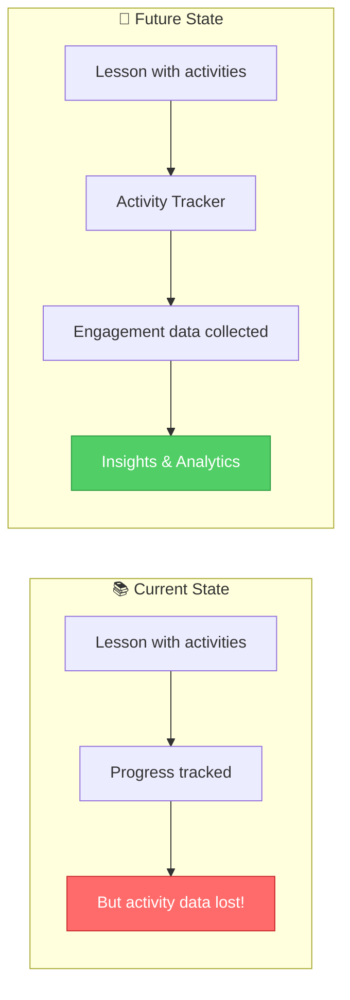

### The Story: The Missing Piece

Right now, AutoNateAI tracks whether a student *viewed* sections of a lesson. But lessons aren't just passive reading — they have **activities**:

- 🧠 **Quizzes** — "What does a variable store?"
- 🎯 **Drag & Drop** — Match concepts to definitions
- 💻 **Code Challenges** — Write a function that...
- 🔄 **Interactive Demos** — Click to see how data flows

When a student completes these activities, we lose valuable data:
- Did they get the quiz right on the first try?
- How long did they struggle with the drag & drop?
- Did they retry the code challenge 5 times?
- What concepts are they weak on?

**The Activity Tracker** will capture all of this, enabling:
- Personalized learning paths ("You're struggling with loops, here's extra practice")
- Instructor insights ("80% of students miss this question")
- Gamification ("You got 3 perfect scores today! 🔥")
- Daily challenges that adapt to skill level

---

## Design Goals

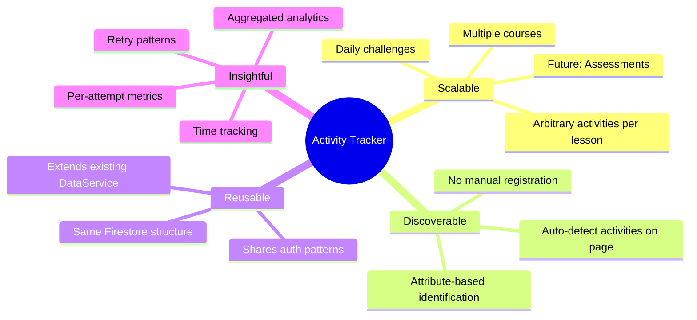

### The Story: Building for Scale

Imagine it's 6 months from now. AutoNateAI has:
- 4 courses (Apprentice, Undergrad, Junior, Senior)
- 7 chapters per course (28 total chapters)
- ~5 activities per chapter (140+ activities)
- Daily challenges (365 per year!)
- 1,000 active students

The Activity Tracker needs to handle:
- **Discovery**: "Find all activities on this page without me listing them"
- **Flexibility**: "A quiz has different data than a code challenge"
- **Aggregation**: "Show me this student's overall quiz performance"
- **Speed**: "Don't make 100 Firestore calls to load the dashboard"

---

## Proposed Architecture

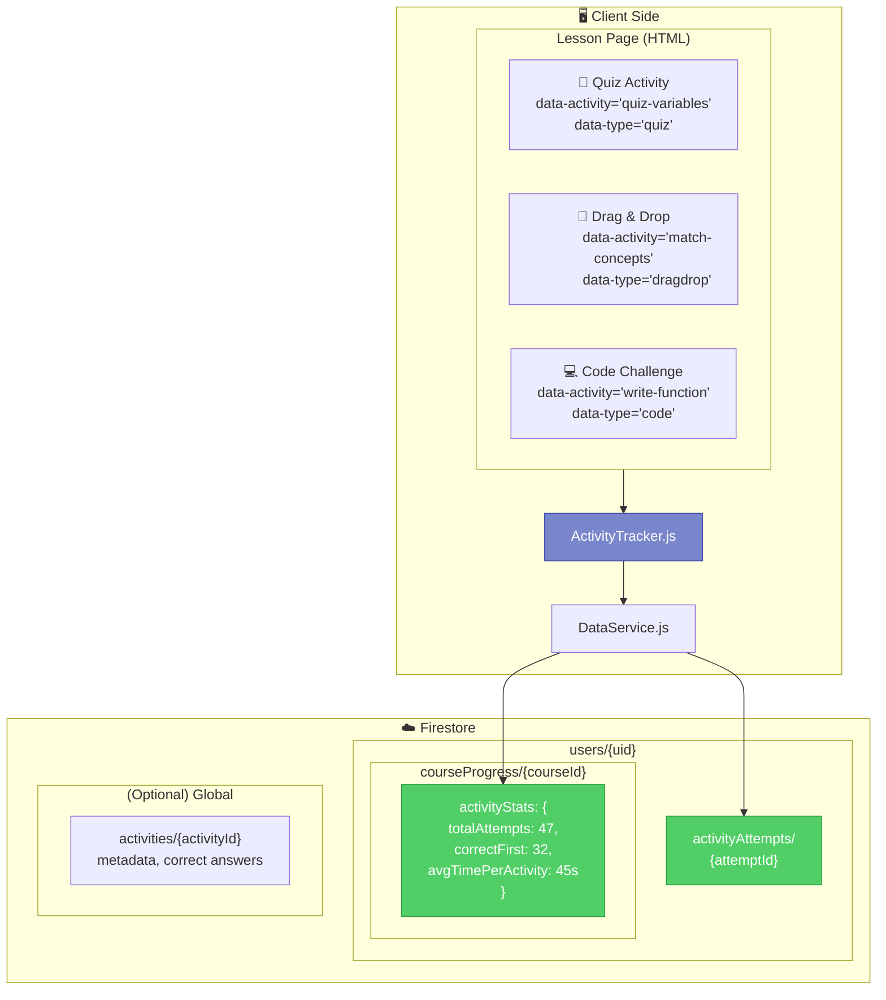

### The Story: Three Layers of Data

Think of the Activity Tracker like a sports statistics system:

**Layer 1: The Play-by-Play** (`activityAttempts/{attemptId}`)
Every single attempt at every activity. Like recording every pitch in baseball:
- Who? (userId)
- What? (activityId, activityType)
- When? (timestamp)
- Result? (correct/incorrect, score, timeSpent)
- Context? (courseId, lessonId, attemptNumber)

**Layer 2: The Season Stats** (`courseProgress/{courseId}/activityStats`)
Aggregated metrics per course. Like a player's batting average:
- Total attempts across all activities
- First-try success rate
- Average time per activity
- Weak areas (activities with low scores)

**Layer 3: The Record Book** (`activities/{activityId}`) — *Optional*
Global activity definitions. Like the rules of the game:
- Activity metadata (title, type, difficulty)
- Correct answers (for validation)
- Point values
- Hints/explanations

---

## Data Models

### Activity Attempt (Per-Attempt Record)

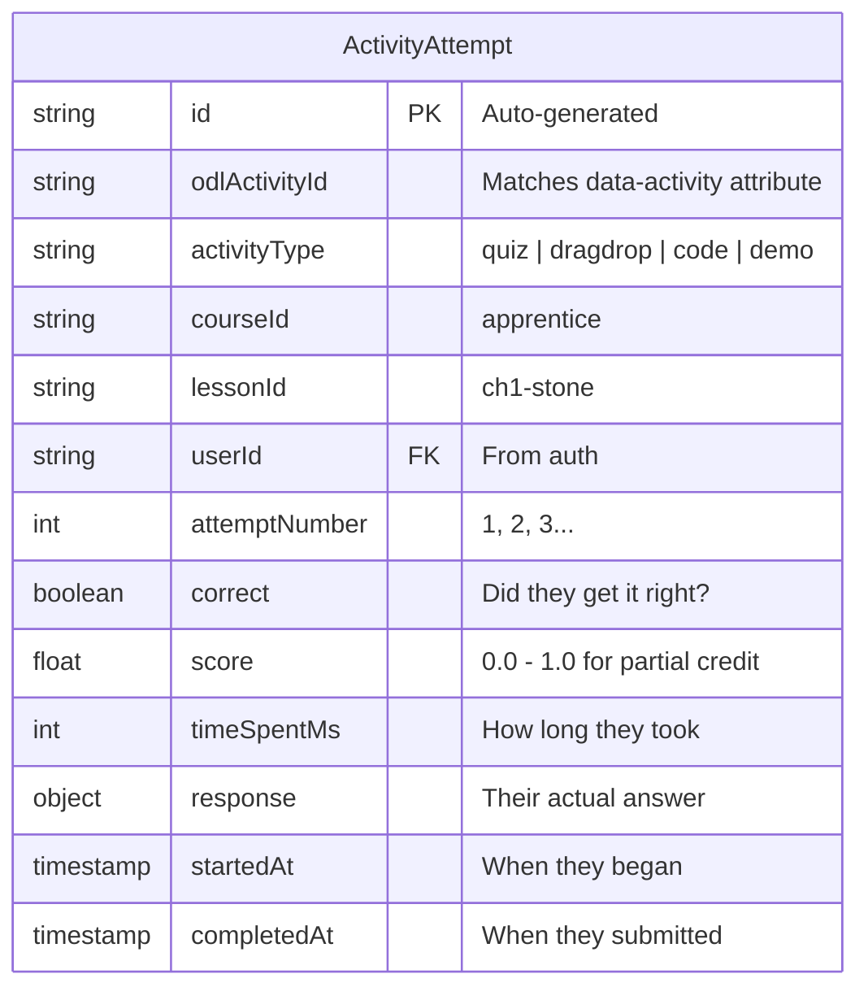

### The Story: What We Capture

When a student attempts a quiz question, we capture:

```javascript
// Example: Student answers a quiz about variables
{
  id: "auto-generated-uuid",
  activityId: "quiz-variables-q1",
  activityType: "quiz",
  courseId: "apprentice",
  lessonId: "ch1-stone",
  userId: "user-123",
  attemptNumber: 2,              // This is their 2nd try
  correct: true,                 // They got it right!
  score: 1.0,                    // Full credit
  timeSpentMs: 12400,            // Took 12.4 seconds
  response: {
    selected: "b",               // They picked option B
    question: "What does a variable store?",
    options: ["Code", "Data", "Functions", "Loops"]
  },
  startedAt: Timestamp,
  completedAt: Timestamp
}
```

### Activity Stats (Aggregated Per-Course)

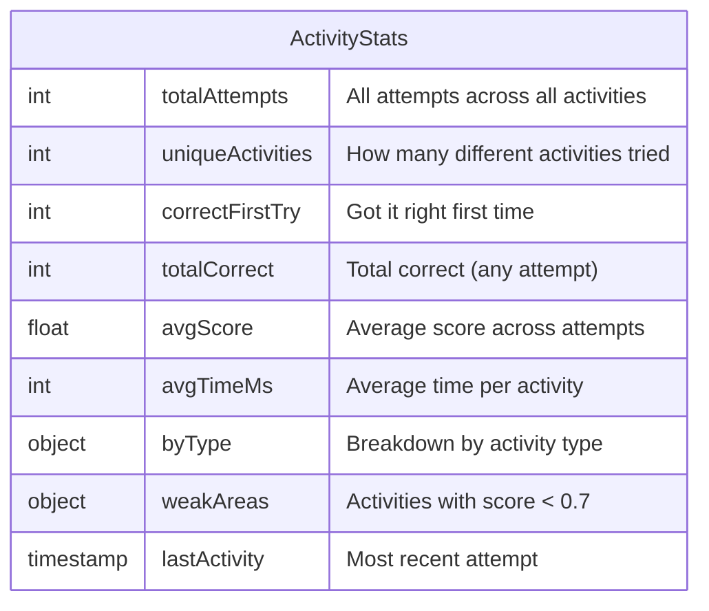

### The Story: The Report Card

At the course level, we maintain a "report card":

```javascript
// Stored at: users/{uid}/courseProgress/apprentice
{
  // ... existing fields (completedLessons, progressPercent, etc.)
  
  activityStats: {
    totalAttempts: 47,
    uniqueActivities: 23,
    correctFirstTry: 18,
    totalCorrect: 41,
    avgScore: 0.87,
    avgTimeMs: 34000,
    byType: {
      quiz: { attempts: 28, avgScore: 0.92 },
      dragdrop: { attempts: 12, avgScore: 0.83 },
      code: { attempts: 7, avgScore: 0.71 }
    },
    weakAreas: [
      { activityId: "quiz-loops-q3", attempts: 4, lastScore: 0.5 },
      { activityId: "code-function-1", attempts: 3, lastScore: 0.6 }
    ],
    lastActivity: Timestamp
  }
}
```

---

## Activity Discovery

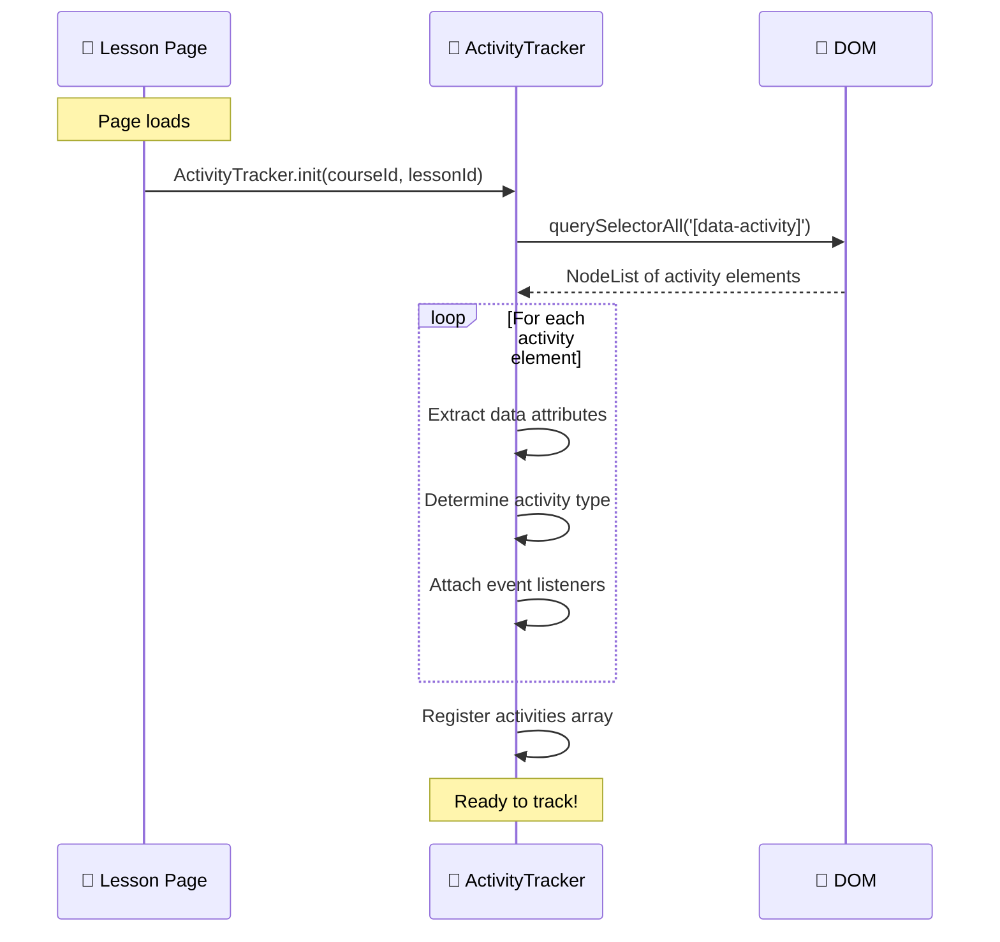

### The Story: No Manual Registration

Instead of maintaining a list of activities somewhere, we use **HTML data attributes**:

```html
<!-- In the lesson HTML -->
<div class="quiz-container" 
     data-activity="quiz-variables-q1"
     data-type="quiz"
     data-points="10">
  <h3>What does a variable store?</h3>
  <!-- quiz content -->
</div>

<div class="dragdrop-container"
     data-activity="match-dataflow"
     data-type="dragdrop"
     data-points="20">
  <!-- drag and drop content -->
</div>
```

When `ActivityTracker.init()` runs, it:
1. Scans the page for `[data-activity]` elements
2. Extracts metadata from data attributes
3. Attaches completion listeners
4. Knows exactly what activities exist — automatically!

**Benefits:**
- Add a new activity? Just add the HTML with data attributes
- Remove an activity? Just delete the HTML
- No config files to maintain
- No registration calls to make

---

## Activity Completion Flow

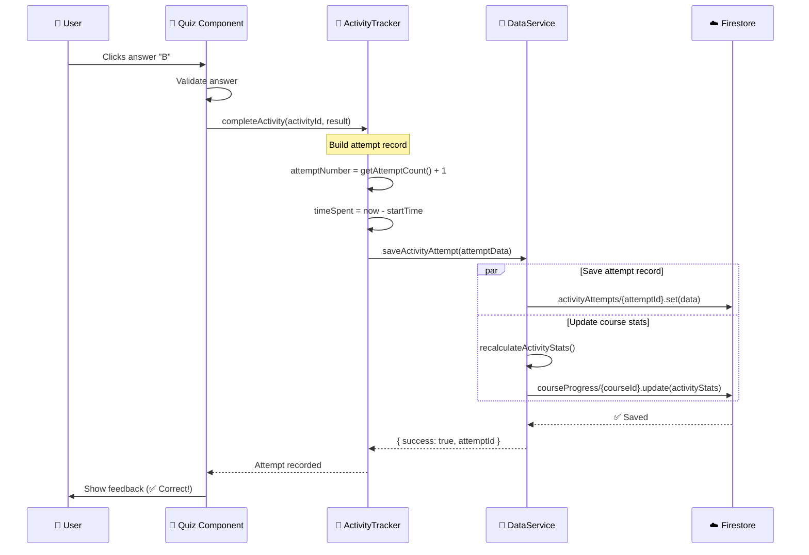

### The Story: The Journey of a Quiz Answer

1. **Student clicks "B"** — The quiz component handles the click
2. **Quiz validates** — Checks if "B" is correct
3. **Quiz notifies tracker** — `ActivityTracker.completeActivity('quiz-variables-q1', { correct: true, selected: 'b' })`
4. **Tracker builds record** — Adds timing, attempt number, context
5. **DataService saves** — Two parallel writes:
   - Individual attempt → `activityAttempts/{id}`
   - Updated stats → `courseProgress/apprentice/activityStats`
6. **Student sees feedback** — "✅ Correct!"

---

## Integration with Existing Services

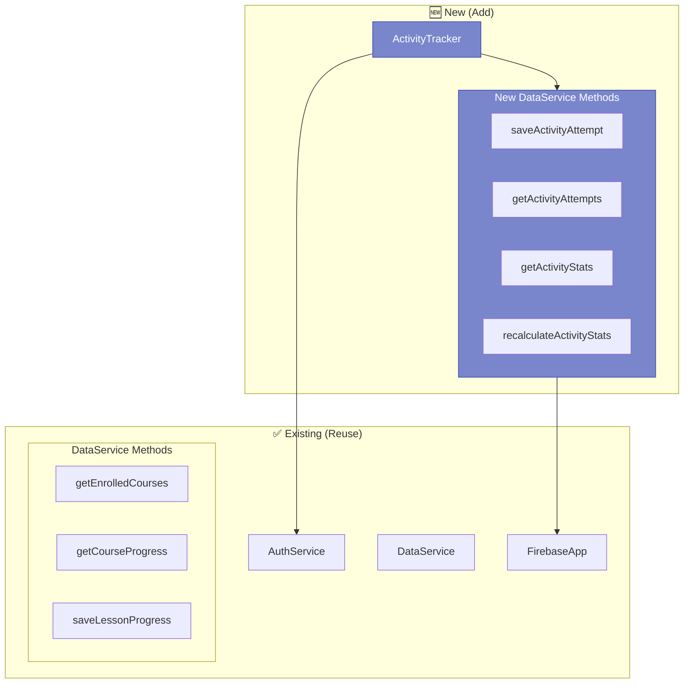

### The Story: Building on What Works

We don't reinvent the wheel. The Activity Tracker extends the existing architecture:

**Reuses:**
- `AuthService` — Same user authentication
- `FirebaseApp` — Same Firestore connection
- `DataService` patterns — Same error handling, same structure
- Firestore paths — Lives under `users/{uid}/` like everything else

**Adds to DataService:**
```javascript
// New methods in courses/shared/js/data-service.js

saveActivityAttempt(attemptData)     // Save individual attempt
getActivityAttempts(filters)          // Query attempts (by course, lesson, type)
getActivityStats(courseId)            // Get aggregated stats
recalculateActivityStats(courseId)    // Recompute after new attempt
```

**New Component:**
```javascript
// New file: courses/shared/js/activity-tracker.js

ActivityTracker = {
  init(courseId, lessonId),           // Discover activities on page
  startActivity(activityId),          // Begin timing
  completeActivity(activityId, result), // Record completion
  getAttemptCount(activityId),        // How many tries so far?
  // ...
}
```

---

## Firestore Structure

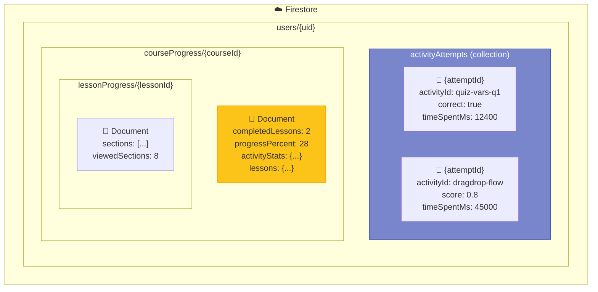

### The Story: Where Everything Lives

**New Collection: `activityAttempts`**
- Lives at `users/{uid}/activityAttempts/{attemptId}`
- Each document is ONE attempt at ONE activity
- Queryable by: `courseId`, `lessonId`, `activityType`, `timestamp`
- Enables: "Show me all quiz attempts from last week"

**Extended Document: `courseProgress/{courseId}`**
- Adds `activityStats` field to existing course progress document
- Contains aggregated metrics
- Updated after each attempt via `recalculateActivityStats()`

**Unchanged: `lessonProgress/{lessonId}`**
- Still tracks section viewing
- Activity Tracker is separate concern

---

## Daily Challenges Extension

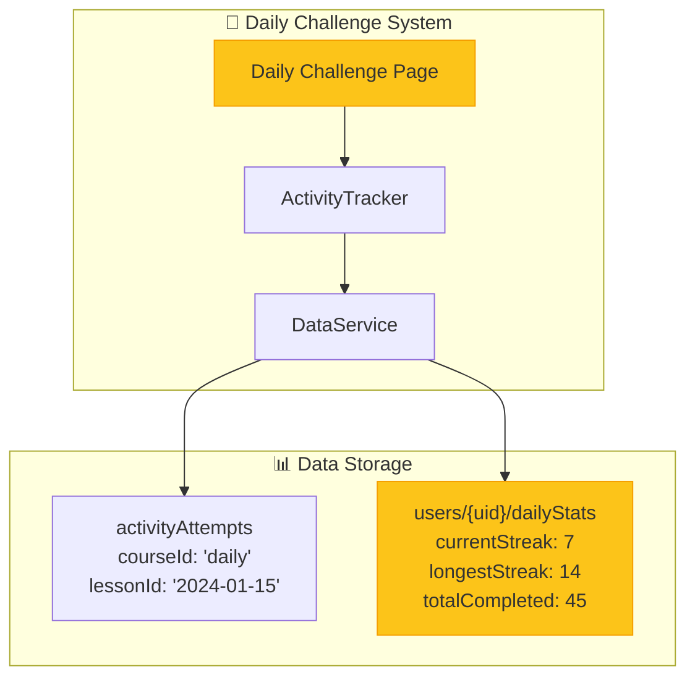

### The Story: Same Tracker, Different Context

Daily challenges use the SAME ActivityTracker with different context:

```javascript
// On a daily challenge page
ActivityTracker.init('daily', '2024-01-15');  // courseId = 'daily', lessonId = date
```

This means:
- Same `activityAttempts` collection, filtered by `courseId: 'daily'`
- Separate `dailyStats` document for streak tracking
- Can query: "Show all daily challenges from January"
- Gamification: Streaks, badges, leaderboards

---

## Method Summary

### ActivityTracker (New Component)

| Method | Purpose | When Called |
|--------|---------|-------------|
| `init(courseId, lessonId)` | Discover activities, set context | Page load |
| `discoverActivities()` | Scan DOM for `[data-activity]` | Called by init |
| `startActivity(activityId)` | Begin timing, increment attempt | User starts activity |
| `completeActivity(id, result)` | Save attempt, update stats | User submits answer |
| `getAttemptCount(activityId)` | How many tries? | Before showing hints |
| `getActivityResult(activityId)` | Previous result | Show "you answered X" |

### DataService (Extended)

| Method | Purpose | Firestore Path |
|--------|---------|----------------|
| `saveActivityAttempt(data)` | Save individual attempt | `activityAttempts/{id}` |
| `getActivityAttempts(filters)` | Query attempts | `activityAttempts` (query) |
| `getActivityStats(courseId)` | Get aggregated stats | `courseProgress/{id}` |
| `recalculateActivityStats(courseId)` | Recompute after attempt | `courseProgress/{id}` |
| `getDailyStats()` | Get streak, badges | `users/{uid}/dailyStats` |

---

## Implementation Phases

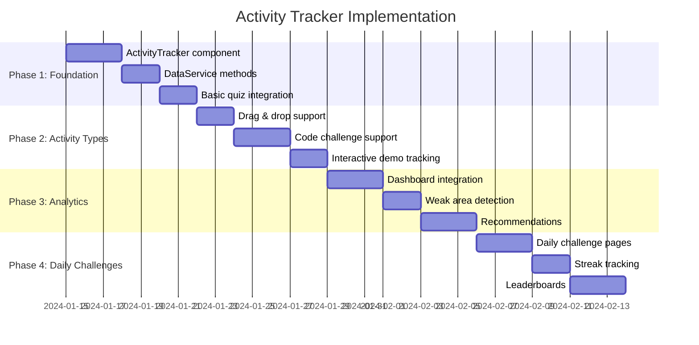

### The Story: Building in Layers

**Phase 1: Foundation** (1 week)
- Create `ActivityTracker.js` with discovery and basic tracking
- Add `saveActivityAttempt()` to DataService
- Integrate with ONE quiz in Apprentice course
- Verify data flows correctly

**Phase 2: Activity Types** (1 week)
- Add support for drag & drop result structure
- Add support for code challenge evaluation
- Handle interactive demos (engagement time)
- Test across multiple lessons

**Phase 3: Analytics** (1 week)
- Show activity stats on dashboard
- Identify weak areas from low scores
- "Recommended practice" suggestions
- Instructor view (if needed)

**Phase 4: Daily Challenges** (1 week)
- Create daily challenge page template
- Implement streak tracking
- Add leaderboards (optional)
- Celebrate achievements

---

## File Structure

```
courses/
├── shared/
│   └── js/
│       ├── activity-tracker.js      🆕 NEW
│       ├── data-service.js          📝 EXTENDED
│       ├── progress-tracker.js      ✅ UNCHANGED
│       ├── auth.js                  ✅ UNCHANGED
│       └── firebase-config.js       ✅ UNCHANGED
├── apprentice/
│   ├── ch1-stone/
│   │   └── index.html               📝 ADD data-activity attributes
│   └── ...
└── daily/                           🆕 NEW (Phase 4)
    └── index.html
```

---

## Next Steps

1. **Review this architecture** — Does it meet your needs?
2. **Create ActivityTracker.js** — The client-side component
3. **Extend DataService** — Add the new methods
4. **Add data attributes** — To one lesson as a pilot
5. **Test the flow** — Verify data appears in Firestore
6. **Iterate** — Add more activity types, analytics, daily challenges

---

## Questions to Consider

Before implementation:

1. **Activity validation** — Should correct answers live in Firestore (secure) or in the HTML (simple)?
2. **Retry limits** — Should students have unlimited attempts, or cap at 3?
3. **Partial credit** — For drag & drop, is 4/5 correct worth 0.8 score?
4. **Time limits** — Should activities have time limits?
5. **Offline support** — Queue attempts if offline, sync later?

