# Analytics & Community Engagement Architecture

## Vision

Transform learning data into actionable insights and meaningful connections. Build a system that serves:

1. **Administrators** - District-wide performance metrics, cohort analysis, intervention alerts
2. **Teachers** - Class performance, individual student progress, curriculum effectiveness
3. **Students** - Personal growth tracking, skill gaps, recommended learning paths, peer connections
4. **Community** - Leaderboards, peer matching, collaborative challenges, Discord integration

---

## System Architecture Overview

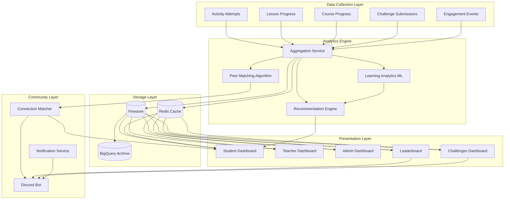

---

## Data Model Architecture

### Core Collections (Firestore)

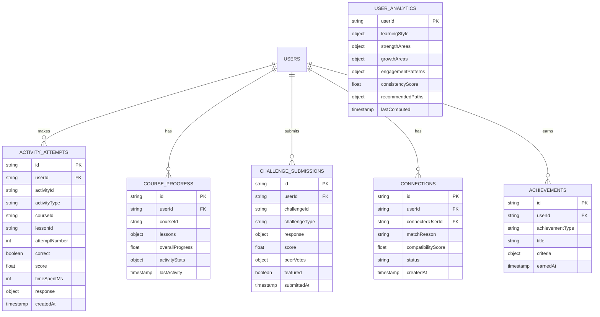

### Aggregated Analytics Collections

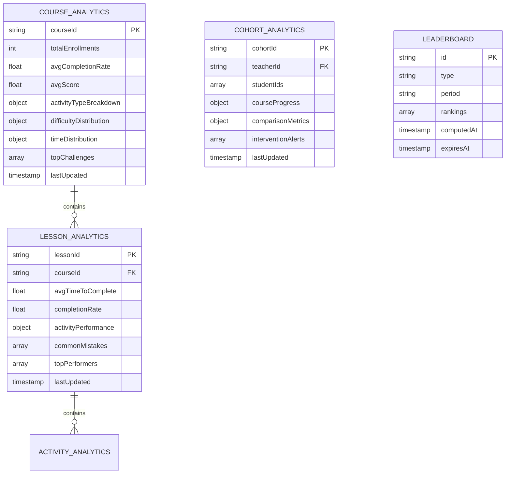

---

## Analytics Computation Flows

### Real-time Activity Processing

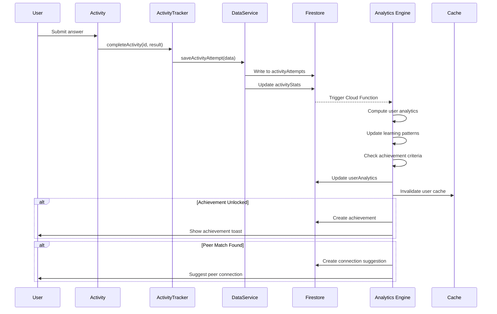

### Batch Analytics Processing (Cloud Functions)

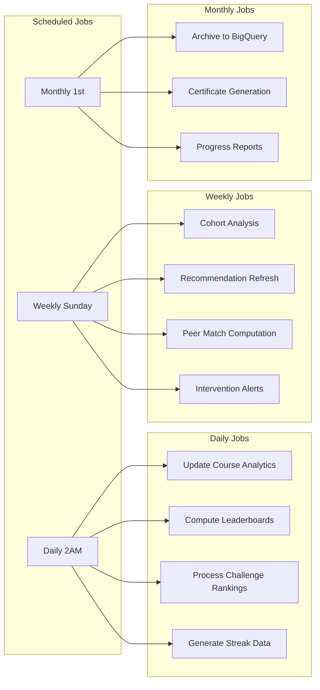

---

## Dashboard Architecture

### Reusable Analytics Components

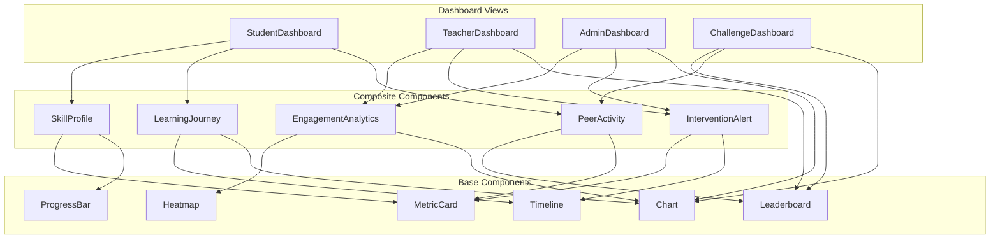

### Student Dashboard

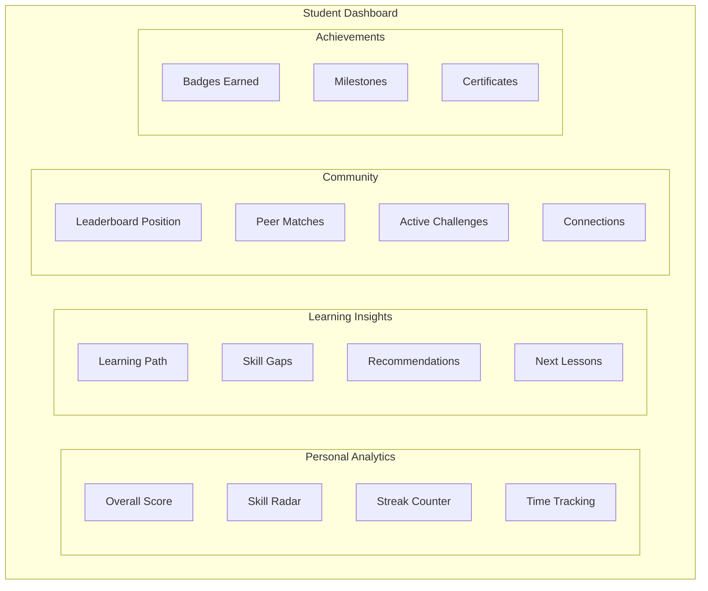

### Teacher Dashboard

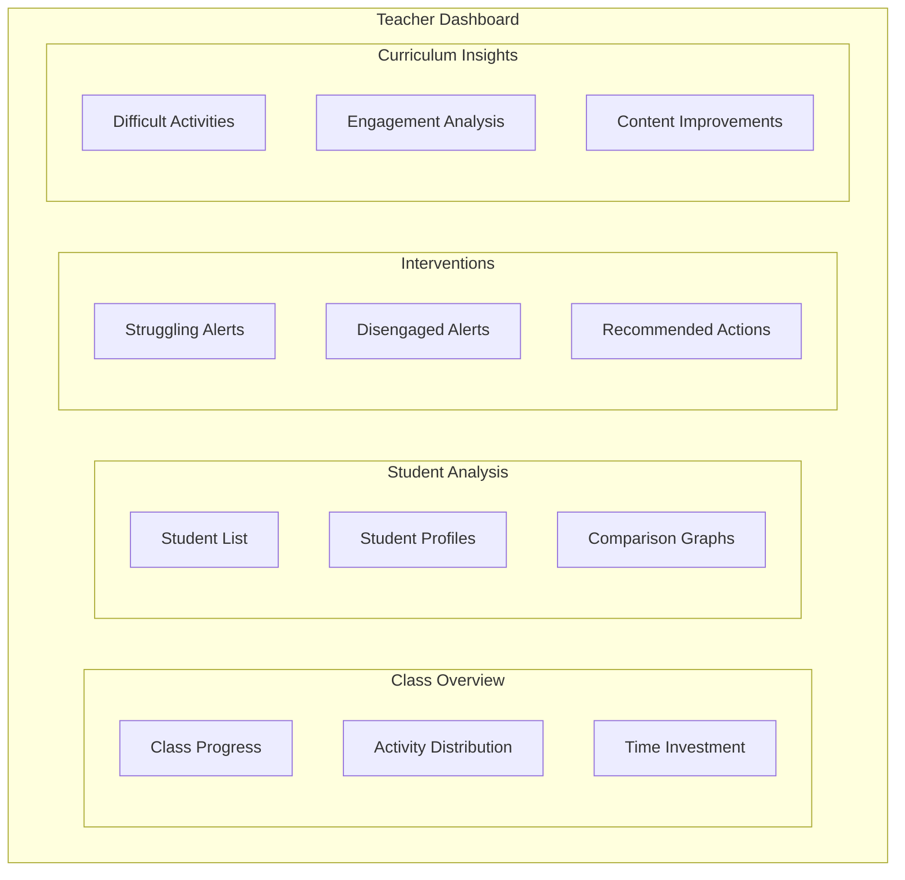

### Admin/Superintendent Dashboard

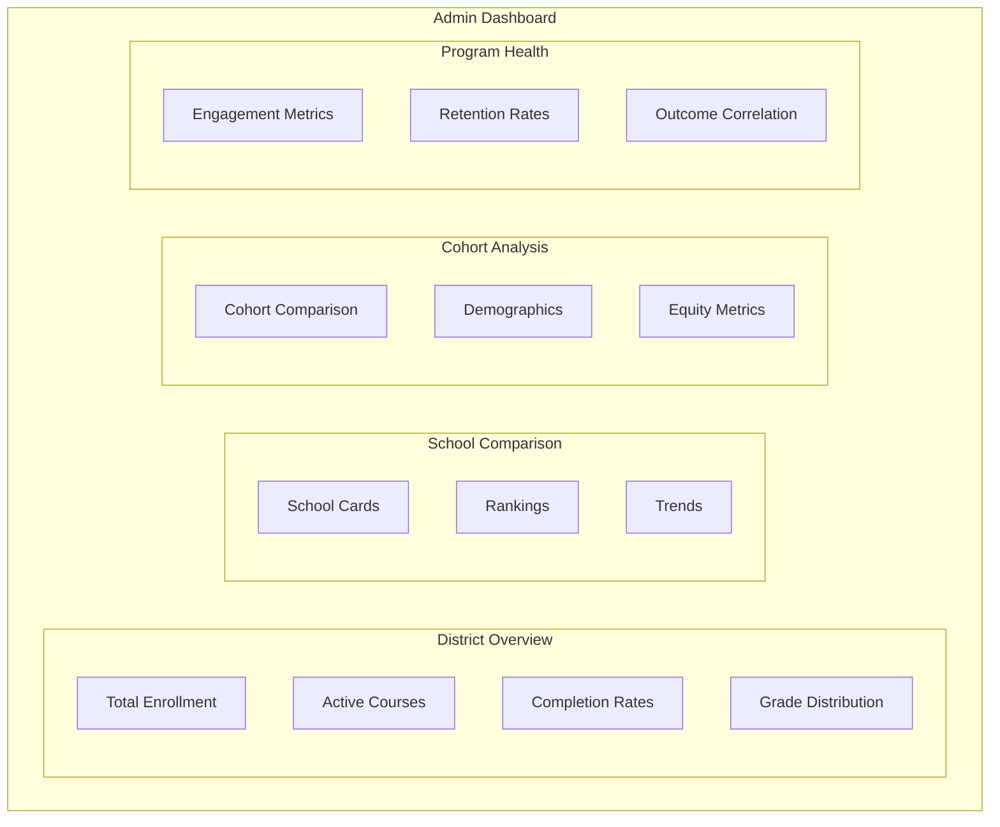

---

## Psychoanalytic Learning Insights

### Learning Pattern Detection

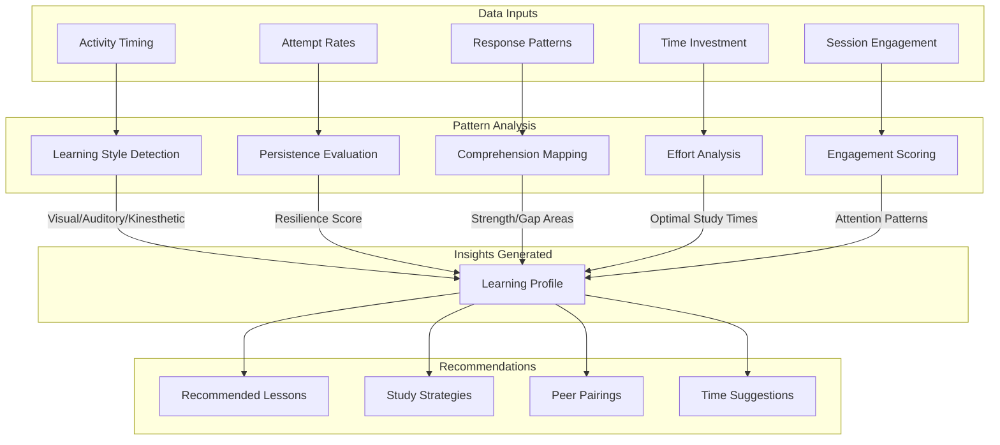

### Student Profile Metrics

```javascript
// UserAnalytics document structure
{
  userId: "user123",
  
  // Learning Style (computed from activity patterns)
  learningStyle: {
    primary: "visual",           // visual | auditory | kinesthetic
    secondary: "kinesthetic",
    confidence: 0.82,
    dataPoints: 156
  },
  
  // Strength Areas (based on activity performance)
  strengthAreas: [
    { topic: "variables", score: 0.94, attempts: 23 },
    { topic: "loops", score: 0.88, attempts: 18 },
    { topic: "functions", score: 0.85, attempts: 31 }
  ],
  
  // Growth Areas (areas needing improvement)
  growthAreas: [
    { topic: "recursion", score: 0.52, suggestedResources: [...] },
    { topic: "async", score: 0.61, suggestedResources: [...] }
  ],
  
  // Engagement Patterns
  engagementPatterns: {
    preferredTimes: ["18:00-20:00", "09:00-11:00"],
    avgSessionLength: 34,        // minutes
    peakPerformanceDay: "Tuesday",
    consistencyScore: 0.78,      // 0-1, how regular
    streakRecord: 14,
    currentStreak: 5
  },
  
  // Persistence Metrics
  persistenceMetrics: {
    avgAttemptsBeforeSuccess: 2.3,
    giveUpRate: 0.08,            // How often they abandon
    retryAfterFailure: 0.91,     // How often they retry
    improvementRate: 0.15        // Score improvement per attempt
  },
  
  // Recommended Learning Path
  recommendedPaths: [
    {
      type: "remediation",
      topic: "recursion",
      lessons: ["ch3-magnetism", "ch4-architect"],
      priority: "high"
    },
    {
      type: "advancement",
      topic: "data-structures",
      lessons: ["ch5-capstone1"],
      priority: "medium"
    }
  ],
  
  lastComputed: Timestamp
}
```

---

## Peer Matching Algorithm

### Matching Criteria

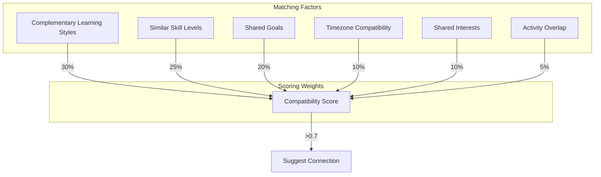

### Connection Types

```javascript
// Connection recommendation types
const connectionTypes = {
  STUDY_BUDDY: {
    criteria: "similar_level + complementary_styles",
    description: "Great for collaborative learning"
  },
  MENTOR: {
    criteria: "higher_level + teaching_inclination",
    description: "Can help guide your learning"
  },
  MENTEE: {
    criteria: "lower_level + similar_path",
    description: "You can help them grow"
  },
  CHALLENGE_PARTNER: {
    criteria: "competitive_level + similar_interests",
    description: "Perfect for challenges"
  },
  ACCOUNTABILITY: {
    criteria: "similar_goals + similar_engagement",
    description: "Keep each other on track"
  }
};
```

---

## Leaderboard System

### Leaderboard Types

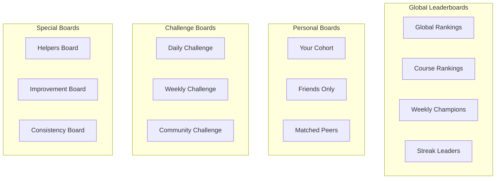

### Leaderboard Data Structure

```javascript
// Leaderboard document
{
  id: "global-weekly-2026-03",
  type: "global",
  period: "weekly",
  startDate: Timestamp,
  endDate: Timestamp,
  
  rankings: [
    {
      rank: 1,
      userId: "user123",
      displayName: "CodeNinja",
      avatar: "url",
      score: 2450,
      metrics: {
        activitiesCompleted: 47,
        challengesWon: 3,
        streakDays: 7,
        helpfulVotes: 12
      },
      change: +2  // Position change from last period
    },
    // ... more rankings
  ],
  
  computedAt: Timestamp,
  expiresAt: Timestamp
}
```

---

## Challenges Dashboard

### Challenge System Architecture

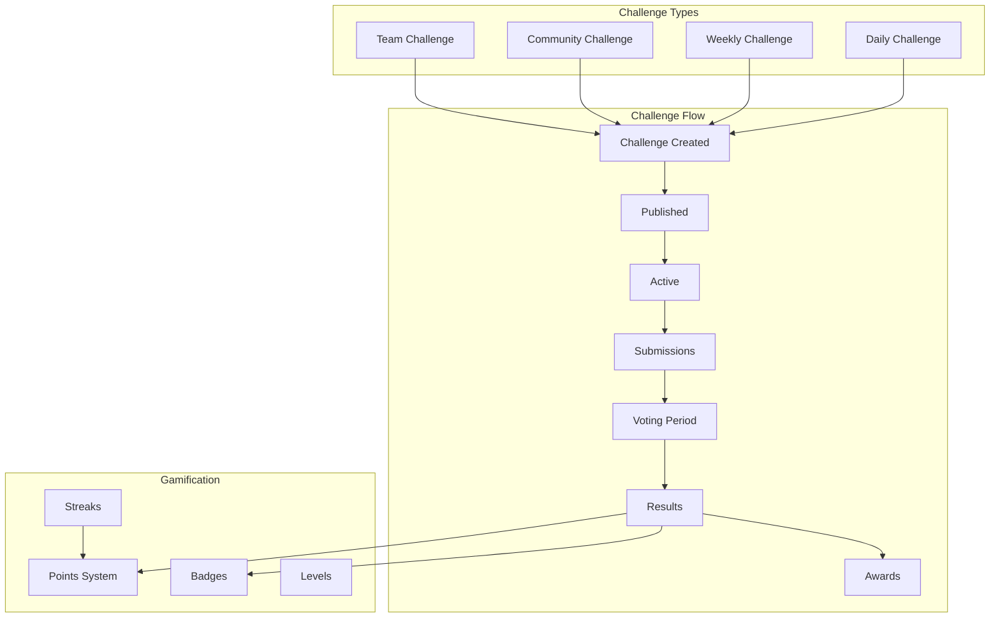

### Challenge Dashboard Components

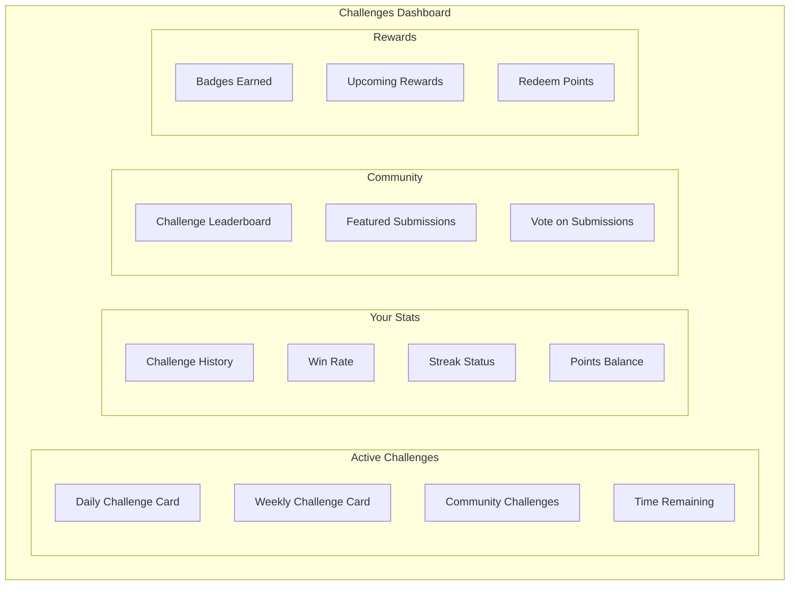

---

## Discord Integration

### Bot Commands & Features

```mermaid
flowchart TB
    subgraph "Discord Bot"
        subgraph "Commands"
            ST[/stats - Your analytics]
            LB[/leaderboard - View rankings]
            CH[/challenge - Daily challenge]
            CN[/connect - Find peers]
            AC[/achievements - Your badges]
        end
        
        subgraph "Automated Posts"
            DCS[Daily Challenge Announcement]
            LBU[Leaderboard Updates]
            ACA[Achievement Celebrations]
            MLS[Milestone Shoutouts]
        end
        
        subgraph "Notifications"
            NM[New Match Notification]
            CR[Challenge Results]
            ST2[Streak Reminders]
            IV[Intervention Nudges]
        end
    end
```

### Discord Channel Structure

```
📊 ANALYTICS
├── #daily-leaderboard     - Auto-posted daily rankings
├── #weekly-champions      - Weekly winners celebration
├── #achievement-feed      - Live achievement notifications
└── #milestone-celebrations - Big milestone shoutouts

🏆 CHALLENGES
├── #daily-challenge       - Daily challenge posts
├── #challenge-submissions - Student submissions
├── #challenge-discussion  - Strategy talk
└── #hall-of-fame         - Featured winners

🤝 CONNECTIONS
├── #find-a-buddy         - Peer matching suggestions
├── #study-groups         - Form study groups
├── #mentor-matching      - Mentor/mentee connections
└── #accountability-pairs - Accountability partners

📈 PROGRESS
├── #streak-check-in      - Daily streak posts
├── #progress-share       - Share your progress
└── #help-wanted          - Ask for help
```

---

## Reusable Service Architecture

### Analytics Service Layer

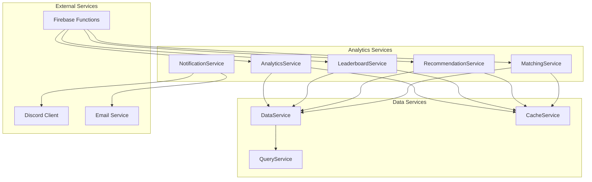

### Service Method Signatures

```javascript
// AnalyticsService.js
const AnalyticsService = {
  // User Analytics
  async getUserAnalytics(userId) {},
  async computeUserAnalytics(userId) {},
  async getLearningInsights(userId) {},
  async getRecommendations(userId) {},
  
  // Course Analytics
  async getCourseAnalytics(courseId) {},
  async getLessonAnalytics(courseId, lessonId) {},
  async getActivityAnalytics(activityId) {},
  
  // Cohort Analytics
  async getCohortAnalytics(cohortId) {},
  async getClassAnalytics(teacherId, classId) {},
  async getSchoolAnalytics(schoolId) {},
  async getDistrictAnalytics(districtId) {},
  
  // Comparison & Benchmarks
  async compareToAverage(userId, scope) {},
  async getPercentileRank(userId, metric, scope) {},
  async getBenchmarks(scope) {}
};

// LeaderboardService.js
const LeaderboardService = {
  // Leaderboard Retrieval
  async getLeaderboard(type, period, options) {},
  async getUserRank(userId, type, period) {},
  async getNearbyRanks(userId, type, count) {},
  
  // Leaderboard Computation
  async computeLeaderboard(type, period) {},
  async updateRankings(type) {},
  
  // Personal Boards
  async getCohortLeaderboard(userId) {},
  async getFriendsLeaderboard(userId) {},
  async getMatchedPeersBoard(userId) {}
};

// MatchingService.js
const MatchingService = {
  // Peer Matching
  async findMatches(userId, type, limit) {},
  async computeCompatibility(userId1, userId2) {},
  async getSuggestedConnections(userId) {},
  
  // Connection Management
  async createConnection(userId, targetId, type) {},
  async getConnections(userId, status) {},
  async updateConnectionStatus(connectionId, status) {}
};

// RecommendationService.js
const RecommendationService = {
  // Learning Recommendations
  async getNextLessons(userId) {},
  async getRemediationPath(userId, topic) {},
  async getAdvancementPath(userId) {},
  
  // Study Recommendations
  async getOptimalStudyTimes(userId) {},
  async getStudyStrategies(userId) {},
  async getResourceRecommendations(userId, topic) {}
};
```

---

## Database Operation Patterns

### Smart Queries with Caching

```javascript
// QueryService.js - Efficient data fetching with caching
const QueryService = {
  // Cache-first pattern
  async getWithCache(collection, docId, ttlSeconds = 300) {
    const cacheKey = `${collection}:${docId}`;
    
    // Check cache first
    const cached = await CacheService.get(cacheKey);
    if (cached) return cached;
    
    // Fetch from Firestore
    const doc = await db.collection(collection).doc(docId).get();
    const data = doc.data();
    
    // Cache for future
    await CacheService.set(cacheKey, data, ttlSeconds);
    return data;
  },
  
  // Batch fetching with deduplication
  async batchGet(collection, docIds) {
    const unique = [...new Set(docIds)];
    const refs = unique.map(id => db.collection(collection).doc(id));
    const snapshots = await db.getAll(...refs);
    
    return snapshots.reduce((acc, snap) => {
      if (snap.exists) acc[snap.id] = snap.data();
      return acc;
    }, {});
  },
  
  // Aggregation with pagination
  async aggregateWithPagination(query, pageSize = 100) {
    let lastDoc = null;
    const results = [];
    
    while (true) {
      let q = query.limit(pageSize);
      if (lastDoc) q = q.startAfter(lastDoc);
      
      const snapshot = await q.get();
      if (snapshot.empty) break;
      
      results.push(...snapshot.docs.map(d => d.data()));
      lastDoc = snapshot.docs[snapshot.docs.length - 1];
      
      if (snapshot.docs.length < pageSize) break;
    }
    
    return results;
  }
};
```

### Firestore Security Rules

```javascript
// firestore.rules additions for analytics
rules_version = '2';
service cloud.firestore {
  match /databases/{database}/documents {
    
    // User can read their own analytics
    match /userAnalytics/{userId} {
      allow read: if request.auth.uid == userId;
      allow write: if false; // Only cloud functions write
    }
    
    // Leaderboards are public read
    match /leaderboards/{leaderboardId} {
      allow read: if request.auth != null;
      allow write: if false; // Only cloud functions write
    }
    
    // Connections require mutual consent
    match /connections/{connectionId} {
      allow read: if request.auth.uid in resource.data.participants;
      allow create: if request.auth.uid == request.resource.data.initiatorId;
      allow update: if request.auth.uid in resource.data.participants;
    }
    
    // Teachers can read their students' analytics
    match /cohortAnalytics/{cohortId} {
      allow read: if request.auth.uid == resource.data.teacherId
                  || request.auth.uid in resource.data.adminIds;
    }
  }
}
```

---

## Implementation Phases

### Phase 1: Core Analytics (Foundation)

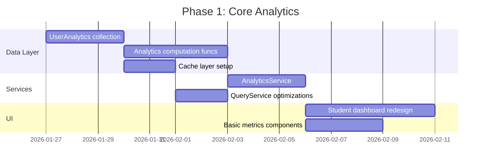

**Deliverables:**
- [ ] UserAnalytics Firestore collection
- [ ] Cloud Function for analytics computation
- [ ] AnalyticsService with core methods
- [ ] Student dashboard with personal metrics
- [ ] Skill radar chart component
- [ ] Learning path recommendations

### Phase 2: Leaderboards & Gamification

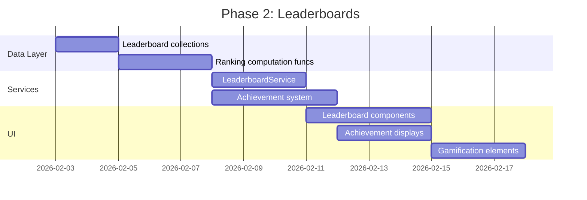

**Deliverables:**
- [ ] Global, course, and personal leaderboards
- [ ] Weekly/monthly ranking computation
- [ ] Achievement/badge system
- [ ] Streak tracking and display
- [ ] Points and levels system

### Phase 3: Community & Matching

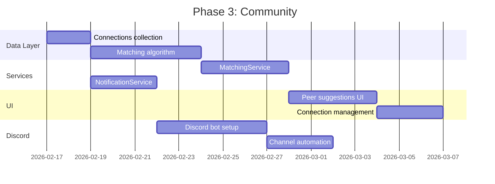

**Deliverables:**
- [ ] Peer matching algorithm
- [ ] Connection suggestions UI
- [ ] Discord bot with core commands
- [ ] Automated Discord posts
- [ ] Study buddy finder

### Phase 4: Challenges Dashboard

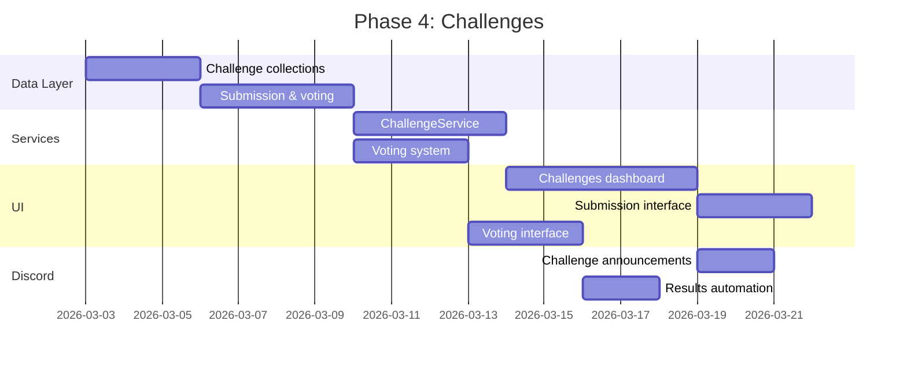

**Deliverables:**
- [ ] Daily/weekly challenge system
- [ ] Submission and voting workflow
- [ ] Challenge leaderboards
- [ ] Featured submissions gallery
- [ ] Discord challenge integration

### Phase 5: Teacher & Admin Dashboards

```mermaid
gantt
    title Phase 5: Educator Tools
    dateFormat  YYYY-MM-DD
    section Data Layer
    Cohort analytics            :a1, 2026-03-17, 3d
    School/district rollups     :a2, after a1, 4d
    section Services
    CohortAnalyticsService      :b1, after a2, 4d
    InterventionService         :b2, after a1, 3d
    section UI
    Teacher dashboard           :c1, after b1, 5d
    Admin dashboard             :c2, after c1, 5d
    Intervention alerts         :c3, after b2, 3d
    Reports & exports           :c4, after c2, 3d
```

**Deliverables:**
- [ ] Teacher class view dashboard
- [ ] Student comparison tools
- [ ] Intervention alert system
- [ ] Admin district overview
- [ ] Progress reports generation
- [ ] Data export capabilities

---

## File Structure

```
courses/
├── shared/
│   ├── js/
│   │   ├── services/
│   │   │   ├── analytics-service.js      # User & course analytics
│   │   │   ├── leaderboard-service.js    # Ranking computations
│   │   │   ├── matching-service.js       # Peer matching
│   │   │   ├── recommendation-service.js # Learning recommendations
│   │   │   ├── challenge-service.js      # Challenge management
│   │   │   ├── notification-service.js   # Push & Discord notifications
│   │   │   └── cache-service.js          # Client-side caching
│   │   └── components/
│   │       ├── analytics/
│   │       │   ├── metric-card.js
│   │       │   ├── skill-radar.js
│   │       │   ├── progress-timeline.js
│   │       │   ├── engagement-heatmap.js
│   │       │   └── comparison-chart.js
│   │       ├── leaderboard/
│   │       │   ├── leaderboard-table.js
│   │       │   ├── rank-card.js
│   │       │   └── position-change.js
│   │       ├── community/
│   │       │   ├── peer-suggestion.js
│   │       │   ├── connection-card.js
│   │       │   └── study-group.js
│   │       └── challenges/
│   │           ├── challenge-card.js
│   │           ├── submission-form.js
│   │           └── voting-interface.js
│   └── css/
│       ├── analytics.css
│       ├── leaderboard.css
│       └── challenges.css
├── dashboard/
│   └── index.html                        # Student dashboard
├── teacher-dashboard/
│   └── index.html                        # Teacher view
├── admin-dashboard/
│   └── index.html                        # Admin view
└── challenges/
    └── index.html                        # Challenges dashboard

firebase-functions/
├── analytics/
│   ├── computeUserAnalytics.js
│   ├── computeCourseAnalytics.js
│   └── computeCohortAnalytics.js
├── leaderboards/
│   ├── computeLeaderboards.js
│   └── updateRankings.js
├── matching/
│   ├── computeMatches.js
│   └── suggestConnections.js
├── challenges/
│   ├── createDailyChallenge.js
│   └── computeResults.js
└── notifications/
    ├── sendAchievement.js
    └── discordWebhook.js

discord-bot/
├── commands/
│   ├── stats.js
│   ├── leaderboard.js
│   ├── challenge.js
│   └── connect.js
├── automations/
│   ├── dailyChallenge.js
│   ├── leaderboardPost.js
│   └── achievementCelebration.js
└── index.js
```

---

## Success Metrics

### Student Engagement
- Daily/weekly active users
- Average session duration increase
- Activity completion rates
- Streak maintenance rates

### Learning Outcomes
- Score improvement over time
- Time to proficiency reduction
- Skill gap closure rates
- Course completion rates

### Community Health
- Connection acceptance rates
- Study group formation
- Challenge participation
- Discord engagement metrics

### Platform Growth
- New user signups
- Retention rates
- Referral rates
- NPS scores

---

## Next Steps

1. **Review this architecture** with team
2. **Prioritize phases** based on impact vs effort
3. **Create GitHub issues** for Phase 1 tasks
4. **Begin UserAnalytics** collection design
5. **Prototype student dashboard** redesign
