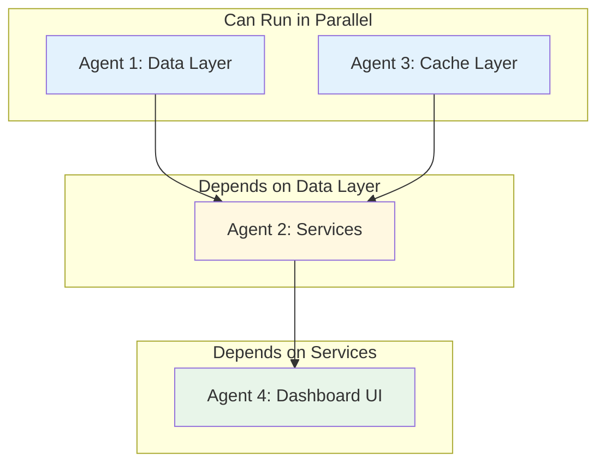
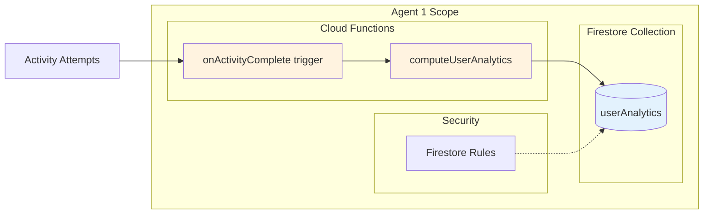
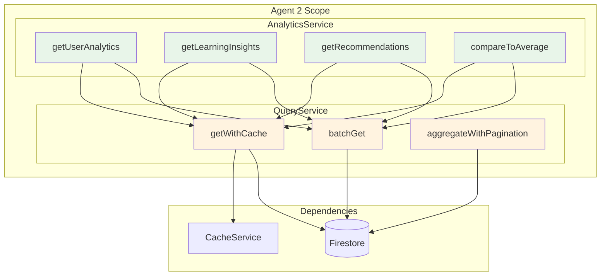
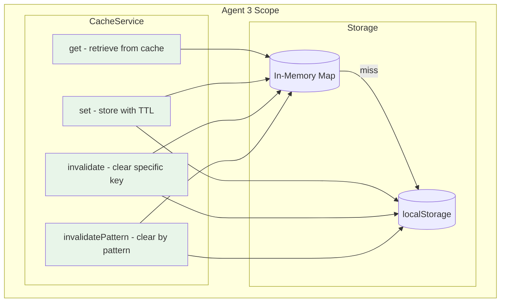
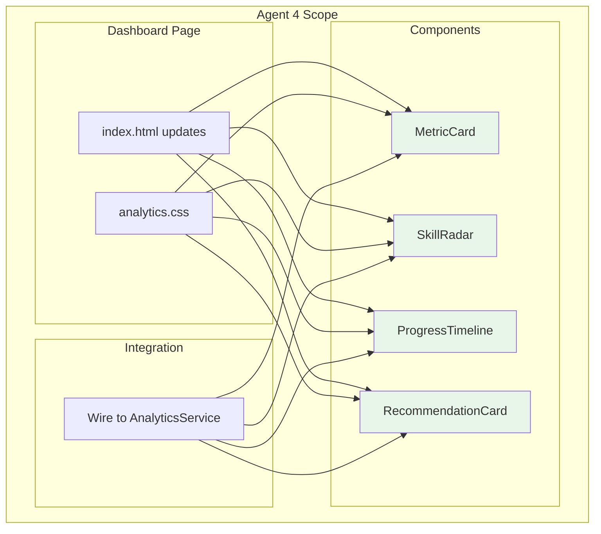

# Phase 1: Core Analytics Foundation

## Overview

Phase 1 establishes the analytics foundation that all other phases depend on. We build the data layer (Firestore collections, Cloud Functions), service layer (AnalyticsService, QueryService, CacheService), and the redesigned student dashboard.

## Dependency Diagram



## Execution Order

| Step | Agents | What They Build | Duration |
|------|--------|-----------------|----------|
| 1 | Agent 1 + Agent 3 | Data Layer + Cache Layer (parallel) | ~2 hours |
| 2 | Agent 2 | AnalyticsService + QueryService | ~2 hours |
| 3 | Agent 4 | Student Dashboard Redesign | ~3 hours |

---

## Agent 1: Data Layer (Firestore + Cloud Functions)

### What You're Building



### Prompt for Agent 1

````text
You are building the Data Layer for the SWE Hackers Analytics system.

## Context
Read @swe-hackers/diagrams_and_docs/analytics-community-architecture.md to understand the full system. You are implementing the "Data Model Architecture" section, specifically the UserAnalytics collection and the Cloud Functions that compute analytics.

## Your Deliverables

### 1. Firestore Collection Schema
Create the userAnalytics collection as documented. Location: Document this in `firebase-scripts/collections/user-analytics-schema.md`

### 2. Cloud Function: computeUserAnalytics
File: `firebase-functions/analytics/computeUserAnalytics.js`

This function:
- Takes a userId as input
- Queries the user's activityAttempts from the last 30 days
- Computes:
  - Learning style (based on performance by activity type)
  - Strength areas (topics with >80% score)
  - Growth areas (topics with <60% score)
  - Engagement patterns (preferred times, session length, consistency)
  - Persistence metrics (retry rates, improvement rates)
- Writes results to userAnalytics/{userId}

### 3. Cloud Function: onActivityComplete (Firestore trigger)
File: `firebase-functions/analytics/onActivityComplete.js`

This trigger:
- Fires when a new document is created in activityAttempts
- Calls computeUserAnalytics for that user
- Checks achievement criteria (delegate to achievement system later)

### 4. Firestore Security Rules
Update `firestore.rules` to add:
- Users can read their own userAnalytics
- Only Cloud Functions can write to userAnalytics

## Technical Requirements
- Use Firebase Admin SDK
- Handle errors gracefully with logging
- Include JSDoc comments
- Export functions properly for Firebase deployment

## Testing
Create a test script at `firebase-scripts/test-analytics-computation.js` that:
1. Creates mock activity data for a test user
2. Runs computeUserAnalytics
3. Verifies the output structure

## When Done
Report completion with:
- List of files created
- Any design decisions you made
- Console output from test script
````

---

## Agent 2: Services Layer (AnalyticsService + QueryService)

### What You're Building



### Prompt for Agent 2

````text
You are building the Services Layer for the SWE Hackers Analytics system.

## Context
Read @swe-hackers/diagrams_and_docs/analytics-community-architecture.md to understand the full system. Focus on the "Reusable Service Architecture" section. You are implementing AnalyticsService and QueryService.

**Important**: Agent 1 is building the Firestore collections and Cloud Functions. Agent 3 is building CacheService. Your services will use their work.

## Your Deliverables

### 1. QueryService
File: `courses/shared/js/services/query-service.js`

Implement these methods (see architecture doc for signatures):
- `getWithCache(collection, docId, ttlSeconds)` - Cache-first reads
- `batchGet(collection, docIds)` - Efficient batch fetching
- `aggregateWithPagination(query, pageSize)` - Paginated aggregation

The service should:
- Import CacheService (will exist at `courses/shared/js/services/cache-service.js`)
- Import Firebase from the existing `courses/shared/js/firebase-config.js`
- Handle offline gracefully (return cached data if available)

### 2. AnalyticsService
File: `courses/shared/js/services/analytics-service.js`

Implement these methods:
```javascript
const AnalyticsService = {
  // User Analytics
  async getUserAnalytics(userId) {},      // Fetch from userAnalytics collection
  async getLearningInsights(userId) {},   // Extract insights from analytics
  async getRecommendations(userId) {},    // Generate lesson recommendations
  
  // Comparisons
  async compareToAverage(userId, scope) {},  // Compare to course/cohort average
  async getPercentileRank(userId, metric) {} // Calculate percentile
};
```

### 3. Integration with Existing Code
- Import DataService patterns from `courses/shared/js/data-service.js`
- Follow the same coding style and patterns
- Export services to window object for global access

## Technical Requirements
- Use async/await throughout
- Include comprehensive error handling
- Add console logging with emoji prefixes (📊 for analytics)
- Include JSDoc comments for all public methods

## Testing
Add a test section at the bottom of analytics-service.js:
```javascript
// Manual testing - uncomment and run in console
// AnalyticsService.getUserAnalytics('test-user').then(console.log);
```

## When Done
Report completion with:
- List of files created
- Method signatures implemented
- Any assumptions about CacheService interface
````

---

## Agent 3: Cache Layer (CacheService)

### What You're Building



### Prompt for Agent 3

````text
You are building the Cache Layer for the SWE Hackers Analytics system.

## Context
Read @swe-hackers/diagrams_and_docs/analytics-community-architecture.md to understand the full system. Focus on the "Database Operation Patterns" section discussing caching.

## Your Deliverables

### 1. CacheService
File: `courses/shared/js/services/cache-service.js`

Implement a two-tier cache (memory + localStorage):

```javascript
const CacheService = {
  // In-memory cache for fastest access
  _memoryCache: new Map(),
  
  // Configuration
  DEFAULT_TTL: 300, // 5 minutes
  MEMORY_MAX_SIZE: 100, // Entries before LRU eviction
  
  // Core methods
  async get(key) {},           // Check memory, then localStorage
  async set(key, value, ttlSeconds) {}, // Store in both tiers
  async invalidate(key) {},    // Remove specific key
  async invalidatePattern(pattern) {}, // Remove keys matching pattern (e.g., 'user:*')
  
  // Utility methods
  isExpired(cacheEntry) {},    // Check if TTL exceeded
  pruneMemory() {},            // LRU eviction when over MEMORY_MAX_SIZE
  
  // Prefixes for namespacing
  PREFIXES: {
    USER_ANALYTICS: 'ua:',
    LEADERBOARD: 'lb:',
    COURSE_STATS: 'cs:'
  }
};
```

### 2. Cache Entry Structure
Each cached item should store:
```javascript
{
  value: <the actual data>,
  cachedAt: <timestamp>,
  ttl: <seconds until expiration>
}
```

### 3. localStorage Handling
- Use a single localStorage key: `swe_hackers_cache`
- Store as JSON object with all cache entries
- Handle localStorage quota errors gracefully (clear old entries)

## Technical Requirements
- Memory cache should be LRU (Least Recently Used)
- localStorage writes should be debounced (don't write on every set)
- Handle JSON parse errors gracefully
- Include console logging with 🗄️ prefix

## Testing
Create inline tests:
```javascript
// Test suite - run CacheService.runTests() in console
CacheService.runTests = async function() {
  console.log('🧪 Testing CacheService...');
  // Test set/get
  // Test expiration
  // Test invalidation
  // Test LRU eviction
};
```

## When Done
Report completion with:
- File created
- Test output
- Memory/localStorage behavior explanation
````

---

## Agent 4: Student Dashboard Redesign

### What You're Building



### Prompt for Agent 4

````text
You are building the Student Dashboard redesign for the SWE Hackers Analytics system.

## Context
Read @swe-hackers/diagrams_and_docs/analytics-community-architecture.md to understand the full system. Focus on the "Student Dashboard" section and the "Reusable Analytics Components" diagram.

**Important**: Agent 2 is building AnalyticsService which you'll use to fetch data. Design your components to work with the data structures in the architecture doc.

## Your Deliverables

### 1. Analytics Components
Create reusable components in `courses/shared/js/components/analytics/`:

#### MetricCard (`metric-card.js`)
```javascript
class MetricCard {
  constructor(container, options) {
    // options: { title, value, subtitle, icon, trend }
  }
  render() {}
  update(newValue) {}
}
```

#### SkillRadar (`skill-radar.js`)
A radar/spider chart showing skill levels across topics.
- Use Chart.js (already available) or build with SVG
- Should show: Variables, Loops, Functions, Recursion, etc.
- Color-coded: green (>80%), yellow (60-80%), red (<60%)

#### ProgressTimeline (`progress-timeline.js`)
A horizontal timeline showing learning milestones.
- Recent activities with timestamps
- Course completion markers
- Streak indicators

#### RecommendationCard (`recommendation-card.js`)
Displays a recommended next action.
- Shows: lesson title, why it's recommended, estimated time
- Click handler to navigate to lesson

### 2. Analytics CSS
File: `courses/shared/css/analytics.css`

Style all components with:
- Consistent card styling (shadows, borders, padding)
- Responsive grid layout
- Dark mode support (use CSS variables)
- Animations for updates (use anime.js patterns from existing code)

### 3. Dashboard Integration
Update `courses/dashboard/index.html` to:
- Import the new components
- Add an "Analytics" section with:
  - Row of MetricCards (Overall Score, Streak, Time Spent, Activities)
  - SkillRadar chart
  - ProgressTimeline
  - RecommendationCards (2-3 suggestions)
- Fetch data from AnalyticsService on load

### 4. Loading States
All components should handle:
- Loading state (skeleton/shimmer)
- Error state (friendly message)
- Empty state (no data yet)

## Technical Requirements
- Follow existing component patterns in the codebase
- Use anime.js for animations
- Components should be self-contained (no global dependencies except services)
- Mobile-responsive

## Mock Data
Until AnalyticsService is ready, use mock data:
```javascript
const mockAnalytics = {
  overallScore: 847,
  streak: 5,
  timeSpentMinutes: 2040,
  activitiesCompleted: 156,
  skillLevels: {
    variables: 0.94,
    loops: 0.88,
    functions: 0.85,
    recursion: 0.52,
    arrays: 0.76
  },
  recommendations: [
    { lesson: 'ch3-magnetism', reason: 'Strengthen recursion', time: 25 }
  ]
};
```

## When Done
Report completion with:
- List of files created
- Screenshot or description of the new dashboard section
- Any dependencies added
````

---

## Verification Checklist

After all agents complete, verify:

- [ ] `firebase-functions/analytics/computeUserAnalytics.js` exists and exports function
- [ ] `firebase-functions/analytics/onActivityComplete.js` exists and exports trigger
- [ ] `firestore.rules` updated with userAnalytics rules
- [ ] `courses/shared/js/services/cache-service.js` exists with all methods
- [ ] `courses/shared/js/services/query-service.js` exists with all methods
- [ ] `courses/shared/js/services/analytics-service.js` exists with all methods
- [ ] `courses/shared/js/components/analytics/` folder has 4 component files
- [ ] `courses/shared/css/analytics.css` exists
- [ ] `courses/dashboard/index.html` has new Analytics section
- [ ] Test scripts pass

## Next Phase

Once verified, proceed to:
- **Phase 2**: Leaderboards & Gamification
- **Phase 3**: Community & Matching (can run parallel with Phase 2)
- **Phase 5**: Educator Dashboards (can run parallel with Phase 2)
