# Blog System Architecture

## Current State Analysis


### The Problem

The blog listing page (`blog/index.html`) displays 7 articles:

| #        | Article Title                                                  | Link Status   |
| -------- | -------------------------------------------------------------- | ------------- |
| Featured | How We Built This Learning Platform in 30 Days with AI         | `href="#"` ❌ |
| 1        | Context Engineering: The Skill That Will Define Your AI Career | `href="#"` ❌ |
| 2        | Analyzing Detroit's Traffic Patterns with AI                   | `href="#"` ❌ |
| 3        | The Three Forces: Why We Teach Programming Through Metaphor    | `href="#"` ❌ |
| 4        | Introducing the Cognitive Progress Score                       | `href="#"` ❌ |
| 5        | From 10 Hours to 10 Minutes: Refactoring with Agentic AI       | `href="#"` ❌ |
| 6        | Meet Our Founding Learners                                     | `href="#"` ❌ |

**Result:** Clicking any article does nothing. Users experience a broken blog.

---

## Proposed Architecture


### Design Decisions

**Why Static HTML over Markdown/CMS?**

| Approach              | Pros                                                               | Cons                                           | Verdict                       |
| --------------------- | ------------------------------------------------------------------ | ---------------------------------------------- | ----------------------------- |
| **Static HTML**       | Full control, no build step, works with GitHub Pages, SEO-friendly | Manual article creation                        | ✅ **Best for current stage** |
| **Markdown + Parser** | Easy writing                                                       | Requires build step or JS parser, SEO concerns | Later phase                   |
| **Headless CMS**      | Non-technical editing                                              | Infrastructure complexity, API dependencies    | Enterprise phase              |

The current site is static HTML hosted on GitHub Pages. Staying consistent with this pattern means:

- Zero build configuration
- Instant deployment via git push
- Full SEO control with proper meta tags
- Mermaid.js diagrams work natively

---

## Article Data Flow


### Why `articles.json`?

A central registry enables:

1. **Dynamic Index Page** - The blog listing can render from JSON, making it easy to add new articles without editing `index.html`
2. **Related Articles** - Article pages can show "Read Next" suggestions by querying the JSON
3. **Category Filtering** - Future feature: filter by AI Workflows, Local Research, etc.
4. **RSS Feed Generation** - JSON can be transformed to RSS
5. **Search** - Client-side search across article metadata

---

## File Structure (Proposed)


### Naming Convention

Article files use **kebab-case slugs**:

```
[descriptive-slug].html
```

**Examples:**

- `building-platform-30-days.html` ← Featured article
- `context-engineering.html` ← AI Workflows
- `detroit-traffic-ai.html` ← Local Research

**Rules:**

1. Lowercase only
2. Hyphens separate words
3. Max 5 words (40 chars)
4. No dates in filename (dates live in JSON metadata)

---

## Article Template Structure


### Article Sections

| Section              | Purpose                       | Implementation                                     |
| -------------------- | ----------------------------- | -------------------------------------------------- |
| **Header**           | Grab attention, show metadata | Title, emoji icon, category badge, date, read time |
| **Hero Image**       | Visual interest (optional)    | ``                 |
| **Content**          | Main article body             | Standard HTML + Mermaid code blocks                |
| **Code Blocks**      | Syntax-highlighted code       | `<pre><code class="language-python">`              |
| **Mermaid Diagrams** | Visual explanations           | `<pre class="mermaid">` blocks                     |
| **Callouts**         | Highlight key points          | `<aside class="callout callout-info">`             |
| **Footer**           | Engagement                    | Tags, share buttons, author bio                    |
| **Related**          | Keep users reading            | 3 related articles from same category              |

---

## articles.json Schema


### Example JSON

```json
{
  "articles": [
    {
      "slug": "building-platform-30-days",
      "title": "How We Built This Learning Platform in 30 Days with AI",
      "excerpt": "A behind-the-scenes look at building AutoNateAI — from architecture decisions to AI-assisted coding.",
      "category": "Platform Updates",
      "date": "2026-01-04",
      "readTime": 12,
      "icon": "🏗️",
      "featured": true,
      "tags": ["ai", "development", "cursor", "architecture"]
    },
    {
      "slug": "context-engineering",
      "title": "Context Engineering: The Skill That Will Define Your AI Career",
      "excerpt": "Prompt engineering was just the beginning. Learn why context engineering is the real differentiator.",
      "category": "AI Workflows",
      "date": "2025-12-28",
      "readTime": 8,
      "icon": "🤖",
      "featured": false,
      "tags": ["ai", "prompts", "context", "career"]
    }
  ]
}
```

---

## Blog Index Page Flow


### Dynamic Rendering Benefits

1. **Single Source of Truth** - Add article to JSON, it appears on index
2. **No Index Editing** - `index.html` becomes a shell that JS populates
3. **Filtering Ready** - Category buttons can filter without page reload
4. **Easy Sorting** - Sort by date, read time, or popularity

---

## SEO & Social Sharing


### Article OG Image Strategy

Each article should have a preview image for social sharing:

| Option           | Approach                                    | Effort         |
| ---------------- | ------------------------------------------- | -------------- |
| **Default**      | Use site OG image for all articles          | Zero effort    |
| **Per-Category** | One image per category (AI, Research, etc.) | 5 images       |
| **Per-Article**  | Custom hero image per article               | Most impactful |

**Recommendation:** Start with default, upgrade to per-category once content stabilizes.

---

## Implementation Phases


---

## Adding a New Article (Workflow)

There are two ways to create articles: **Manual** (copy template) or **AI-Assisted** (Cursor rule).

### Option A: Manual Workflow

```mermaid
flowchart TB
    subgraph Workflow["📝 Manual Article Workflow"]
        S1["1️⃣ Copy article-template.html"]
        S2["2️⃣ Rename to slug.html"]
        S3["3️⃣ Update meta tags"]
        S4["4️⃣ Fill content manually"]
        S5["5️⃣ Add to articles.json"]
        S6["6️⃣ git push → Live!"]
    end

    S1 --> S2 --> S3 --> S4 --> S5 --> S6

    style Workflow fill:#1a1a2e,stroke:#66bb6a,stroke-width:2px,color:#fff
```



### Option B: AI-Assisted Storytelling Workflow (Recommended)

```mermaid
flowchart TB
    subgraph Discovery["🎯 Discovery Phase"]
        D1["Invoke @create-blog rule"]
        D2["AI asks about topic"]
        D3["AI asks about audience"]
        D4["AI asks about key points"]
        D5["AI asks about desired blocks"]
        D6["AI asks about protagonist"]
    end

    subgraph Creation["✍️ Creation Phase"]
        C1["AI crafts story arc"]
        C2["AI selects block types"]
        C3["AI writes narrative content"]
        C4["AI generates diagrams"]
        C5["AI adds animations"]
        C6["AI outputs complete HTML"]
    end

    subgraph Refinement["🔄 Refinement Phase"]
        R1["Review in browser"]
        R2["Request changes conversationally"]
        R3["AI iterates on specific blocks"]
        R4["Finalize and approve"]
    end

    subgraph Publish["🚀 Publish Phase"]
        P1["AI adds to articles.json"]
        P2["git push → Live!"]
    end

    Discovery --> Creation --> Refinement --> Publish

    style Discovery fill:#1a1a2e,stroke:#4a9eff,stroke-width:2px,color:#fff
    style Creation fill:#2d1f47,stroke:#9c27b0,stroke-width:2px,color:#fff
    style Refinement fill:#0f3460,stroke:#ffd54f,stroke-width:2px,color:#fff
    style Publish fill:#1a472a,stroke:#66bb6a,stroke-width:2px,color:#fff
```



### The Storytelling Philosophy

Every blog post is a **story** where the reader is the **protagonist**. The AI guides them through:

```mermaid
flowchart LR
    subgraph Story["📖 Story Arc"]
        A1["🌅 The Hook<br/><em>Relatable problem</em>"]
        A2["🔥 The Struggle<br/><em>Failed attempts</em>"]
        A3["💡 The Discovery<br/><em>Key insight</em>"]
        A4["🛠️ The Journey<br/><em>Step-by-step</em>"]
        A5["🏆 The Triumph<br/><em>Transformation</em>"]
        A6["🚀 The Call<br/><em>Reader's next step</em>"]
    end

    A1 --> A2 --> A3 --> A4 --> A5 --> A6

    style Story fill:#1a1a2e,stroke:#ff6b6b,stroke-width:2px,color:#fff
```



| Story Beat        | Purpose                 | Example                                                              |
| ----------------- | ----------------------- | -------------------------------------------------------------------- |
| **The Hook**      | Make them feel seen     | "You've tried learning AI tools 5 times. Each time, you hit a wall." |
| **The Struggle**  | Build empathy           | "Copy-paste prompts. Generic outputs. Frustration."                  |
| **The Discovery** | Introduce the insight   | "Then I realized: it's not about prompts. It's about context."       |
| **The Journey**   | Teach through narrative | "Here's exactly what I did..." (with diagrams, code, visuals)        |
| **The Triumph**   | Show transformation     | "Now my AI outputs are 10x better. Here's proof."                    |
| **The Call**      | Invite action           | "Ready to try? Start with this one exercise..."                      |

---

## Block Component Library

Each blog is composed of **blocks** — modular components that can be mixed freely while maintaining AutoNateAI branding.


### Block Composition Rules

| Rule             | Description                                                   |
| ---------------- | ------------------------------------------------------------- |
| **Never stack**  | Don't put 3+ text blocks in a row — break with visual         |
| **Rhythm**       | Alternate between dense (text/code) and light (image/diagram) |
| **Entrance**     | Every block has an anime.js entrance animation                |
| **Scroll-aware** | Animations trigger on scroll into viewport                    |
| **Mobile-first** | All blocks responsive, touch-friendly                         |

---

## AI Discovery Questions

When you invoke the `@create-blog` Cursor rule, it will ask:


---

## Example: Block Composition

Here's how a blog might be composed from blocks:

```
┌─────────────────────────────────────────┐
│           HERO BLOCK                    │
│  "Context Engineering: The Skill..."    │
│  Category badge | Date | Read time      │
│  Animated particles background          │
└─────────────────────────────────────────┘

┌─────────────────────────────────────────┐
│           TEXT BLOCK (Lead)             │
│  "You've copied prompts from Twitter.   │
│   Pasted them into ChatGPT. And got...  │
│   garbage. Sound familiar?"             │
└─────────────────────────────────────────┘

┌─────────────────────────────────────────┐
│           POLL BLOCK                    │
│  "How many times have you tried to      │
│   'learn AI tools' and given up?"       │
│  ○ 1-2 times  ○ 3-5 times  ○ 6+ times  │
└─────────────────────────────────────────┘

┌─────────────────────────────────────────┐
│           MERMAID BLOCK                 │
│  ┌──────────┐     ┌──────────┐         │
│  │ Prompts  │ vs  │ Context  │         │
│  └──────────┘     └──────────┘         │
│  (Interactive diagram with hover)       │
└─────────────────────────────────────────┘

┌─────────────────────────────────────────┐
│           TEXT BLOCK                    │
│  "The difference isn't what you ask.    │
│   It's what you provide BEFORE asking." │
└─────────────────────────────────────────┘

┌─────────────────────────────────────────┐
│         COMPARISON BLOCK                │
│  ┌─────────────┐  ┌─────────────┐       │
│  │ ❌ BAD      │  │ ✅ GOOD     │       │
│  │ "Fix bug"   │  │ [context... │       │
│  │             │  │  + request] │       │
│  └─────────────┘  └─────────────┘       │
└─────────────────────────────────────────┘

┌─────────────────────────────────────────┐
│           STATS BLOCK                   │
│     3x              85%          10min  │
│  Productivity    Accuracy      Saved    │
│  (Count-up animation on scroll)         │
└─────────────────────────────────────────┘

┌─────────────────────────────────────────┐
│           CTA BLOCK                     │
│  "Ready to master context engineering?" │
│  [Start the Course →]                   │
└─────────────────────────────────────────┘

┌─────────────────────────────────────────┐
│         RELATED BLOCK                   │
│  ┌─────┐ ┌─────┐ ┌─────┐               │
│  │ 📝  │ │ 📝  │ │ 📝  │               │
│  └─────┘ └─────┘ └─────┘               │
│  3 related articles from same category  │
└─────────────────────────────────────────┘
```

---

## Cursor Rule: `@create-blog`

The rule lives at: `autonateai-cursor-rules/.cursor/rules/create-blog.mdc`

It contains:

1. **Discovery prompts** — Questions to ask the user
2. **Block library reference** — HTML/CSS for each block type
3. **Storytelling framework** — The 6-beat arc structure
4. **Brand guidelines** — Colors, fonts, animation timing
5. **Output instructions** — Where to save, JSON registry update

### Checklist for New Articles

```markdown
## New Article Checklist

- [ ] Copy `article-template.html` to `blog/[slug].html`
- [ ] Update `<title>` tag
- [ ] Update `<meta name="description">`
- [ ] Update all `og:` meta tags
- [ ] Update all `twitter:` meta tags
- [ ] Set article title in `<h1>`
- [ ] Set category badge
- [ ] Set date and read time
- [ ] Write article content
- [ ] Add Mermaid diagrams if applicable
- [ ] Add entry to `articles.json`
- [ ] Test locally
- [ ] Commit and push
```

---

## CSS Component Classes


---

## Related Articles Component


### Related Articles Logic

```javascript
function getRelatedArticles(currentSlug, allArticles, limit = 3) {
  const current = allArticles.find((a) => a.slug === currentSlug);
  if (!current) return [];

  return allArticles
    .filter((a) => a.slug !== currentSlug)
    .filter(
      (a) =>
        a.category === current.category ||
        a.tags.some((t) => current.tags.includes(t))
    )
    .sort((a, b) => new Date(b.date) - new Date(a.date))
    .slice(0, limit);
}
```

---

## Future Enhancements


---

## Summary: What Gets Built

| File                                  | Purpose                              |
| ------------------------------------- | ------------------------------------ |
| `blog/articles.json`                  | Central article registry             |
| `blog/article-template.html`          | Copy this for new articles           |
| `shared/css/blog.css`                 | Article page styles                  |
| `shared/js/blog.js`                   | Dynamic rendering + related articles |
| `blog/building-platform-30-days.html` | Featured article                     |
| `blog/context-engineering.html`       | AI Workflows article                 |
| `blog/detroit-traffic-ai.html`        | Local Research article               |
| `blog/three-forces-metaphor.html`     | Learning Tips article                |
| `blog/cognitive-progress-score.html`  | Platform Updates article             |
| `blog/refactoring-agentic-ai.html`    | AI Workflows article                 |
| `blog/founding-learners.html`         | Community article                    |

---

## Decision: Static HTML with JSON Registry

This architecture:

✅ **Fits current stack** — Static HTML, GitHub Pages, no build step  
✅ **SEO-friendly** — Full meta tags, no client-side rendering issues  
✅ **Easy to author** — Copy template, fill content, add to JSON  
✅ **Mermaid-native** — Diagrams render without extra config  
✅ **Scalable path** — Can migrate to markdown/CMS later  
✅ **Team-friendly** — Anyone can add articles via git

The JSON registry adds just enough abstraction to avoid editing `index.html` for every new article while keeping the simplicity of static HTML.

---

## Next Steps

1. **Create `articles.json`** with the 7 article entries
2. **Create `shared/css/blog.css`** for article styling
3. **Create `shared/js/blog.js`** for dynamic index rendering
4. **Build `article-template.html`** as the base template
5. **Create the 7 article HTML files** with real content
6. **Update `blog/index.html`** to render from JSON
7. **Test all links and SEO meta tags**
