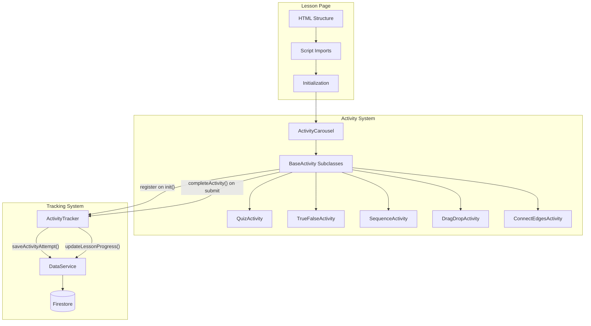
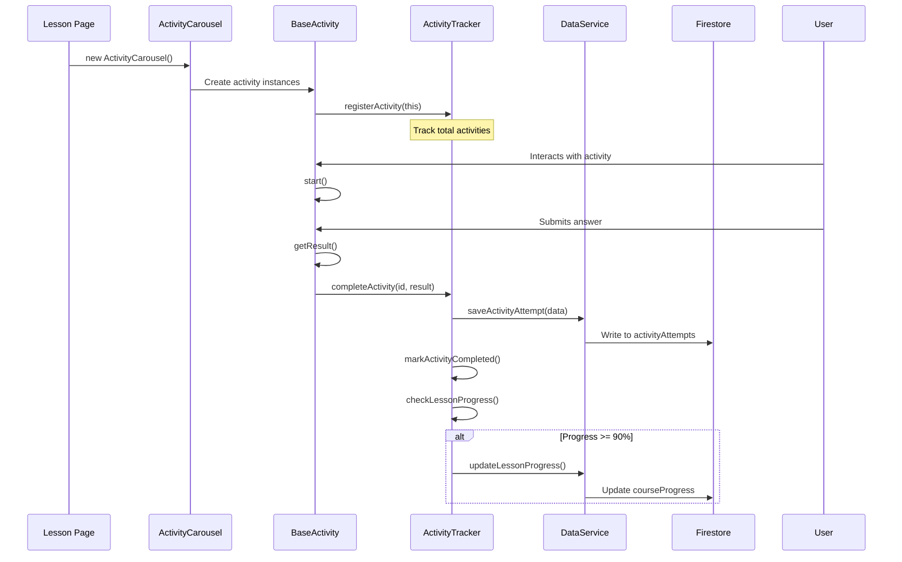

# Lesson Page Migration Guide

## Overview

This guide documents the migration of lesson pages to the new unified activity and progress tracking system. The goal is to standardize all lesson pages across 5 courses to use:

1. **BaseActivity + ActivityCarousel** for all interactive activities
2. **ActivityTracker** for logging attempts and tracking progress
3. **Proper initialization order** for Firebase, Auth, and tracking
4. **Correct lesson structure** (Activities before Quiz)

---

## Architecture Summary



---

## Required Changes Per Lesson Page

### 1. Script Imports (in `<head>`)

Ensure ALL of these scripts are included in order:

```html
<!-- Firebase SDK -->
<script src="https://www.gstatic.com/firebasejs/10.7.1/firebase-app-compat.js"></script>
<script src="https://www.gstatic.com/firebasejs/10.7.1/firebase-auth-compat.js"></script>
<script src="https://www.gstatic.com/firebasejs/10.7.1/firebase-firestore-compat.js"></script>

<!-- Firebase & Data Services -->
<script src="../../shared/js/firebase-config.js"></script>
<script src="../../shared/js/auth.js"></script>
<script src="../../shared/js/data-service.js"></script>
<script src="../../shared/js/activity-tracker.js"></script>

<!-- Activity Carousel System -->
<script src="../../shared/js/interactive/base-activity.js"></script>
<script src="../../shared/js/interactive/activities/quiz-activity.js"></script>
<script src="../../shared/js/interactive/activities/true-false-activity.js"></script>
<script src="../../shared/js/interactive/activities/fill-blank-activity.js"></script>
<script src="../../shared/js/interactive/activities/sequence-activity.js"></script>
<script src="../../shared/js/interactive/activities/drag-drop-activity.js"></script>
<script src="../../shared/js/interactive/activities/connect-edges-activity.js"></script>
<script src="../../shared/js/interactive/activities/scenario-activity.js"></script>
<script src="../../shared/js/interactive/activities/prediction-activity.js"></script>
<script src="../../shared/js/interactive/activities/reflection-activity.js"></script>
<script src="../../shared/js/interactive/activities/graph-builder-activity.js"></script>
<script src="../../shared/js/interactive/activity-carousel.js"></script>
```

**REMOVE** the old quiz-system.js if present:
```html
<!-- REMOVE THIS LINE -->
<script src="../../shared/js/interactive/quiz-system.js"></script>
```

### 2. Initialization Order (in DOMContentLoaded)

```javascript
document.addEventListener('DOMContentLoaded', async () => {
  // 1. Initialize Firebase FIRST
  if (window.FirebaseApp) {
    window.FirebaseApp.init();
    console.log('✅ Firebase initialized');
  }
  
  // 2. Initialize AuthService and WAIT for auth state
  if (window.AuthService) {
    window.AuthService.init();
    await window.AuthService.waitForAuthState();
    console.log('👤 Auth ready:', window.AuthService.getUser()?.email || 'not signed in');
  }
  
  // 3. Initialize ActivityTracker AFTER auth is ready
  const courseId = document.body.dataset.course;
  const lessonId = document.body.dataset.lesson;
  if (courseId && lessonId && window.ActivityTracker) {
    ActivityTracker.init(courseId, lessonId);
    console.log('🎯 ActivityTracker initialized:', courseId, lessonId);
  }
  
  // 4. Initialize activity carousels (they will register with ActivityTracker)
  // ... ActivityCarousel initialization code ...
});
```

### 3. HTML Structure (Activities BEFORE Quiz)

**OLD structure (wrong):**
```html
<section class="section">
  <div class="diagram-container">...</div>
  
  <!-- Quiz was BEFORE activities - WRONG -->
  <div class="quiz-card" id="story-quiz">...</div>
  
  <div class="activity-carousels">
    <div id="story-comprehension"></div>
    <div id="story-application"></div>
    <div id="story-synthesis"></div>
  </div>
</section>
```

**NEW structure (correct):**
```html
<section class="section">
  <div class="diagram-container">...</div>
  
  <!-- Activities FIRST, Quiz LAST -->
  <div class="activity-carousels">
    <div id="story-comprehension" class="carousel-container"></div>
    <div id="story-application" class="carousel-container"></div>
    <div id="story-synthesis" class="carousel-container"></div>
    <div id="story-quiz" class="carousel-container"></div>
  </div>
</section>
```

### 4. Quiz Initialization (Replace old Quiz with ActivityCarousel)

**OLD code:**
```javascript
// OLD - using Quiz class
const storyToQuiz = {
  'story-id': 'story-quiz'
};
pageData.quizzes.forEach(quiz => {
  const containerId = storyToQuiz[quiz.storyId];
  if (!containerId) return;
  new Quiz(containerId, quiz.questions);
});
```

**NEW code:**
```javascript
// NEW - using ActivityCarousel with QuizActivity
const storyToQuizContainer = {
  'story-id': 'story-quiz'
};
pageData.quizzes.forEach(quiz => {
  const containerId = storyToQuizContainer[quiz.storyId];
  if (!containerId) return;
  
  // Transform quiz questions to ActivityCarousel format
  const quizActivities = quiz.questions.map((q, i) => ({
    type: 'quiz',
    id: `${quiz.storyId}-quiz-${i + 1}`,
    question: q.question,
    options: q.options,
    correct: q.correct,
    explanation: q.explanation
  }));
  
  new ActivityCarousel(containerId, {
    type: 'knowledge-check',
    sectionId: quiz.storyId,
    title: '📝 Knowledge Check',
    activities: quizActivities
  });
});
```

---

## Data Flow



---

## Progress Tracking

The system automatically tracks:

1. **Per Activity:**
   - Each attempt logged to `users/{uid}/activityAttempts`
   - Score, time spent, response data
   - Attempt number (allows multiple attempts)

2. **Per Lesson:**
   - Activities completed / total
   - Percent complete
   - Lesson marked complete at 90% threshold

3. **Per Course:**
   - Aggregated stats by activity type
   - Total attempts, average scores
   - Last activity timestamp

---

## Console Logs to Verify

When properly configured, you should see these logs:

```
✅ Firebase initialized
👤 Auth ready: user@email.com
🎯 ActivityTracker initialized: {activities: 0, cachedAnswers: 0}
🎠 ActivityCarousel initialized: story-comprehension {type: 'comprehension', activities: 6}
🎯 Activity registered: quiz-1 (1 total)
🎯 Activity registered: quiz-2 (2 total)
... (more registrations)

// When submitting an activity:
🎯 Activity started: quiz-1
🎯 Activity submitted: quiz-1 {correct: true, score: 1, ...}
🎯 Completing activity: {activityId: 'quiz-1', ...}
📊 Activity attempt saved: quiz-1
📊 Activity stats updated for: course-name
🎯 Attempt saved to Firestore: quiz-1
🎯 Lesson progress: 1/54 (2%)

// When reaching 90%:
🎯 Lesson progress: 49/54 (91%)
🎉 Lesson complete! Updating progress...
🎯 Lesson progress saved to Firestore
```

---

## Parallel Agent Prompts

Use these prompts to spin up multiple Cursor agents to migrate lessons in parallel.

### Agent 1: Apprentice Course

```
@upgrade-lesson-activities

Migrate ALL Apprentice course lessons to the new activity tracking system.

Course path: courses/apprentice/
Lessons (7 total - DO NOT SKIP ANY):
- ch0-origins (intro chapter - HAS ACTIVITIES)
- ch1-stone
- ch2-lightning
- ch3-magnetism
- ch4-architect
- ch5-capstone1
- ch6-capstone2

For EACH lesson (index.html):

1. SCRIPT IMPORTS - Ensure these are present (add if missing):
   - Firebase SDK scripts (firebase-app-compat, firebase-auth-compat, firebase-firestore-compat)
   - firebase-config.js, auth.js, data-service.js, activity-tracker.js
   - All activity type scripts (base-activity.js, quiz-activity.js, etc.)
   - activity-carousel.js
   - REMOVE quiz-system.js if present

2. INITIALIZATION ORDER - Fix DOMContentLoaded to:
   - FirebaseApp.init() FIRST
   - AuthService.init() + await waitForAuthState() SECOND
   - ActivityTracker.init(courseId, lessonId) THIRD
   - ActivityCarousel initialization LAST

3. HTML STRUCTURE - For each story section:
   - Move quiz-card HTML to AFTER activity-carousels
   - OR replace quiz-card with carousel-container inside activity-carousels

4. QUIZ INITIALIZATION - Replace old Quiz() calls with ActivityCarousel:
   - Transform quiz.questions to ActivityCarousel format
   - Add type: 'quiz', id: 'unique-id' to each question
   - Use new ActivityCarousel(containerId, { type: 'knowledge-check', ... })

Test by verifying console shows:
- ✅ Firebase initialized
- 👤 Auth ready
- 🎯 ActivityTracker initialized
- 🎯 Activity registered (multiple)
- 🎯 Completing activity (on submit)
- 📊 Activity attempt saved
```

### Agent 2: Junior Course

```
@upgrade-lesson-activities

Migrate ALL Junior course lessons to the new activity tracking system.

Course path: courses/junior/
Lessons (7 total - DO NOT SKIP ANY):
- ch0-origins (intro chapter - HAS ACTIVITIES)
- ch1-stone
- ch2-lightning
- ch3-magnetism
- ch4-architect
- ch5-capstone1
- ch6-capstone2

For EACH lesson (index.html):

1. SCRIPT IMPORTS - Ensure these are present (add if missing):
   - Firebase SDK scripts (firebase-app-compat, firebase-auth-compat, firebase-firestore-compat)
   - firebase-config.js, auth.js, data-service.js, activity-tracker.js
   - All activity type scripts (base-activity.js, quiz-activity.js, etc.)
   - activity-carousel.js
   - REMOVE quiz-system.js if present

2. INITIALIZATION ORDER - Fix DOMContentLoaded to:
   - FirebaseApp.init() FIRST
   - AuthService.init() + await waitForAuthState() SECOND
   - ActivityTracker.init(courseId, lessonId) THIRD
   - ActivityCarousel initialization LAST

3. HTML STRUCTURE - For each story section:
   - Move quiz-card HTML to AFTER activity-carousels
   - OR replace quiz-card with carousel-container inside activity-carousels

4. QUIZ INITIALIZATION - Replace old Quiz() calls with ActivityCarousel:
   - Transform quiz.questions to ActivityCarousel format
   - Add type: 'quiz', id: 'unique-id' to each question
   - Use new ActivityCarousel(containerId, { type: 'knowledge-check', ... })

Test by verifying console shows:
- ✅ Firebase initialized
- 👤 Auth ready
- 🎯 ActivityTracker initialized
- 🎯 Activity registered (multiple)
- 🎯 Completing activity (on submit)
- 📊 Activity attempt saved
```

### Agent 3: Senior Course

```
@upgrade-lesson-activities

Migrate ALL Senior course lessons to the new activity tracking system.

Course path: courses/senior/
Lessons (7 total - DO NOT SKIP ANY):
- ch0-origins (intro chapter - HAS ACTIVITIES)
- ch1-stone
- ch2-lightning
- ch3-magnetism
- ch4-architect
- ch5-capstone1
- ch6-capstone2

For EACH lesson (index.html):

1. SCRIPT IMPORTS - Ensure these are present (add if missing):
   - Firebase SDK scripts (firebase-app-compat, firebase-auth-compat, firebase-firestore-compat)
   - firebase-config.js, auth.js, data-service.js, activity-tracker.js
   - All activity type scripts (base-activity.js, quiz-activity.js, etc.)
   - activity-carousel.js
   - REMOVE quiz-system.js if present

2. INITIALIZATION ORDER - Fix DOMContentLoaded to:
   - FirebaseApp.init() FIRST
   - AuthService.init() + await waitForAuthState() SECOND
   - ActivityTracker.init(courseId, lessonId) THIRD
   - ActivityCarousel initialization LAST

3. HTML STRUCTURE - For each story section:
   - Move quiz-card HTML to AFTER activity-carousels
   - OR replace quiz-card with carousel-container inside activity-carousels

4. QUIZ INITIALIZATION - Replace old Quiz() calls with ActivityCarousel:
   - Transform quiz.questions to ActivityCarousel format
   - Add type: 'quiz', id: 'unique-id' to each question
   - Use new ActivityCarousel(containerId, { type: 'knowledge-check', ... })

Test by verifying console shows:
- ✅ Firebase initialized
- 👤 Auth ready
- 🎯 ActivityTracker initialized
- 🎯 Activity registered (multiple)
- 🎯 Completing activity (on submit)
- 📊 Activity attempt saved
```

### Agent 4: Undergrad Course

```
@upgrade-lesson-activities

Migrate ALL Undergrad course lessons to the new activity tracking system.

Course path: courses/undergrad/
Lessons (7 total - DO NOT SKIP ANY):
- ch0-origins (intro chapter - HAS ACTIVITIES)
- ch1-stone
- ch2-lightning
- ch3-magnetism
- ch4-architect
- ch5-capstone1
- ch6-capstone2

For EACH lesson (index.html):

1. SCRIPT IMPORTS - Ensure these are present (add if missing):
   - Firebase SDK scripts (firebase-app-compat, firebase-auth-compat, firebase-firestore-compat)
   - firebase-config.js, auth.js, data-service.js, activity-tracker.js
   - All activity type scripts (base-activity.js, quiz-activity.js, etc.)
   - activity-carousel.js
   - REMOVE quiz-system.js if present

2. INITIALIZATION ORDER - Fix DOMContentLoaded to:
   - FirebaseApp.init() FIRST
   - AuthService.init() + await waitForAuthState() SECOND
   - ActivityTracker.init(courseId, lessonId) THIRD
   - ActivityCarousel initialization LAST

3. HTML STRUCTURE - For each story section:
   - Move quiz-card HTML to AFTER activity-carousels
   - OR replace quiz-card with carousel-container inside activity-carousels

4. QUIZ INITIALIZATION - Replace old Quiz() calls with ActivityCarousel:
   - Transform quiz.questions to ActivityCarousel format
   - Add type: 'quiz', id: 'unique-id' to each question
   - Use new ActivityCarousel(containerId, { type: 'knowledge-check', ... })

Test by verifying console shows:
- ✅ Firebase initialized
- 👤 Auth ready
- 🎯 ActivityTracker initialized
- 🎯 Activity registered (multiple)
- 🎯 Completing activity (on submit)
- 📊 Activity attempt saved
```

### Agent 5: Endless Opportunities Course

```
@upgrade-lesson-activities

Migrate ALL Endless Opportunities course lessons to the new activity tracking system.

Course path: courses/endless-opportunities/
Lessons (5 total - DO NOT SKIP ANY):
- week0-intro (intro week - HAS ACTIVITIES)
- week1-questions (ALREADY MIGRATED - use as reference)
- week2-data
- week3-building
- week4-portfolio

NOTE: week1-questions has already been migrated. Use it as a reference for the correct pattern.

For EACH lesson (index.html) EXCEPT week1-questions:

1. SCRIPT IMPORTS - Ensure these are present (add if missing):
   - Firebase SDK scripts (firebase-app-compat, firebase-auth-compat, firebase-firestore-compat)
   - firebase-config.js, auth.js, data-service.js, activity-tracker.js
   - All activity type scripts (base-activity.js, quiz-activity.js, etc.)
   - activity-carousel.js
   - REMOVE quiz-system.js if present

2. INITIALIZATION ORDER - Fix DOMContentLoaded to:
   - FirebaseApp.init() FIRST
   - AuthService.init() + await waitForAuthState() SECOND
   - ActivityTracker.init(courseId, lessonId) THIRD
   - ActivityCarousel initialization LAST

3. HTML STRUCTURE - For each story section:
   - Move quiz-card HTML to AFTER activity-carousels
   - OR replace quiz-card with carousel-container inside activity-carousels

4. QUIZ INITIALIZATION - Replace old Quiz() calls with ActivityCarousel:
   - Transform quiz.questions to ActivityCarousel format
   - Add type: 'quiz', id: 'unique-id' to each question
   - Use new ActivityCarousel(containerId, { type: 'knowledge-check', ... })

Test by verifying console shows:
- ✅ Firebase initialized
- 👤 Auth ready
- 🎯 ActivityTracker initialized
- 🎯 Activity registered (multiple)
- 🎯 Completing activity (on submit)
- 📊 Activity attempt saved
```

---

## Verification Checklist

After migration, verify each lesson page:

- [ ] Firebase initializes without errors
- [ ] Auth state resolves (user email shown or "not signed in")
- [ ] ActivityTracker initializes with correct courseId/lessonId
- [ ] All activities register (check total count)
- [ ] Submitting an activity shows "Completing activity" log
- [ ] Activity attempt saves to Firestore (check Firebase console)
- [ ] Progress percentage updates after each activity
- [ ] No JavaScript errors in console

---

## Troubleshooting

### ActivityTracker is undefined
- Missing `activity-tracker.js` script import
- Script order is wrong (must be after data-service.js)

### User not authenticated
- AuthService.init() not called
- Not awaiting waitForAuthState()
- Firebase not initialized first

### Activities not registering
- ActivityCarousel created before ActivityTracker.init()
- Fix initialization order

### Progress not updating
- ActivityTracker.completeActivity() not being called
- Check if BaseActivity has the correct version with AT integration

### Lesson progress not saving to Firestore
- DataService.updateLessonProgress() failing
- Check Firestore rules allow writes

---

## Files Modified in This Migration

Core system files:
- `courses/shared/js/activity-tracker.js` - Added progress tracking
- `courses/shared/js/interactive/base-activity.js` - Added AT registration

Lesson pages (per course):
- `courses/{course}/{lesson}/index.html` - Script imports, init order, HTML structure, quiz init
