# Marketing Site Architecture

## The Vision

```mermaid
flowchart LR
    subgraph Current["📄 Current State"]
        L1[Landing Page] --> C1[Course Cards]
        C1 --> A1[Auth → Dashboard]
    end

    subgraph Future["🚀 Future State"]
        L2[Marketing Landing Page] --> M2[Full Platform Showcase]
        M2 --> N2[Blog / Consulting / Enterprise]
        N2 --> A2[Auth → Dashboard]
        L2 --> S2[Social Share Previews 🖼️]
    end

    style C1 fill:#ff6b6b,stroke:#c92a2a,color:#fff
    style M2 fill:#51cf66,stroke:#2f9e44,color:#fff
    style S2 fill:#ffd54f,stroke:#f59f00,color:#000
```



### The Story: From Course List to Platform Marketing

Right now, when someone lands on `autonateai.com`, they see course cards and a Discord link. That's fine for people who already know what AutoNateAI is — but what about the first-time visitor?

They're thinking:
- "What IS this platform?"
- "Why should I learn here instead of YouTube or Udemy?"
- "What makes this different?"
- "Can this help my company/school?"

The new landing page needs to **sell the experience**, not just list the courses. We need to show:

1. **The Platform** — Beautiful dashboard, progress tracking, analytics
2. **The Content** — Interactive lessons, animations, the "Three Forces" narrative
3. **The Community** — Discord, daily challenges, leaderboards
4. **The Business** — Consulting, enterprise partnerships, custom courses

Plus, when someone shares the link on iMessage, LinkedIn, or Twitter, they should see a beautiful preview image — not a blank card.

---

## Site Structure

```mermaid
flowchart TB
    subgraph Public["🌐 Public Pages (Unauthenticated)"]
        Home["🏠 Landing Page
        autonateai.com"]
        
        Blog["📝 Blog
        /blog"]
        
        Consulting["💼 Consulting
        /consulting"]
        
        Enterprise["🏢 Enterprise & Education
        /enterprise"]
        
        Challenges["⚡ Daily Challenges
        /challenges"]
        
        CourseDetail["📚 Course Details
        /course/{id}.html"]
    end

    subgraph Auth["🔐 Authentication"]
        Login["Login Page
        /auth/login.html"]
        
        Register["Register Page
        /auth/register.html"]
    end

    subgraph Private["🔒 Authenticated Dashboard"]
        Dashboard["📊 Main Dashboard
        /dashboard/"]
        
        CourseDash["📈 Course Dashboard
        /dashboard/course.html?id=X"]
        
        Lessons["📖 Lesson Pages
        /{course}/{chapter}/"]
    end

    Home --> Blog
    Home --> Consulting
    Home --> Enterprise
    Home --> Challenges
    Home --> CourseDetail
    CourseDetail --> Login
    Login --> Dashboard
    Dashboard --> CourseDash
    CourseDash --> Lessons
```



### The Story: A Visitor's Journey

**Sarah** is a junior developer at a startup. She sees a LinkedIn post about AutoNateAI and clicks the link.

1. **Landing Page** → She sees a stunning hero section with animated elements. Screenshots show a beautiful dashboard with analytics. She's intrigued.

2. **Scrolls Down** → She sees the platform features: progress tracking, flashcards, activities. A section shows "What Our Learners Build" with real project examples.

3. **Clicks "Blog"** → She reads an article about "How We Used AI to Analyze Detroit's Traffic Patterns" — real research, real workflows.

4. **Back to Landing** → She clicks "Start Learning" on the Junior Accelerator course.

5. **Course Detail Page** → Full course breakdown, what she'll learn, time commitment.

6. **Clicks "Enroll"** → Prompted to create an account. Signs up with Google.

7. **Dashboard** → She's in! She sees her cognitive score, starts her first lesson.

**Mike** is a CTO at a mid-size company. He's on the same landing page.

1. **Landing Page** → Sees "Enterprise & Education" in the nav.

2. **Enterprise Page** → Learns about custom course creation, corporate training, partnerships.

3. **Contact Form** → Submits inquiry for a demo.

---

## Page Specifications

### 1. Landing Page (index.html)

```mermaid
flowchart TB
    subgraph Hero["🎬 Hero Section"]
        H1[Animated Headline]
        H2[Subheadline with Value Prop]
        H3[CTA Buttons]
        H4[Platform Screenshot/Animation]
    end

    subgraph Features["✨ Platform Features"]
        F1["📊 Analytics Dashboard
        Track your cognitive progress"]
        F2["🃏 Flashcards & Notes
        Retain what you learn"]
        F3["⚡ Interactive Activities
        Learn by doing"]
        F4["🎨 Beautiful Animations
        Engaging visual experience"]
    end

    subgraph Courses["📚 Course Showcase"]
        C1[Apprentice - Beginners]
        C2[Junior - Career Accelerator]
        C3[Senior - Impact Multiplier]
    end

    subgraph Social["🤝 Community"]
        S1[Discord Integration]
        S2[Daily Challenges Preview]
        S3[Leaderboard Teaser]
    end

    subgraph CTA["🎯 Final CTA"]
        CTA1[Start Learning Free]
        CTA2[Enterprise Inquiry]
    end

    Hero --> Features --> Courses --> Social --> CTA
```



#### Content Sections

| Section | Purpose | Content |
|---------|---------|---------|
| **Hero** | Capture attention | "Master AI-Augmented Development" headline, animated code/diagram elements |
| **Problem** | Connect with pain | "Traditional learning is broken. Watch videos, forget everything." |
| **Solution** | Present AutoNateAI | "Learn by building. Track your growth. Join a community." |
| **Platform Preview** | Show the product | Dashboard screenshots, analytics panel, lesson preview |
| **Features Grid** | Detail benefits | 4-6 feature cards with icons and descriptions |
| **Course Cards** | Show offerings | 3 main courses with "Start Learning" CTAs |
| **Testimonials** | Social proof | Quotes from learners (can start with founding members) |
| **Community** | Discord plug | "Join 500+ learners" with Discord link |
| **Enterprise CTA** | B2B lead gen | "Custom training for your team" |
| **Footer** | Navigation | Blog, Consulting, Enterprise, Legal links |

#### Screenshots Needed

To showcase the platform, we need screenshots of:

1. **Main Dashboard** — Analytics panel, course cards, streak
2. **Course Dashboard** — Tabs, chapter list, progress ring
3. **Lesson Page** — Interactive content, animations, progress tracker
4. **Mobile View** — Responsive design on phone

---

### 2. Blog Page (/blog)

```mermaid
flowchart LR
    subgraph BlogHome["📝 Blog Home"]
        BH1[Featured Article Hero]
        BH2[Article Grid]
        BH3[Categories/Tags]
    end

    subgraph Article["📄 Article Page"]
        A1[Title + Meta]
        A2[Author + Date]
        A3[Content with Mermaid]
        A4[Related Articles]
    end

    BlogHome --> Article
```



#### Blog Categories

| Category | Content Type |
|----------|--------------|
| **AI Workflows** | How we use AI to solve real problems |
| **Local Research** | Detroit/Michigan focused analysis |
| **Learning Tips** | Study techniques, retention strategies |
| **Platform Updates** | New features, course announcements |
| **Community** | Student spotlights, Discord highlights |

#### Initial Articles (To Create)

1. "How We Built This Learning Platform in 30 Days with AI"
2. "The Three Forces: Why We Teach Programming Through Metaphor"
3. "Context Engineering: The Skill That Will Define Your AI Career"

---

### 3. Consulting Page (/consulting)

```mermaid
flowchart TB
    subgraph Services["💼 Services"]
        S1["🤖 AI Integration
        Help teams adopt AI workflows"]
        S2["📊 System Architecture
        Design scalable systems"]
        S3["🎓 Team Training
        Custom workshops"]
        S4["📝 Technical Writing
        Documentation & diagrams"]
    end

    subgraph Process["📋 Process"]
        P1[Discovery Call] --> P2[Proposal]
        P2 --> P3[Engagement]
        P3 --> P4[Delivery]
    end

    subgraph CTA["📞 Contact"]
        C1[Contact Form]
        C2[Calendar Link]
    end
```



#### Page Sections

| Section | Content |
|---------|---------|
| **Hero** | "AI-Augmented Development Consulting" |
| **Services Grid** | 4 service cards with descriptions |
| **Process** | How an engagement works |
| **Case Studies** | Example projects (can be anonymized) |
| **Contact Form** | Name, email, company, message |

---

### 4. Enterprise & Education Page (/enterprise)


#### Target Audiences

| Audience | Pain Point | Our Solution |
|----------|-----------|--------------|
| **CTOs/Engineering Managers** | Team skill gaps in AI | Custom training programs |
| **HR/L&D Leaders** | Measuring training ROI | Analytics dashboard |
| **University Professors** | Outdated curriculum | Modern AI-augmented content |
| **Bootcamp Operators** | Differentiating offerings | Licensed course content |

---

### 5. Daily Challenges Page (/challenges)

```mermaid
flowchart TB
    subgraph ChallengeTypes["⚡ Challenge Types"]
        C1["🎯 Prompt Engineering
        Craft the perfect prompt"]
        C2["🧩 Context Design
        Structure information for AI"]
        C3["🔄 Workflow Optimization
        Build efficient AI pipelines"]
        C4["🎨 Creative Coding
        anime.js / visual challenges"]
    end

    subgraph Mechanics["🎮 Mechanics"]
        M1[Daily Reset at Midnight]
        M2[3 Challenges Per Day]
        M3[XP + Streak Rewards]
        M4[Leaderboard Rankings]
    end

    subgraph Preview["👀 Preview"]
        P1[Today's Challenges]
        P2[Sample Challenge Demo]
        P3[CTA: Login to Compete]
    end
```



#### Challenge Categories

| Category | Description | Example |
|----------|-------------|---------|
| **Prompt Craft** | Write a prompt to achieve X output | "Write a prompt that makes Claude explain recursion to a 5-year-old" |
| **Context Engineering** | Structure data for AI consumption | "Given this codebase, what context would you provide for a bug fix?" |
| **Non-Deterministic Thinking** | Handle AI uncertainty | "This AI gave 3 different answers. How do you decide which is correct?" |
| **Agentic Workflows** | Design multi-step AI processes | "Design an agent that can refactor a React component" |
| **Visual Challenges** | anime.js / CSS challenges | "Create a loading animation that shows progress" |

---

## Meta Tags & Social Sharing

```mermaid
flowchart LR
    subgraph OG["🖼️ OpenGraph Tags"]
        OG1["og:title
        AutoNateAI - AI-Augmented Learning"]
        OG2["og:description
        Master programming through..."]
        OG3["og:image
        1200x630 preview image"]
        OG4["og:url
        https://autonateai.com"]
    end

    subgraph Twitter["🐦 Twitter Cards"]
        T1["twitter:card
        summary_large_image"]
        T2["twitter:site
        @autonateai"]
        T3["twitter:image
        Same as og:image"]
    end

    subgraph Preview["📱 Link Preview"]
        P1[iMessage]
        P2[LinkedIn]
        P3[Twitter/X]
        P4[Discord]
    end

    OG --> Preview
    Twitter --> Preview
```



### Required Meta Tags

```html
<!-- Primary Meta Tags -->
<title>AutoNateAI - AI-Augmented Learning Platform</title>
<meta name="description" content="Master AI-augmented development through interactive lessons, real projects, and a supportive community. Track your cognitive progress with our analytics dashboard.">

<!-- Open Graph / Facebook -->
<meta property="og:type" content="website">
<meta property="og:url" content="https://autonateai.com/">
<meta property="og:title" content="AutoNateAI - AI-Augmented Learning Platform">
<meta property="og:description" content="Master AI-augmented development through interactive lessons, real projects, and a supportive community.">
<meta property="og:image" content="https://autonateai.com/assets/og-preview.png">

<!-- Twitter -->
<meta name="twitter:card" content="summary_large_image">
<meta name="twitter:url" content="https://autonateai.com/">
<meta name="twitter:title" content="AutoNateAI - AI-Augmented Learning Platform">
<meta name="twitter:description" content="Master AI-augmented development through interactive lessons, real projects, and a supportive community.">
<meta name="twitter:image" content="https://autonateai.com/assets/og-preview.png">
```

### OpenAI Image Generation

For the `og:image`, we need to generate a branded preview image using **DALL-E 3** (the latest model after DALL-E 2).

**Image Specifications:**
- **Size:** 1200x630 pixels (optimal for social sharing)
- **Content:** AutoNateAI branding, dashboard preview, learning theme
- **Style:** Modern, dark theme matching our UI, tech/education feel

**Prompt Strategy:**
```
A modern tech learning platform preview image, dark theme with purple 
and teal accents, showing abstract representations of: analytics 
dashboard, code snippets, neural network patterns, graduation cap icon. 
Text "AutoNateAI" in modern sans-serif font. Clean, professional, 
1200x630 pixels, suitable for social media preview.
```

---

## Implementation Plan


### File Structure

```
courses/
├── index.html              ← Updated landing page
├── blog/
│   ├── index.html          ← Blog home
│   └── [articles]          ← Individual articles
├── consulting.html         ← Consulting page
├── enterprise.html         ← Enterprise & Education
├── challenges.html         ← Daily Challenges preview
├── assets/
│   ├── og-preview.png      ← Generated OG image
│   ├── screenshots/
│   │   ├── dashboard.png
│   │   ├── course-dashboard.png
│   │   └── lesson.png
│   └── icons/
└── shared/
    └── css/
        └── marketing.css   ← Styles for public pages
```

---

## Screenshot Strategy

### Option A: Manual Screenshots
Take screenshots manually and crop to standard sizes.

### Option B: Browser Automation
Use Playwright/Puppeteer to:
1. Navigate to pages
2. Login with test account
3. Screenshot specific elements
4. Save to assets folder

### Recommended Screenshots

| Screenshot | Page | Element | Size |
|-----------|------|---------|------|
| Dashboard Overview | `/dashboard/` | Full viewport | 1200x800 |
| Analytics Panel | `/dashboard/` | `.analytics-panel` | 800x400 |
| Course Dashboard | `/dashboard/course.html?id=apprentice` | Full viewport | 1200x800 |
| Chapter List | `/dashboard/course.html?id=apprentice` | `.chapters-list` | 800x600 |
| Lesson with Activity | `/apprentice/ch1-stone/` | `.quiz-container` | 600x400 |
| Mobile Dashboard | `/dashboard/` | Full (375px width) | 375x812 |

---

## Open Questions

| Question | Options | Recommendation |
|----------|---------|----------------|
| **Blog system** | Static HTML vs. CMS vs. Markdown | Start with static HTML, migrate later |
| **Contact form backend** | Formspree vs. Firebase Functions | Formspree (faster to implement) |
| **Screenshot automation** | Manual vs. Automated | Manual first, automate later |
| **Image generation** | DALL-E 3 vs. Custom design | DALL-E 3 for speed, refine if needed |
| **Testimonials** | Real vs. Placeholder | Placeholder with note "Join our founding learners" |

---

## Success Metrics

After launch, track:

1. **Conversion Rate** — Visitors → Sign-ups
2. **Bounce Rate** — Landing page engagement
3. **Link Shares** — OG image appearing in social posts
4. **Enterprise Inquiries** — Contact form submissions
5. **Blog Traffic** — Article views, time on page

---

## Next Steps

1. Review this architecture doc
2. Decide on open questions
3. Generate OG image with DALL-E 3
4. Update landing page hero + features
5. Create new pages (blog, consulting, enterprise, challenges)
6. Take/automate screenshots
7. Test social sharing previews
8. Launch! 🚀

