# Progress Tracking Data Flow Analysis

## The Problem
The dashboard shows `lessons: {}` (empty) even though lesson progress IS being saved. There's a disconnect between where data is written and where it's read.

---

## Current Architecture

```mermaid
flowchart TB
    subgraph Firestore["☁️ Firestore Database"]
        subgraph UserDoc["users/{uid}"]
            subgraph CourseProgress["courseProgress/{courseId}"]
                CP_Fields["📄 Course Document Fields:
                • completedLessons: number
                • progressPercent: number
                • lessons: { } ← EMPTY!
                • lastLesson: string
                • totalLessons: 7"]

                subgraph LessonProgress["lessonProgress/{lessonId}"]
                    LP_Fields["📄 Lesson Document Fields:
                    • sections: array
                    • viewedSections: number
                    • totalSections: number
                    • progressPercent: number
                    • completed: boolean ← DATA HERE!"]
                end
            end
        end
    end

    style CP_Fields fill:#ff6b6b,stroke:#c92a2a,color:#fff
    style LP_Fields fill:#51cf66,stroke:#2f9e44,color:#fff
```

---

## Dashboard Read Flow

```mermaid
sequenceDiagram
    participant D as 📊 Dashboard
    participant DS as 🔧 DataService
    participant FS as ☁️ Firestore

    Note over D: User opens dashboard

    D->>DS: getEnrolledCourses()
    DS->>FS: collection('users/{uid}/courseProgress').get()
    FS-->>DS: [{ courseId, lessons: {}, completedLessons: 0, ... }]
    DS-->>D: courses array

    Note over D: createCourseCard(progress)

    D->>D: progress.lessons['ch0-origins']
    Note over D,D: ❌ Returns UNDEFINED!<br/>lessons object is empty

    D->>D: Display: "0/7 Complete"
```

---

## Lesson Save Flow

---

## Lesson Load Flow

---

## The Data Model Mismatch

---

## Method Call Chain

---

## Proposed Fix Options

### Option 1: Dashboard reads from subcollection

**Pros:** Data is definitely there
**Cons:** Multiple reads (one per lesson), slower

### Option 2: Fix the parent document write

**Pros:** Single read, faster
**Cons:** Need to find why write isn't working

### Option 3: Dual-source with fallback

**Pros:** Works with existing data
**Cons:** More complex, technical debt

---

## Recommended Fix: Option 2

The write SHOULD work. Need to verify:
1. Is `saveLessonProgress` actually being called?
2. Is the `courseRef.set()` succeeding?
3. Is Firestore security rules blocking the write?
4. Is there a field name issue with hyphens?

**Debug steps:**
1. Add console.log before and after courseRef.set()
2. Check Firestore console directly to see if field exists
3. Test with a simple field name (no hyphens)

