# Progress Tracking Data Flow Analysis

## The Problem

```mermaid
flowchart LR
    subgraph Reality["What Actually Happens"]
        U1[👤 User completes lesson] --> S1[✅ Progress saved]
        S1 --> D1[📊 Dashboard shows 0%]
    end

    subgraph Expected["What Should Happen"]
        U2[👤 User completes lesson] --> S2[✅ Progress saved]
        S2 --> D2[📊 Dashboard shows 14%]
    end

    style D1 fill:#ff6b6b,stroke:#c92a2a,color:#fff
    style D2 fill:#51cf66,stroke:#2f9e44,color:#fff
```



### The Story

Imagine you're a student using AutoNateAI. You just spent 20 minutes going through "The Origins" lesson, scrolling through all 8 sections, watching the animations, and feeling great about learning where computers came from.

You click "Back to Dashboard" expecting to see your progress reflected — maybe "1/7 Chapters Complete" and a nice "Continue: Stone →" button.

Instead, you see: **"0/7 Chapters Complete"** and **"Continue: Origins →"**

Wait, what? You JUST finished Origins! Where did your progress go?

**Here's the mystery:** If you go BACK to the Origins lesson, your progress IS there. The progress tracker shows all sections completed. So the data exists... somewhere. But the dashboard can't see it.

This document traces through the code to find out WHY.

---

## Current Architecture

```mermaid
flowchart TB
    subgraph Firestore["☁️ Firestore Database"]
        subgraph UserDoc["users/{uid}"]
            subgraph CourseProgress["courseProgress/{courseId}"]
                CP_Fields["📄 Course Document Fields:
                • completedLessons: number
                • progressPercent: number
                • lessons: { } ← EMPTY!
                • lastLesson: string
                • totalLessons: 7"]

                subgraph LessonProgress["lessonProgress/{lessonId}"]
                    LP_Fields["📄 Lesson Document Fields:
                    • sections: array
                    • viewedSections: number
                    • totalSections: number
                    • progressPercent: number
                    • completed: boolean ← DATA HERE!"]
                end
            end
        end
    end

    style CP_Fields fill:#ff6b6b,stroke:#c92a2a,color:#fff
    style LP_Fields fill:#51cf66,stroke:#2f9e44,color:#fff
```



### The Story: Two Filing Cabinets

Think of Firestore like an office with filing cabinets. When a user signs up and enrolls in a course, we create TWO places to store their progress:

**Filing Cabinet #1: The Course Summary** (`courseProgress/{courseId}`)

This is like a folder on your desk with a sticky note summary:

- "Apprentice Course"
- "0 lessons done"
- "0% complete"
- Quick reference: which lessons are done? → `lessons: {}`

**Filing Cabinet #2: The Detailed Records** (`lessonProgress/{lessonId}`)

This is a locked drawer inside Filing Cabinet #1, containing the FULL details:

- Every section you scrolled past
- Exactly how long you spent
- Whether you finished
- Where you left off

**The Problem:** When you complete a lesson, we successfully write to Filing Cabinet #2 (the detailed drawer). But the sticky note on Filing Cabinet #1 never gets updated!

The Dashboard only looks at the sticky note (Cabinet #1). The lesson pages look inside the drawer (Cabinet #2). That's why the lesson knows you're done, but the dashboard doesn't.

### Technical Details: Firestore Data Structure

**Path:** `users/{uid}/courseProgress/{courseId}`

This **Course Document** is created when a user clicks "Start Learning" on a course detail page. The enrollment happens in:

- **File:** `courses/shared/js/data-service.js`
- **Method:** `DataService.enrollInCourse()` (line ~269)

```javascript
// What gets created on enrollment:
{
  courseId: "apprentice",
  courseName: "The Apprentice's Path",
  courseIcon: "🌟",
  enrolledAt: Timestamp,
  completedLessons: 0,      // Should increment as lessons finish
  progressPercent: 0,        // Should be (completedLessons / 7) * 100
  totalLessons: 7,
  lessons: {}                // Should contain per-lesson summaries — BUT IT'S EMPTY!
}
```

**Path:** `users/{uid}/courseProgress/{courseId}/lessonProgress/{lessonId}`

This **Lesson Document** (a subcollection nested inside the course) is created/updated as the user progresses through a lesson:

- **File:** `courses/shared/js/data-service.js`
- **Method:** `DataService.saveLessonProgress()` (line ~447)

```javascript
// What gets saved when you scroll through a lesson:
{
  lessonId: "ch0-origins",
  courseId: "apprentice",
  sections: [
    { id: "section-1", title: "In The Beginning...", viewed: true, completed: true, timeSpent: 45000 },
    { id: "section-2", title: "How Electricity Thinks", viewed: true, completed: true, timeSpent: 32000 },
    // ... all 8 sections
  ],
  viewedSections: 8,
  totalSections: 8,
  progressPercent: 100,      // ✅ This IS saved correctly!
  completed: true,           // ✅ This IS saved correctly!
  lastSection: "section-8",
  totalTimeSpent: 285000
}
```

**The Bug:** The detailed `lessonProgress` document is saved correctly (green box in diagram). But the summary `lessons` field on the parent `courseProgress` document stays empty (red box in diagram).

---

## Dashboard Read Flow

```mermaid
sequenceDiagram
    participant D as 📊 Dashboard
    participant DS as 🔧 DataService
    participant FS as ☁️ Firestore

    Note over D: User opens dashboard

    D->>DS: getEnrolledCourses()
    DS->>FS: collection('users/{uid}/courseProgress').get()
    FS-->>DS: [{ courseId, lessons: {}, completedLessons: 0, ... }]
    DS-->>D: courses array

    Note over D: createCourseCard(progress)

    D->>D: progress.lessons['ch0-origins']
    Note over D,D: ❌ Returns UNDEFINED!<br/>lessons object is empty

    D->>D: Display: "0/7 Complete"
```



### Description: How the Dashboard Loads Course Progress

**File:** `courses/dashboard/index.html`

1. **Page Load** — When the dashboard loads, `DOMContentLoaded` event triggers initialization.

2. **`loadEnrolledCourses()`** (line ~458) is called, which invokes:

3. **`DataService.getEnrolledCourses()`** from `courses/shared/js/data-service.js` (line ~246)

   - Queries: `db.collection('users').doc(user.uid).collection('courseProgress').get()`
   - Returns: Array of course documents with their data

4. **For each course**, `createCourseCard(progress, courseInfo)` is called (line ~494)

   - Reads `progress.completedLessons` — expects a number, gets `0`
   - Reads `progress.progressPercent` — expects a number, gets `0`
   - Iterates through `chapterIds` array: `['ch0-origins', 'ch1-stone', ...]`
   - For each chapter, checks `progress.lessons[chId]` — **returns `undefined`** because `lessons` is `{}`

5. **Result:** Card displays "0/7 Chapters Complete" and "Continue: Origins" even though Origins is done.

**Data Model Expected by Dashboard:**

```javascript
progress = {
  courseId: "apprentice",
  lessons: {
    "ch0-origins": { completed: true, progressPercent: 100, ... },
    "ch1-stone": { completed: false, ... }
  },
  completedLessons: 1,
  progressPercent: 14
}
```

**Data Model Actually Received:**

```javascript
progress = {
  courseId: "apprentice",
  lessons: {}, // EMPTY!
  completedLessons: 0,
  progressPercent: 0,
};
```

---

## Lesson Save Flow


### Description: How Lesson Progress is Saved

**Files:**

- `courses/shared/js/progress-tracker.js` — Client-side progress tracking
- `courses/shared/js/data-service.js` — Firestore operations

**Step-by-Step Flow:**

1. **User scrolls** through a lesson page (e.g., `courses/apprentice/ch0-origins/index.html`)

2. **`ProgressTracker.init('apprentice', 'ch0-origins')`** is called on page load (line ~1525 of lesson HTML)

   - Discovers all sections on the page via `discoverSections()`
   - Sets up `IntersectionObserver` to detect when sections become visible
   - Calls `loadProgress()` to restore previous state from Firestore

3. **As user scrolls**, `setCurrentSection(section)` is triggered (line ~540 in progress-tracker.js)

   - Marks the section as `viewed: true`
   - Marks all previous sections as viewed too
   - Calls `updateTrackerUI()` to update the visual progress indicator

4. **When all sections are viewed** (100% complete):

   - `saveProgress()` is called immediately (not debounced)
   - Builds `progressData` object with all section states

5. **`DataService.saveLessonProgress(courseId, lessonId, progressData)`** is called (line ~447 in data-service.js)

   **SAVE #1 — Subcollection (WORKS ✅)**

   ```javascript
   lessonRef = db
     .collection("users")
     .doc(user.uid)
     .collection("courseProgress")
     .doc(courseId)
     .collection("lessonProgress")
     .doc(lessonId);
   await lessonRef.set(data, { merge: true });
   ```

   **SAVE #2 — Parent Document (NOT PERSISTING ❓)**

   ```javascript
   courseRef = db
     .collection("users")
     .doc(user.uid)
     .collection("courseProgress")
     .doc(courseId);
   await courseRef.set(
     {
       lastActivity: serverTimestamp(),
       lastLesson: lessonId,
       [`lessons.${lessonId}`]: lessonData, // This should create lessons.ch0-origins
     },
     { merge: true }
   );
   ```

6. **`recalculateCourseProgress(courseId)`** is called (line ~87 in data-service.js)
   - Reads the course document
   - Counts lessons where `completed === true`
   - Updates `completedLessons` and `progressPercent`

**The Mystery:** Save #1 works, Save #2 appears to succeed (no errors), but the data doesn't appear in the parent document.

---

## Lesson Load Flow


### Description: How Lesson Progress is Loaded

**Files:**

- `courses/shared/js/progress-tracker.js` — `loadProgress()` method
- `courses/shared/js/data-service.js` — `getLessonProgress()` method

**Step-by-Step Flow:**

1. **User navigates to a lesson** (e.g., clicks "Continue: Origins" on dashboard)

2. **`ProgressTracker.init('apprentice', 'ch0-origins')`** runs on page load

3. **`loadProgress()`** is called (line ~905 in progress-tracker.js)

   - Waits for `AuthService` to be ready
   - Waits for user to be signed in via `AuthService.waitForAuthState()`

4. **`DataService.getLessonProgress(courseId, lessonId)`** is called (line ~508 in data-service.js)

   ```javascript
   lessonRef = db
     .collection("users")
     .doc(user.uid)
     .collection("courseProgress")
     .doc(courseId)
     .collection("lessonProgress")
     .doc(lessonId);
   const doc = await lessonRef.get();
   return doc.exists ? doc.data() : null;
   ```

5. **Progress is restored:**

   - `sections` array is iterated
   - Each section's `viewed` and `completed` state is restored
   - `updateTrackerUI()` reflects the restored state

6. **Auto-scroll to last position:**
   - `scrollToLastSection(progress.lastSection)` is called
   - User is scrolled to where they left off

**Why This Works:** The lesson page reads from the **subcollection** (`lessonProgress/{lessonId}`), where the data IS being saved correctly.

---

## The Data Model Mismatch


### Description: The Core Mismatch

**The System Has Two Data Locations:**

| Location      | Path                                                  | Purpose                              | Status     |
| ------------- | ----------------------------------------------------- | ------------------------------------ | ---------- |
| Subcollection | `courseProgress/{courseId}/lessonProgress/{lessonId}` | Detailed section-by-section progress | ✅ Working |
| Parent Field  | `courseProgress/{courseId}.lessons.{lessonId}`        | Summary for dashboard                | ❌ Empty   |

**What Writes Where:**

| Operation                     | Subcollection       | Parent Document                                  |
| ----------------------------- | ------------------- | ------------------------------------------------ |
| `saveLessonProgress()`        | ✅ Writes full data | ❓ Attempts to write summary                     |
| `enrollInCourse()`            | -                   | ✅ Creates with `lessons: {}`                    |
| `recalculateCourseProgress()` | -                   | ✅ Updates `completedLessons`, `progressPercent` |

**What Reads Where:**

| Operation              | Subcollection   | Parent Document                   |
| ---------------------- | --------------- | --------------------------------- |
| `getLessonProgress()`  | ✅ Reads        | -                                 |
| `getEnrolledCourses()` | ❌ Doesn't read | ✅ Reads (but `lessons` is empty) |

**The Fix Applied:** `getEnrolledCourses()` now falls back to reading from the subcollection when `lessons` is empty.

---

## Method Call Chain


### Description: Complete Method Call Chain

**Dashboard Flow (courses/dashboard/index.html):**

1. `DOMContentLoaded` → `loadEnrolledCourses()` (line ~458)
2. `loadEnrolledCourses()` → `DataService.getEnrolledCourses()` (line ~460)
3. For each course → `createCourseCard(course, courseInfo)` (line ~474)
4. `createCourseCard()` reads `progress.lessons[chId]` (line ~511)

**Lesson Flow (courses/apprentice/ch0-origins/index.html + shared/js/progress-tracker.js):**

1. `DOMContentLoaded` → `ProgressTracker.init('apprentice', 'ch0-origins')` (line ~1525 in lesson HTML)
2. `init()` → `discoverSections()` → `renderTrackerUI()` → `loadProgress()` (lines ~40-70)
3. `loadProgress()` → `DataService.getLessonProgress(courseId, lessonId)` (line ~944)
4. Scroll events → `setCurrentSection(section)` (line ~540)
5. `setCurrentSection()` → `saveProgress()` when state changes (line ~591)
6. `saveProgress()` → `DataService.saveLessonProgress(courseId, lessonId, progressData)` (line ~1029)
7. `saveLessonProgress()` → writes to subcollection + parent doc (lines ~462-504)
8. If complete → `recalculateCourseProgress(courseId)` (line ~516)

**DataService Methods (courses/shared/js/data-service.js):**

| Method                        | Line | Purpose                                       |
| ----------------------------- | ---- | --------------------------------------------- |
| `getEnrolledCourses()`        | ~246 | Fetch all enrolled courses for dashboard      |
| `getLessonProgress()`         | ~508 | Fetch detailed progress for a specific lesson |
| `saveLessonProgress()`        | ~447 | Save progress to subcollection + parent doc   |
| `recalculateCourseProgress()` | ~87  | Recount completed lessons, update percentages |
| `enrollInCourse()`            | ~269 | Create initial course progress document       |

---

## The Fix: Subcollection Fallback


### Description: The Applied Fix

**File:** `courses/shared/js/data-service.js` — `getEnrolledCourses()` method (line ~246)

**Before (broken):**

```javascript
async getEnrolledCourses() {
  const snapshot = await progressCollection.get();
  return snapshot.docs.map(doc => ({
    id: doc.id,
    ...doc.data()  // Returns lessons: {} (empty)
  }));
}
```

**After (fixed):**

```javascript
async getEnrolledCourses() {
  const snapshot = await progressCollection.get();

  const courses = await Promise.all(snapshot.docs.map(async doc => {
    const courseData = { id: doc.id, ...doc.data() };

    // If lessons field is empty, fetch from subcollection
    if (!courseData.lessons || Object.keys(courseData.lessons).length === 0) {
      const lessonsSnapshot = await db.collection('users').doc(user.uid)
        .collection('courseProgress').doc(doc.id)
        .collection('lessonProgress').get();

      // Build lessons object from subcollection
      const lessons = {};
      let completedCount = 0;

      lessonsSnapshot.docs.forEach(lessonDoc => {
        const lessonData = lessonDoc.data();
        lessons[lessonDoc.id] = {
          completed: lessonData.completed || lessonData.progressPercent >= 100,
          progressPercent: lessonData.progressPercent || 0,
          // ... other fields
        };
        if (lessons[lessonDoc.id].completed) completedCount++;
      });

      courseData.lessons = lessons;
      courseData.completedLessons = completedCount;
      courseData.progressPercent = Math.round((completedCount / 7) * 100);
    }

    return courseData;
  }));

  return courses;
}
```

**Result:** Dashboard now correctly shows "1/7 Chapters Complete" because it reads the actual data from the subcollection.
