# RBAC & Partner Course Architecture

## The Story

Imagine AutoNateAI as a university campus. The **main building** has public courses anyone can attend (Apprentice, Junior, Senior paths). But there are also **private partner buildings** - like the Endless Opportunities wing - where only students with special access badges can enter.

The RBAC (Role-Based Access Control) system is the **security guard** at every door, checking badges and ensuring only authorized people can access protected content.

---

## System Overview


---

## Role Hierarchy

| Role | Access Level | Description |
|------|-------------|-------------|
| `guest` | Lowest | Not logged in, can only see public pages |
| `user` | Basic | Logged in, can access public courses and their dashboard |
| `enterprise` | Elevated | User with organization memberships, can access partner courses |
| `admin` | Highest | Full platform access, can manage users and courses |

**Key Principle**: Higher roles inherit all permissions from lower roles. An admin can do everything an enterprise user can do, and so on.

---

## User Document Schema

```javascript
// Firestore: /users/{userId}
{
  uid: "user-id-here",
  email: "user@example.com",
  displayName: "John Doe",
  role: "user" | "enterprise" | "admin",
  organizationAccess: ["endless-opportunities", "..."],
  courseAccess: ["specific-course-id", "..."],  // Direct course grants
  createdAt: Timestamp,
  lastLoginAt: Timestamp,
  updatedAt: Timestamp,
  updatedBy: "admin-user-id"  // Who last modified
}
```

---

## Course Visibility Types

```mermaid
flowchart LR
    subgraph Visibility["Course Visibility"]
        PUBLIC[🌍 PUBLIC<br/>Anyone can see]
        AUTH[🔑 AUTHENTICATED<br/>Must be logged in]
        ORG[🏢 ORGANIZATION<br/>Must belong to org]
        ADMIN[🛡️ ADMIN<br/>Admin only]
    end
```



| Type | Who Can Access | Example |
|------|---------------|---------|
| `public` | Everyone, logged in or not | The Apprentice's Path |
| `authenticated` | Any logged-in user | Paid premium courses |
| `organization` | Users with specific org access | Endless Opportunities Bootcamp |
| `admin` | Only admins | Test/draft courses |

---

## Course Registry

Courses are registered in `RBACService.COURSE_REGISTRY`:

```javascript
COURSE_REGISTRY: {
  // Public courses
  'apprentice': {
    visibility: 'public',
    organizations: []
  },
  
  // Partner courses
  'endless-opportunities': {
    visibility: 'organization',
    organizations: ['endless-opportunities'],
    displayName: 'Endless Opportunities AI Bootcamp',
    partnerLogo: '/assets/partners/endless-opportunities-logo.png'
  }
}
```

---

## Access Check Flow


---

## File Structure

```
courses/
├── shared/js/
│   ├── rbac.js              # RBAC Service (permissions, roles)
│   ├── route-guard.js       # Route protection (updated)
│   ├── auth.js              # Authentication (existing)
│   └── data-service.js      # Data operations (existing)
│
├── admin/
│   └── index.html           # Admin dashboard
│
├── endless-opportunities/   # Partner course folder
│   ├── week1-chatgpt/
│   │   └── index.html
│   ├── week2-visual/
│   ├── week3-claude/
│   └── week4-launch/
│
├── course/
│   └── endless-opportunities.html  # Course detail page
│
└── enterprise.html          # Enhanced with partner showcase
```

---

## RBACService API

### Check Permissions

```javascript
// Check if user has a specific role
const isAdmin = await RBACService.hasRole('admin');

// Check if user belongs to an organization
const isEO = await RBACService.belongsToOrganization('endless-opportunities');

// Check if user can access a specific course
const canAccess = await RBACService.canAccessCourse('endless-opportunities');
```

### Admin Operations

```javascript
// Set user role (admin only)
await RBACService.setUserRole(userId, 'enterprise');

// Grant organization access
await RBACService.grantOrganizationAccess(userId, 'endless-opportunities');

// Revoke organization access
await RBACService.revokeOrganizationAccess(userId, 'endless-opportunities');

// Bulk grant access
await RBACService.bulkGrantOrganizationAccess(userIds, 'endless-opportunities');
```

### Utility Functions

```javascript
// Get all accessible courses for current user
const courses = await RBACService.getAccessibleCourses();

// Get all users in an organization (admin only)
const users = await RBACService.getOrganizationUsers('endless-opportunities');

// Debug current permissions
await RBACService.debug();
```

---

## Adding a New Partner Course

### 1. Register the Course

Add to `COURSE_REGISTRY` in `rbac.js`:

```javascript
'new-partner': {
  visibility: 'organization',
  organizations: ['new-partner-org'],
  displayName: 'New Partner Course',
  partnerLogo: '/assets/partners/new-partner-logo.png'
}
```

### 2. Add Route Pattern

Add to `coursePatterns` in `route-guard.js`:

```javascript
'new-partner': {
  requiresAuth: true,
  requiresOrganization: 'new-partner-org'
}
```

### 3. Create Course Structure

```bash
mkdir -p courses/new-partner/lesson1
# Create course detail page at courses/course/new-partner.html
# Create lesson files
```

### 4. Grant Access to Users

Via Admin Dashboard or programmatically:

```javascript
await RBACService.grantOrganizationAccess(userId, 'new-partner-org');
```

---

## Admin Dashboard

Located at `/courses/admin/index.html`

Features:
- **User Management**: View, search, filter users
- **Role Assignment**: Change user roles (user → enterprise → admin)
- **Organization Access**: Grant/revoke organization memberships
- **Statistics**: Total users, enterprise users, organizations, courses

Only accessible to users with `admin` role.

---

## Security Considerations

1. **Client-Side Checks Are Not Enough**: The RBAC system provides UI protection, but sensitive data should also be protected by Firestore Security Rules.

2. **Firestore Rules Example**:
```javascript
// Only allow users to read their own data
match /users/{userId} {
  allow read, write: if request.auth.uid == userId;
}

// Admin-only access to all users
match /users/{userId} {
  allow read, write: if get(/databases/$(database)/documents/users/$(request.auth.uid)).data.role == 'admin';
}
```

3. **Cache Invalidation**: RBACService caches permissions for 5 minutes. Cache is cleared on auth state change.

---

## Endless Opportunities Course Structure

| Week | Content | Skills |
|------|---------|--------|
| Week 1 | ChatGPT Mastery | Prompt engineering, content creation |
| Week 2 | Visual AI | Midjourney, DALL-E, Canva AI |
| Week 3 | Claude & Analysis | Research, business planning |
| Week 4 | Business Launch | Client acquisition, pricing, portfolio |

**Target Audience**: Middle and high school students (6th-12th grade)
**Duration**: 4 weeks, 8 hours of live instruction
**Goal**: Launch a freelance business with AI tools

---

## Next Steps

1. **Firestore Security Rules**: Implement server-side access control
2. **Organization Management**: UI for creating/editing organizations
3. **Analytics Dashboard**: Track enrollment and progress by organization
4. **Invite System**: Allow org admins to invite users directly
5. **Bulk User Import**: CSV upload for onboarding cohorts

---

*Last Updated: January 2026*
*Author: AutoNateAI Team*

