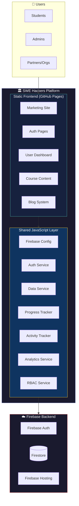
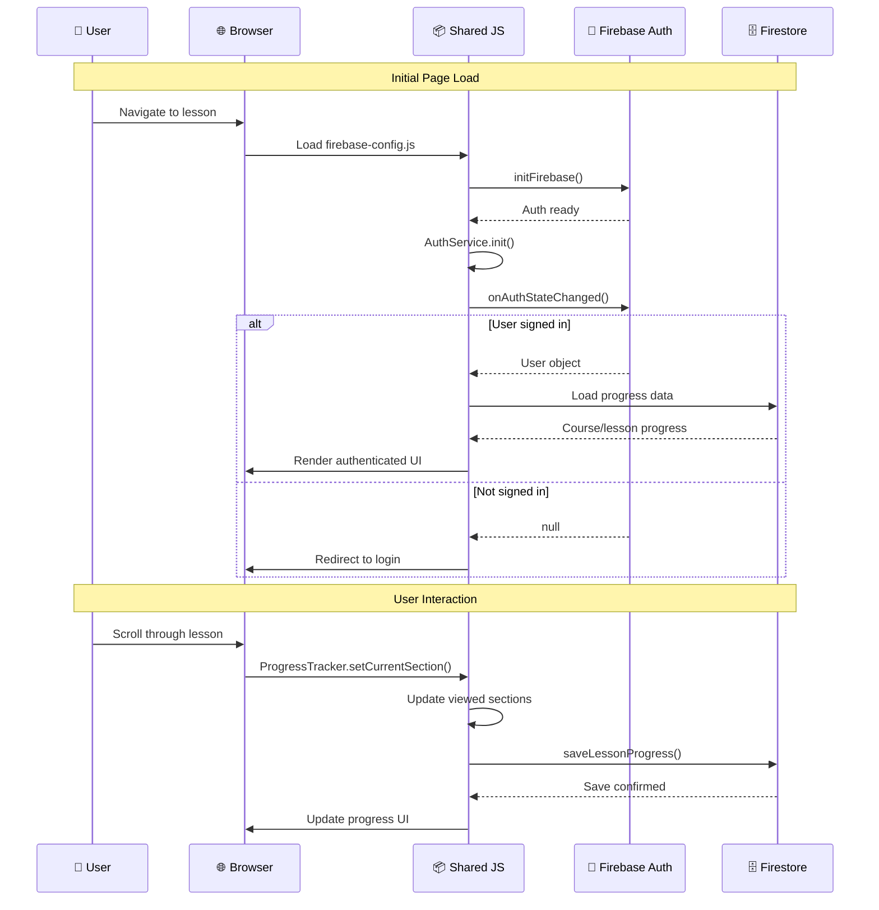
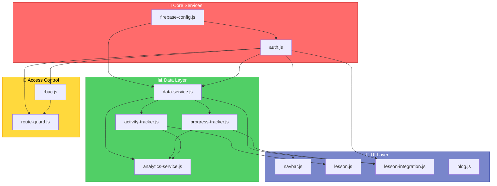
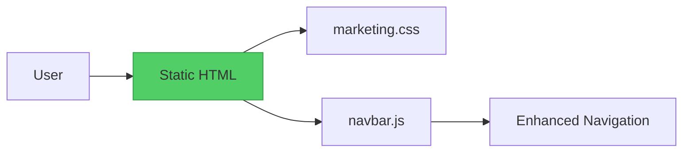
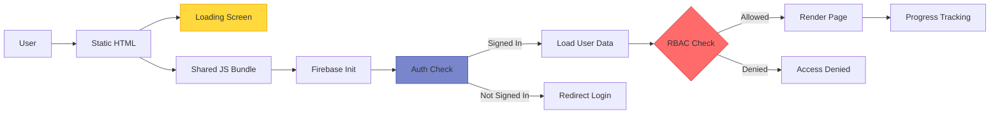
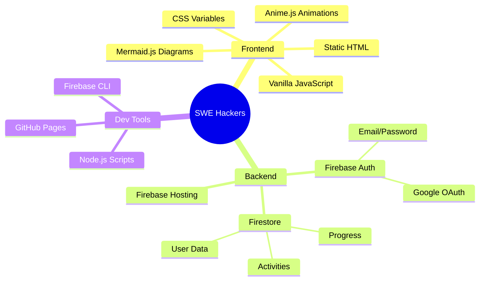

# SWE Hackers Platform Architecture Overview

> **Purpose:** High-level system architecture for onboarding engineers to the SWE Hackers / AutoNateAI learning platform.

## System Context



## Architecture Principles

| Principle | Implementation |
|-----------|----------------|
| **Static-First** | All HTML is pre-rendered; Firebase handles dynamic data |
| **Progressive Enhancement** | Pages work without JS, enhanced with interactivity |
| **Shared Services** | Single JS files in `/shared/js/` used across all pages |
| **Firestore-Centric** | All user data flows through Firestore with real-time sync |
| **RBAC for Access** | Role-based access control for partner courses |

## Directory Structure

```
courses/
├── index.html                    # Marketing landing page
├── catalog.html                  # Course catalog
├── consulting.html               # Consulting services
├── enterprise.html               # Enterprise offerings
├── challenges.html               # Daily challenges
│
├── auth/                         # Authentication pages
│   ├── login.html
│   └── register.html
│
├── dashboard/                    # User dashboard (protected)
│   ├── index.html               # Main dashboard
│   ├── courses.html             # Course library
│   └── progress.html            # Progress analytics
│
├── course/                       # Course detail pages (public)
│   ├── apprentice.html
│   ├── junior.html
│   ├── senior.html
│   ├── undergrad.html
│   └── endless-opportunities.html
│
├── apprentice/                   # Apprentice course content
│   ├── ch0-origins/
│   ├── ch1-stone/
│   ├── ch2-lightning/
│   ├── ch3-magnetism/
│   ├── ch4-architect/
│   ├── ch5-capstone1/
│   └── ch6-capstone2/
│
├── junior/                       # Junior course (same structure)
├── senior/                       # Senior course (same structure)
├── undergrad/                    # Undergrad course (same structure)
├── endless-opportunities/        # Partner course (org-restricted)
│
├── blog/                         # Blog system
│   ├── index.html               # Blog listing
│   ├── articles.json            # Article metadata
│   └── article-template.html    # Template for articles
│
├── shared/                       # Shared resources
│   ├── css/
│   │   ├── marketing.css        # Marketing pages
│   │   ├── auth.css             # Auth pages
│   │   ├── dashboard.css        # Dashboard
│   │   ├── course-dashboard.css # Course-specific dashboard
│   │   ├── course-detail.css    # Course detail pages
│   │   ├── lesson.css           # Lesson pages
│   │   └── blog.css             # Blog pages
│   │
│   └── js/
│       ├── firebase-config.js   # Firebase initialization
│       ├── auth.js              # Authentication service
│       ├── data-service.js      # Firestore operations
│       ├── progress-tracker.js  # Lesson progress tracking
│       ├── activity-tracker.js  # Activity/quiz tracking
│       ├── analytics-service.js # Learning analytics
│       ├── rbac.js              # Role-based access control
│       ├── route-guard.js       # Route protection
│       ├── lesson-integration.js# Lesson page integration
│       ├── lesson.js            # Lesson animations/interactions
│       ├── navbar.js            # Shared navigation
│       └── blog.js              # Blog functionality
│
└── assets/                       # Static assets
    ├── courses/                  # Course images
    ├── screenshots/              # Dashboard previews
    └── og-preview.png            # Social preview image
```

## High-Level Data Flow



## Service Dependency Graph



## Page Type Matrix

| Page Type | Auth Required | Route Guard | Services Used |
|-----------|---------------|-------------|---------------|
| Marketing (index, catalog) | ❌ | ❌ | navbar.js |
| Auth (login, register) | ❌ | ❌ | auth.js |
| Course Detail | ❌ | ❌ | auth.js, data-service.js |
| Dashboard | ✅ | ✅ | All services |
| Lesson | ✅ | ✅ + RBAC | All services |
| Blog | ❌ | ❌ | blog.js |
| Partner Course | ✅ | ✅ + Org | All services + RBAC |

## Request Flow by Page Type

### Marketing Pages



### Authenticated Pages (Dashboard, Lessons)



## Technology Stack



## Key Architectural Decisions

### 1. Static-First Architecture

**Decision:** All pages are static HTML served from GitHub Pages/Firebase Hosting.

**Rationale:**
- Zero server infrastructure to maintain
- Fast load times (CDN-cached)
- Easy to deploy (git push)
- Firebase handles all dynamic functionality

**Trade-offs:**
- No server-side rendering for SEO (mitigated with meta tags)
- All business logic in client-side JS

### 2. Single Shared JS Layer

**Decision:** One set of JS files in `/shared/js/` used by all pages.

**Rationale:**
- DRY principle - single source of truth
- Easier maintenance
- Consistent behavior across pages
- Browser caching benefits

**Trade-offs:**
- Pages load all services even if not needed
- Careful coordination for changes

### 3. Firestore Subcollection for Progress

**Decision:** Lesson progress stored in subcollections under course progress.

**Rationale:**
- Allows detailed per-lesson tracking
- Can scale to many lessons without huge documents
- Enables granular queries

**Trade-offs:**
- Requires multiple reads for dashboard (mitigated with fallback logic)
- More complex data model

### 4. Client-Side RBAC

**Decision:** Role-based access control implemented in client-side JS.

**Rationale:**
- Sufficient for current scale
- No server needed for access decisions
- Firestore security rules provide true enforcement

**Trade-offs:**
- UI can be bypassed (Firestore rules are the real gate)
- Must keep client RBAC in sync with security rules

## Related Documentation

| Document | Description |
|----------|-------------|
| [01-service-layer.md](./01-service-layer.md) | Deep dive into shared JS services |
| [02-page-types.md](./02-page-types.md) | Page architecture patterns |
| [03-data-model.md](./03-data-model.md) | Firestore data model |
| [04-authentication-rbac.md](./04-authentication-rbac.md) | Auth and RBAC system |
| [05-progress-tracking.md](./05-progress-tracking.md) | Progress tracking system |
| [06-frontend-patterns.md](./06-frontend-patterns.md) | CSS and UI patterns |

## Quick Start for Engineers

1. **Understand the service layer:** Start with `firebase-config.js` → `auth.js` → `data-service.js`
2. **Trace a user flow:** Follow a user from login → dashboard → lesson → completion
3. **Check existing patterns:** Before adding new functionality, review similar implementations
4. **Test with real data:** Use the Firebase emulator or a test account to see actual data flows
