# Service Layer Architecture

> **Purpose:** Deep dive into the shared JavaScript services that power the SWE Hackers platform.

## Service Overview


## Service Initialization Order


---

## FirebaseApp (`firebase-config.js`)

### Purpose
Initializes the Firebase SDK and exposes Firebase services to other modules.

### API

```javascript
window.FirebaseApp = {
  init()      // Initialize Firebase, returns boolean
  getAuth()   // Returns firebase.auth() instance
  getDb()     // Returns firebase.firestore() instance
  getApp()    // Returns firebase.app() instance
}
```

### Architecture


### Key Behaviors

1. **Singleton Pattern:** Only initializes once even if called multiple times
2. **Defensive Checks:** Verifies Firebase SDK is loaded before initialization
3. **Global Exposure:** Exposes `window.FirebaseApp` for cross-module access

---

## AuthService (`auth.js`)

### Purpose
Handles user authentication, registration, session management, and auth state observation.

### API

```javascript
window.AuthService = {
  // State
  currentUser              // Current Firebase user or null
  
  // Initialization
  init()                   // Start auth state listener
  waitForAuthState()       // Returns Promise<User|null>
  
  // Authentication
  register(email, password, displayName)
  loginWithEmail(email, password)
  loginWithGoogle()
  logout()
  resetPassword(email)
  
  // User Info
  isAuthenticated()        // Returns boolean
  getUser()                // Returns current user
  
  // State Management
  onAuthStateChanged(cb)   // Subscribe to auth changes
  setRedirectUrl(url)      // Store URL for post-login redirect
  getRedirectUrl()         // Get and clear stored redirect
}
```

### State Machine


### Auth Flow


### Key Behaviors

1. **Auth State Promise:** `waitForAuthState()` resolves when auth is definitively known
2. **Session Restoration:** Waits 300ms for Firebase to restore existing session
3. **User Document Creation:** Auto-creates Firestore user doc on first login
4. **Redirect Management:** Stores intended destination during auth flow

---

## DataService (`data-service.js`)

### Purpose
Central data access layer for all Firestore operations. Handles course progress, quiz answers, activity tracking, and user stats.

### API Categories


### Data Flow Pattern


### Key Method: `getEnrolledCourses()`

This method demonstrates the subcollection fallback pattern:


### Key Method: `saveLessonProgress()`

Dual-write pattern to subcollection and parent:

```mermaid
sequenceDiagram
    participant C as Caller
    participant DS as DataService
    participant FS as Firestore

    C->>DS: saveLessonProgress(courseId, lessonId, data)
    
    Note over DS: Write #1: Subcollection
    DS->>FS: lessonProgress/{lessonId}.set(data)
    FS-->>DS: ✅ Success

    Note over DS: Determine completion
    DS->>DS: isComplete = progressPercent >= 100

    Note over DS: Write #2: Parent summary
    DS->>FS: courseProgress/{courseId}.set({<br/>  lessons.{lessonId}: summary<br/>})
    FS-->>DS: ✅ Success

    alt Lesson complete
        DS->>DS: recalculateCourseProgress()
        DS->>FS: Update completedLessons, progressPercent
    end

    DS-->>C: { success: true }
```



---

## ProgressTracker (`progress-tracker.js`)

### Purpose
Tracks user progress through lesson sections in real-time using Intersection Observer. Persists to Firestore and provides visual feedback.

### API

```javascript
window.ProgressTracker = {
  // Initialization
  init(courseId, lessonId)
  
  // Section Management
  discoverSections()
  setCurrentSection(section)
  markSectionComplete(sectionId)
  scrollToSection(sectionId)
  
  // Persistence
  loadProgress()
  saveProgress()
  
  // UI
  renderTracker()
  updateTrackerUI()
  toggleCollapse()
  showCompletionToast()
}
```

### State Model


### Section Discovery


### Scroll Tracking


### Visual Components


---

## ActivityTracker (`activity-tracker.js`)

### Purpose
Tracks user engagement with interactive lesson activities (quizzes, drag-drop, code challenges, demos). Supports offline caching with sync.

### Supported Activity Types


### Activity Discovery

```mermaid
flowchart TD
    INIT[ActivityTracker.init]
    INIT --> QUERY["querySelectorAll('[data-activity]')"]
    
    QUERY --> FOREACH[For each element]
    FOREACH --> PARSE[Parse data attributes]
    
    PARSE --> EXTRACT["Extract:
    • id: data-activity
    • type: data-type
    • points: data-points
    • timeLimit: data-time-limit"]
    
    EXTRACT --> ATTACH[Attach listeners by type]
    
    ATTACH --> QUIZ[setupQuizListeners]
    ATTACH --> DD[setupDragDropListeners]
    ATTACH --> CODE[setupCodeChallengeListeners]
    ATTACH --> DEMO[setupDemoListeners]
```



### Quiz Submission Flow


### Offline Sync

```mermaid
flowchart TD
    subgraph Online["📶 Online"]
        SAVE[saveAttemptWithCache]
        SAVE --> CACHE[Cache to localStorage]
        CACHE --> TRY[Try Firestore write]
        TRY -->|Success| REMOVE[Remove from cache]
        TRY -->|Fail| QUEUE[Keep in queue]
    end

    subgraph Offline["📴 Offline"]
        ATTEMPT[User submits attempt]
        ATTEMPT --> CACHE2[Cache to localStorage]
        CACHE2 --> TOAST[Show offline toast]
    end

    subgraph Reconnect["🔌 Back Online"]
        EVENT[online event]
        EVENT --> SYNC[syncQueuedAttempts]
        SYNC --> FOREACH[For each queued item]
        FOREACH --> WRITE[Write to Firestore]
        WRITE -->|Success| DEL[Delete from queue]
        WRITE -->|Fail| RETRY[Keep for next sync]
    end

    style Online fill:#51cf66,stroke:#2f9e44
    style Offline fill:#ff6b6b,stroke:#c92a2a
    style Reconnect fill:#7986cb,stroke:#3949ab
```



---

## AnalyticsService (`analytics-service.js`)

### Purpose
Calculates learning metrics and cognitive progress indicators for dashboard display.

### Metrics Computed


### Cognitive Score Calculation

```mermaid
flowchart LR
    subgraph Inputs["Normalized Inputs (0-100)"]
        M["Mastery: firstTryAccuracy × 100"]
        V["Velocity: (lessons/week ÷ 3) × 100"]
        S["Streak: (days ÷ 7) × 100"]
        C["Completion: (done/total) × 100"]
    end

    subgraph Weights["Applied Weights"]
        MW["40%"]
        VW["30%"]
        SW["20%"]
        CW["10%"]
    end

    subgraph Score["Final Score"]
        CALC["M×0.4 + V×0.3 + S×0.2 + C×0.1"]
        ROUND["Round to integer"]
        LEVEL["Determine level"]
    end

    M --> MW --> CALC
    V --> VW --> CALC
    S --> SW --> CALC
    C --> CW --> CALC
    CALC --> ROUND --> LEVEL
```



### Caching Strategy


---

## Service Interaction Patterns

### Pattern 1: Authenticated Data Access

```mermaid
sequenceDiagram
    participant Page
    participant Service as Any Service
    participant Auth as AuthService
    participant FB as Firestore

    Page->>Service: Call method
    Service->>Auth: getUser()
    
    alt User exists
        Auth-->>Service: User object
        Service->>FB: Query with user.uid
        FB-->>Service: Data
        Service-->>Page: Result
    else No user
        Auth-->>Service: null
        Service-->>Page: null/empty/error
    end
```

### Pattern 2: Progressive Loading

```mermaid
sequenceDiagram
    participant Page
    participant UI as UI Layer
    participant Service
    participant Cache
    participant FB as Firestore

    Page->>UI: Show loading state
    Page->>Service: Request data
    
    Service->>Cache: Check cache
    alt Cache hit
        Cache-->>Service: Cached data
        Service-->>Page: Quick response
        Page->>UI: Render cached data
    else Cache miss
        Service->>FB: Fetch data
        FB-->>Service: Fresh data
        Service->>Cache: Update cache
        Service-->>Page: Response
        Page->>UI: Render data
    end
```

### Pattern 3: Optimistic UI with Retry

```mermaid
sequenceDiagram
    participant U as User
    participant UI as UI Layer
    participant Service
    participant Cache
    participant FB as Firestore

    U->>UI: Trigger action
    UI->>UI: Optimistic update
    UI->>Service: Persist change
    Service->>Cache: Cache locally
    
    Service->>FB: Write to Firestore
    
    alt Success
        FB-->>Service: Confirmed
        Service->>Cache: Mark synced
    else Failure
        FB-->>Service: Error
        Service->>Service: Queue for retry
        Service->>UI: Show retry indicator
    end
```

---

## Error Handling Patterns

### Auth Errors

```mermaid
flowchart TD
    ERR[Firebase Auth Error]
    ERR --> CODE{Error Code}
    
    CODE -->|auth/email-in-use| MSG1["Email already registered"]
    CODE -->|auth/invalid-email| MSG2["Invalid email address"]
    CODE -->|auth/weak-password| MSG3["Password too weak"]
    CODE -->|auth/user-not-found| MSG4["No account found"]
    CODE -->|auth/wrong-password| MSG5["Incorrect password"]
    CODE -->|auth/too-many-requests| MSG6["Too many attempts"]
    CODE -->|auth/network-request-failed| MSG7["Network error"]
    CODE -->|default| MSG8["An error occurred"]
    
    MSG1 --> USER[Display to User]
    MSG2 --> USER
    MSG3 --> USER
    MSG4 --> USER
    MSG5 --> USER
    MSG6 --> USER
    MSG7 --> USER
    MSG8 --> USER
```

### Data Service Errors

```mermaid
flowchart TD
    ERR[Firestore Error]
    ERR --> CHECK{Error Type}
    
    CHECK -->|not-found| CREATE[Create document]
    CHECK -->|permission-denied| AUTH[Re-authenticate]
    CHECK -->|unavailable| OFFLINE[Queue for offline]
    CHECK -->|other| LOG[Console.error + return null]
    
    CREATE --> RETRY[Retry operation]
    AUTH --> REDIRECT[Redirect to login]
    OFFLINE --> CACHE[Cache locally]
```

---

## Testing & Debugging

### Console Commands

```javascript
// Check current auth state
AuthService.getUser()

// View current permissions
RBACService.debug()

// Check enrolled courses
DataService.getEnrolledCourses()

// View lesson progress
DataService.getLessonProgress('apprentice', 'ch0-origins')

// Get analytics summary
AnalyticsService.getDashboardSummary()

// Clear analytics cache
AnalyticsService.clearCache()

// Check activity tracker state
ActivityTracker.activities
ActivityTracker.attemptCounts
```

### Common Issues

| Symptom | Likely Cause | Debug Steps |
|---------|--------------|-------------|
| Dashboard shows 0% | Subcollection not read | Check `getEnrolledCourses()` fallback |
| Progress not saving | Auth timing issue | Check `waitForAuthState()` |
| Quiz won't submit | Activity not discovered | Verify `data-activity` attribute |
| Route guard loops | Auth state race | Check `_authReadyPromise` |
| Offline cache not syncing | Event listener missing | Verify `online` event |
