# Page Types Architecture

> **Purpose:** Documentation of the different page types in the platform, their structure, and architectural patterns.

## Page Type Overview

```mermaid
flowchart TB
    subgraph Public["🌐 Public Pages"]
        MK[Marketing Pages]
        CAT[Catalog]
        CD[Course Details]
        BG[Blog]
    end

    subgraph Auth["🔐 Auth Pages"]
        LG[Login]
        RG[Register]
    end

    subgraph Protected["🛡️ Protected Pages"]
        DB[Dashboard]
        LS[Lesson Pages]
        PG[Progress Pages]
    end

    subgraph Partner["🏢 Partner Pages"]
        PC[Partner Courses]
    end

    Public -->|No Auth| Server
    Auth -->|Auth Flow| Server
    Protected -->|Auth Required| Server
    Partner -->|Auth + RBAC| Server

    subgraph Server["☁️ Backend"]
        FB[Firebase Auth]
        FS[Firestore]
    end

    style Public fill:#51cf66,stroke:#2f9e44
    style Auth fill:#ffd93d,stroke:#f59f00
    style Protected fill:#7986cb,stroke:#3949ab
    style Partner fill:#ff6b6b,stroke:#c92a2a
```



## Page Type Matrix

| Page Type | Path Pattern | Auth | RBAC | Services | CSS |
|-----------|--------------|------|------|----------|-----|
| Marketing | `index.html`, `catalog.html` | ❌ | ❌ | navbar.js | marketing.css |
| Auth | `auth/*.html` | ❌ | ❌ | auth.js | auth.css |
| Course Detail | `course/*.html` | ❌ | ❌ | auth.js, data-service.js | course-detail.css |
| Dashboard | `dashboard/*.html` | ✅ | ❌ | All | dashboard.css |
| Lesson | `{course}/ch*/*.html` | ✅ | ✅ | All | lesson.css |
| Blog | `blog/*.html` | ❌ | ❌ | blog.js | blog.css |
| Partner Course | `{partner}/*.html` | ✅ | ✅ Org | All | lesson.css |

---

## Marketing Pages

### Purpose
Public-facing pages for user acquisition, course discovery, and business information.

### Pages
- `index.html` - Landing page
- `catalog.html` - Course catalog
- `consulting.html` - Consulting services
- `enterprise.html` - Enterprise offerings
- `challenges.html` - Daily challenges preview

### Architecture


### Script Loading Pattern

```html
<!-- Fonts -->
<link href="fonts.googleapis.com/css2?family=Inter..." rel="stylesheet">

<!-- Styles -->
<link rel="stylesheet" href="shared/css/marketing.css">

<!-- Anime.js for animations -->
<script src="cdnjs.cloudflare.com/ajax/libs/animejs/3.2.1/anime.min.js"></script>

<!-- Shared Components -->
<script src="shared/js/navbar.js" defer></script>
```

### Navigation Component

```mermaid
flowchart LR
    subgraph Desktop["🖥️ Desktop Nav"]
        LOGO[Logo]
        LINKS[Nav Links]
        CTA[CTA Buttons]
    end

    subgraph Mobile["📱 Mobile Nav"]
        LOGO2[Logo]
        BTN[Menu Button]
        MENU[Dropdown Menu]
    end

    BTN -->|Click| MENU
    
    style Desktop fill:#51cf66,stroke:#2f9e44
    style Mobile fill:#7986cb,stroke:#3949ab
```



---

## Auth Pages

### Purpose
User registration and authentication flows.

### Pages
- `auth/login.html` - User sign-in
- `auth/register.html` - New user registration

### Architecture


### Auth Flow


### Error Handling UI


---

## Dashboard Pages

### Purpose
User's learning hub showing enrolled courses, progress analytics, and activity.

### Pages
- `dashboard/index.html` - Main dashboard
- `dashboard/courses.html` - Course library
- `dashboard/progress.html` - Detailed progress

### Architecture


### Loading Pattern


### Sidebar Navigation Structure


### Course Card Component

```mermaid
flowchart LR
    subgraph Card["Course Card"]
        ICON[Course Icon]
        TITLE[Course Title]
        BAR[Progress Bar]
        DOTS[Chapter Dots]
        BTN[Continue Button]
    end

    subgraph Data["Data Binding"]
        CP[courseProgress]
        LP[lessons object]
    end

    Data -->|completedLessons/7| BAR
    Data -->|lessons[chId].completed| DOTS
    Data -->|lastLesson| BTN

    style Card fill:#16213e,stroke:#4db6ac
```

---

## Lesson Pages

### Purpose
Interactive learning content with progress tracking and activities.

### Structure
```
{course}/
├── ch0-origins/index.html
├── ch1-stone/index.html
├── ch2-lightning/index.html
├── ch3-magnetism/index.html
├── ch4-architect/index.html
├── ch5-capstone1/index.html
└── ch6-capstone2/index.html
```

### Architecture


### Script Loading Order

```html
<!-- Firebase -->
<script src="firebase-app-compat.js"></script>
<script src="firebase-auth-compat.js"></script>
<script src="firebase-firestore-compat.js"></script>

<!-- External Libraries -->
<script src="mermaid.min.js"></script>
<script src="anime.min.js"></script>

<!-- Core Services -->
<script src="../../shared/js/firebase-config.js"></script>
<script src="../../shared/js/auth.js"></script>
<script src="../../shared/js/data-service.js"></script>
<script src="../../shared/js/rbac.js"></script>
<script src="../../shared/js/route-guard.js"></script>

<!-- Progress Services -->
<script src="../../shared/js/progress-tracker.js"></script>
<script src="../../shared/js/activity-tracker.js"></script>

<!-- Integration -->
<script src="../../shared/js/lesson-integration.js"></script>
<script src="../../shared/js/lesson.js"></script>
```

### Lesson Initialization Flow


### Content Section Structure


### Progress Tracker Sidebar

```mermaid
flowchart TD
    subgraph Tracker["🎯 Progress Tracker"]
        HEADER[Header + Collapse Toggle]
        BAR[Progress Bar]
        PCT[Percentage Text]
        
        subgraph Sections["Section List"]
            S1[Section 1 - Viewed ✓]
            S2[Section 2 - Current →]
            S3[Section 3 - Pending ○]
        end
        
        STATS[Time + Sections Count]
    end

    subgraph States["Visual States"]
        VIEWED[Purple outline]
        CURRENT[Blue glow + filled]
        COMPLETE[Teal filled]
    end

    Sections --> States
```



---

## Blog Pages

### Purpose
Content marketing and knowledge sharing through blog articles.

### Pages
- `blog/index.html` - Article listing
- `blog/{article}.html` - Individual articles
- `blog/articles.json` - Article metadata

### Architecture



```mermaid
flowchart TD
    subgraph Template["📄 Article Template"]
        META[Article Metadata]
        HERO[Hero Block]
        CONTENT[Content Blocks]
        RELATED[Related Articles]
    end

    subgraph Blocks["🧱 Block Types"]
        TEXT[Text Block]
        CODE[Code Block]
        IMAGE[Image Block]
        QUOTE[Quote Block]
        POLL[Poll Block]
        QUIZ[Quiz Block]
        DIAGRAM[Mermaid Diagram]
        REVEAL[Reveal/Accordion]
        STATS[Stats Block]
    end

    subgraph Services["📦 Services"]
        BJS[blog.js]
        ANIME[Anime.js]
        MERM[Mermaid.js]
    end

    Template --> Blocks
    Blocks --> Services
```

### Blog.js Initialization


---

## Course Detail Pages

### Purpose
Course information and enrollment entry point.

### Pages
```
course/
├── apprentice.html
├── junior.html
├── senior.html
├── undergrad.html
└── endless-opportunities.html
```

### Architecture



```mermaid
flowchart TD
    subgraph Page["📄 Course Detail Page"]
        HERO[Course Hero]
        SYLLABUS[Chapter Syllabus]
        FEATURES[What You'll Learn]
        CTA[Enrollment CTA]
    end

    subgraph States["🔄 UI States"]
        GUEST[Guest: Show Enrollment]
        ENROLLED[Enrolled: Show Continue]
        COMPLETE[Complete: Show Certificate]
    end

    subgraph Data["📊 Data"]
        AS[AuthService]
        DS[DataService.getCourseProgress]
    end

    Page --> States
    States --> Data
```

### Enrollment Flow


---

## Partner Course Pages (RBAC-Protected)

### Purpose
Organization-specific courses with access control.

### Example: Endless Opportunities
```
endless-opportunities/
├── week0-intro/index.html
├── week1-chatgpt/index.html
├── week2-visual/index.html
├── week3-claude/index.html
└── week4-launch/index.html
```

### RBAC Architecture


### Organization Check


---

## Admin Pages

### Purpose
Platform administration and user management.

### Pages
- `admin/index.html` - Admin dashboard

### Access Control

```mermaid
flowchart TD
    REQ[Admin Page Request]
    REQ --> AUTH{Authenticated?}
    AUTH -->|No| LOGIN[Redirect Login]
    AUTH -->|Yes| ROLE{Admin Role?}
    ROLE -->|No| DENY[Access Denied → Dashboard]
    ROLE -->|Yes| CHECK{Super Admin Email?}
    CHECK -->|autonate.ai@gmail.com| ALLOW[Full Access]
    CHECK -->|Other admin| ALLOW
    
    style ALLOW fill:#51cf66,stroke:#2f9e44
    style DENY fill:#ff6b6b,stroke:#c92a2a
```

---

## Page Loading Performance Pattern

### Critical Path

```mermaid
gantt
    title Page Load Timeline
    dateFormat  X
    axisFormat %L ms
    
    section HTML
    Download HTML     :0, 50
    Parse HTML        :50, 80
    
    section CSS
    Download CSS      :50, 100
    Parse CSS         :100, 120
    
    section JS (defer)
    Download JS       :80, 200
    Execute JS        :200, 400
    
    section Auth
    Firebase Init     :400, 450
    Auth Check        :450, 600
    
    section Data
    Load User Data    :600, 800
    Render UI         :800, 900
    
    section Interactive
    Full Interactive  :900, 1000
```

### Loading State Pattern

```mermaid
stateDiagram-v2
    [*] --> LoadingScreen: Page loads
    LoadingScreen --> CheckingAuth: Scripts loaded
    CheckingAuth --> Authenticated: User found
    CheckingAuth --> Redirect: No user (protected page)
    Authenticated --> LoadingData: Fetch user data
    LoadingData --> Ready: Data loaded
    Ready --> Interactive: UI rendered
    
    note right of LoadingScreen: Shows spinner
    note right of Redirect: To /auth/login.html
    note right of Ready: Hide loading screen
```
