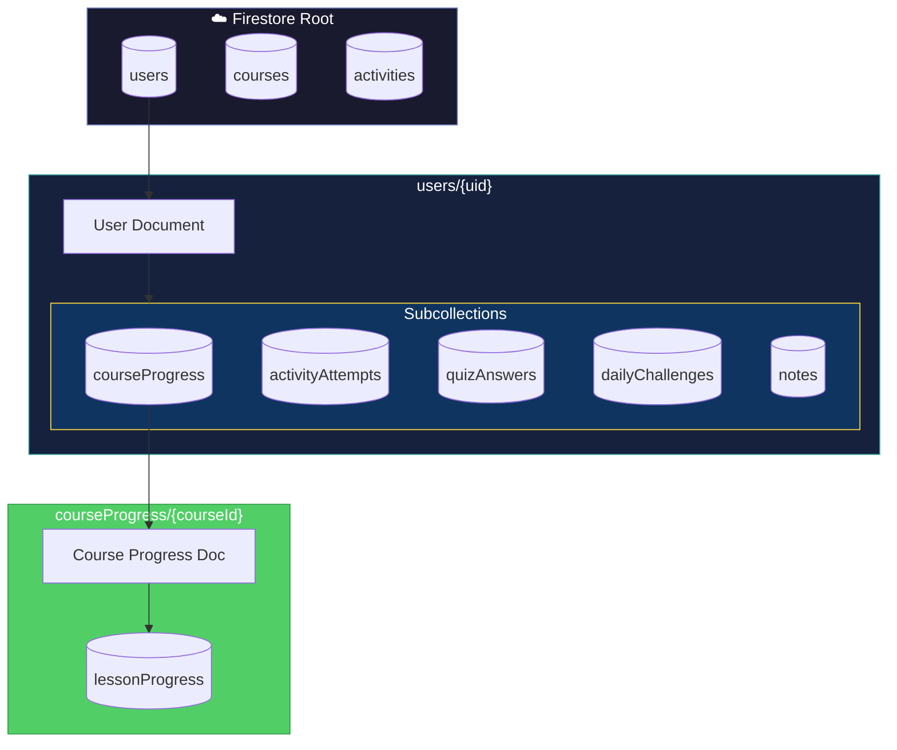
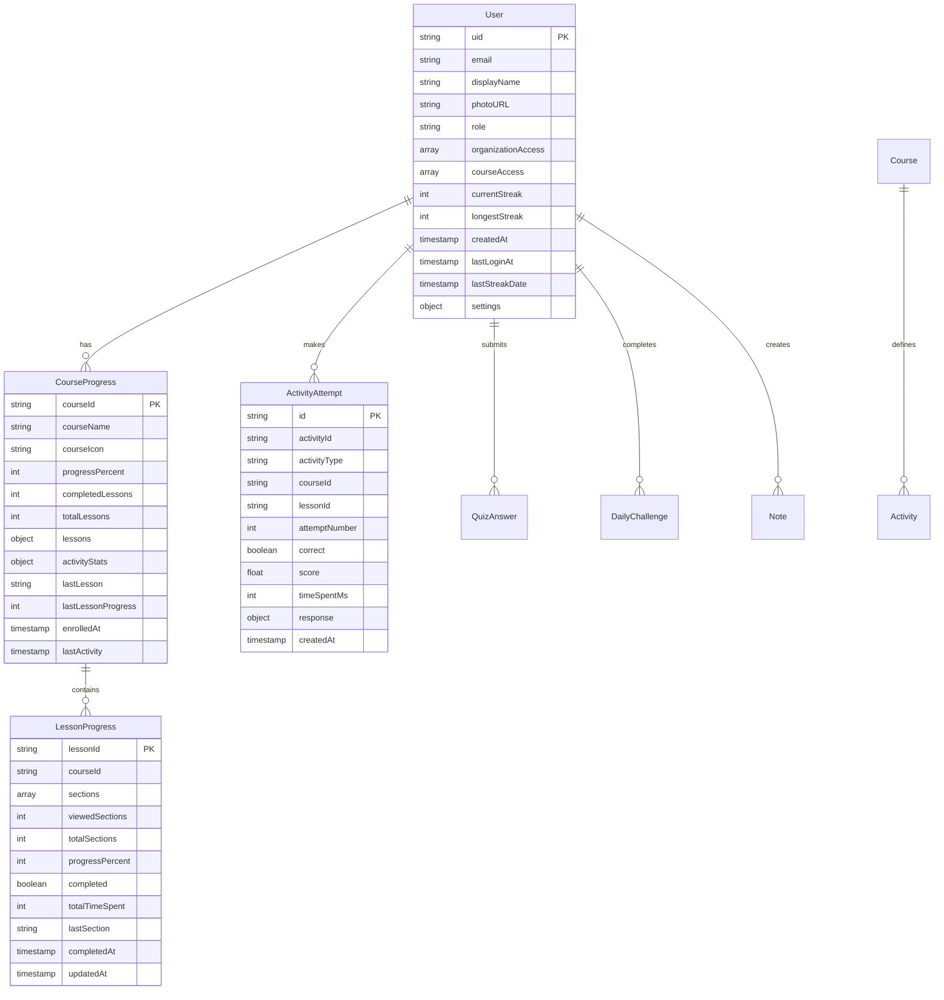
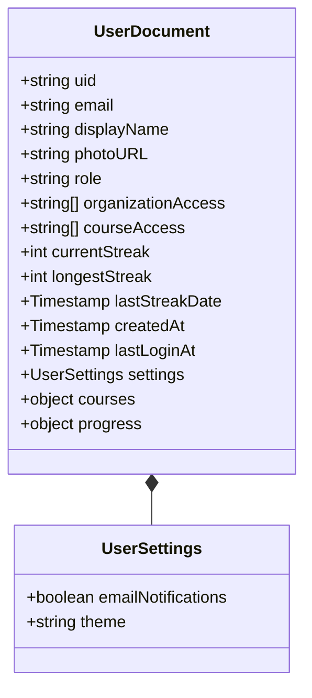
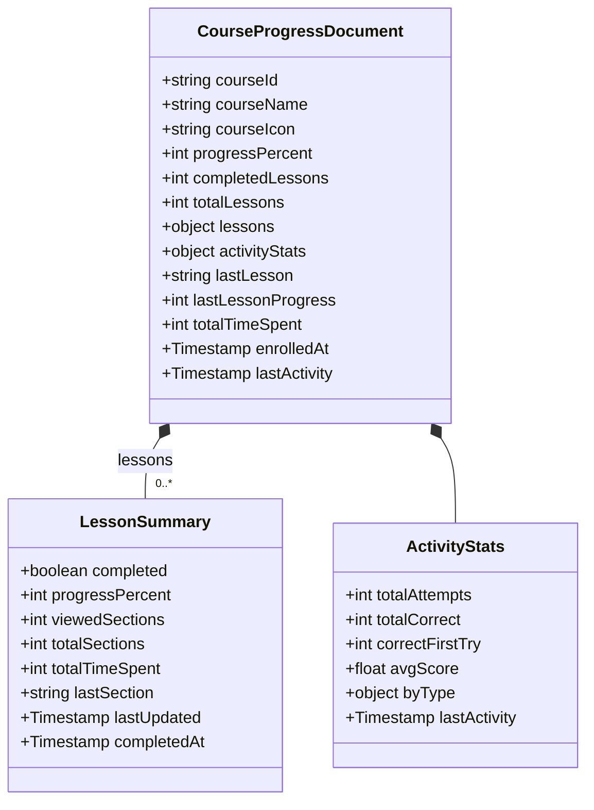
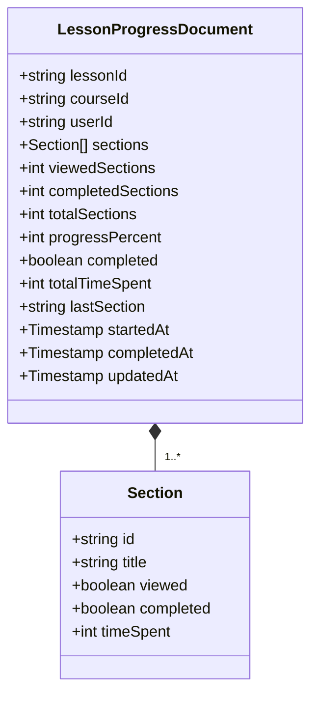
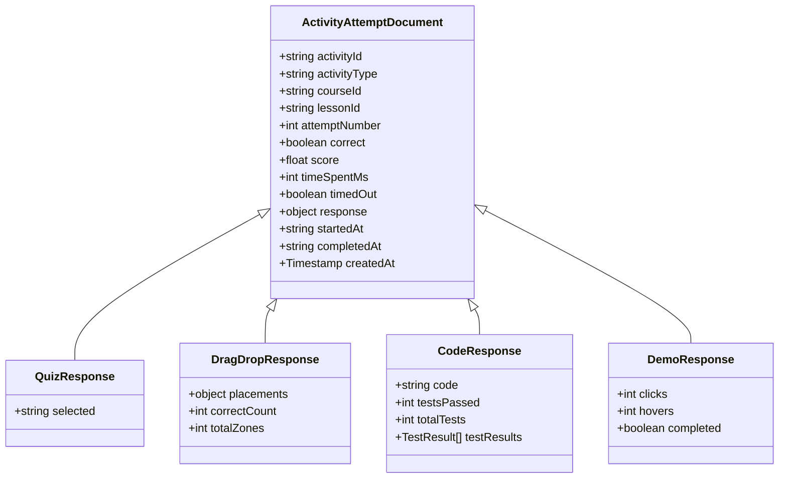
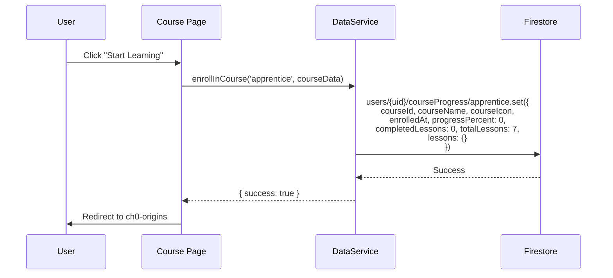
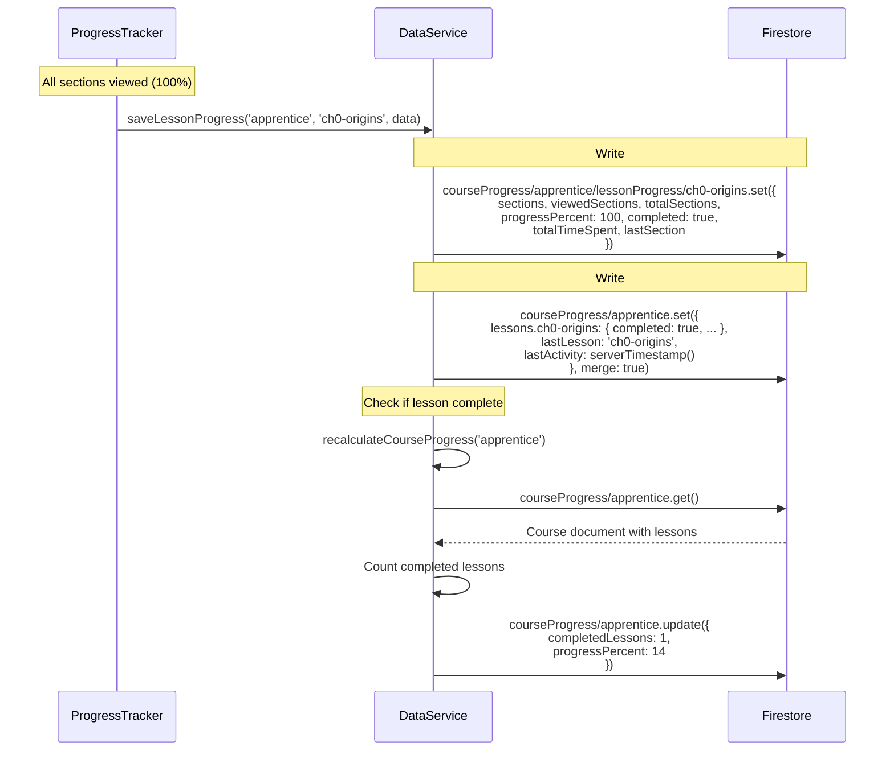
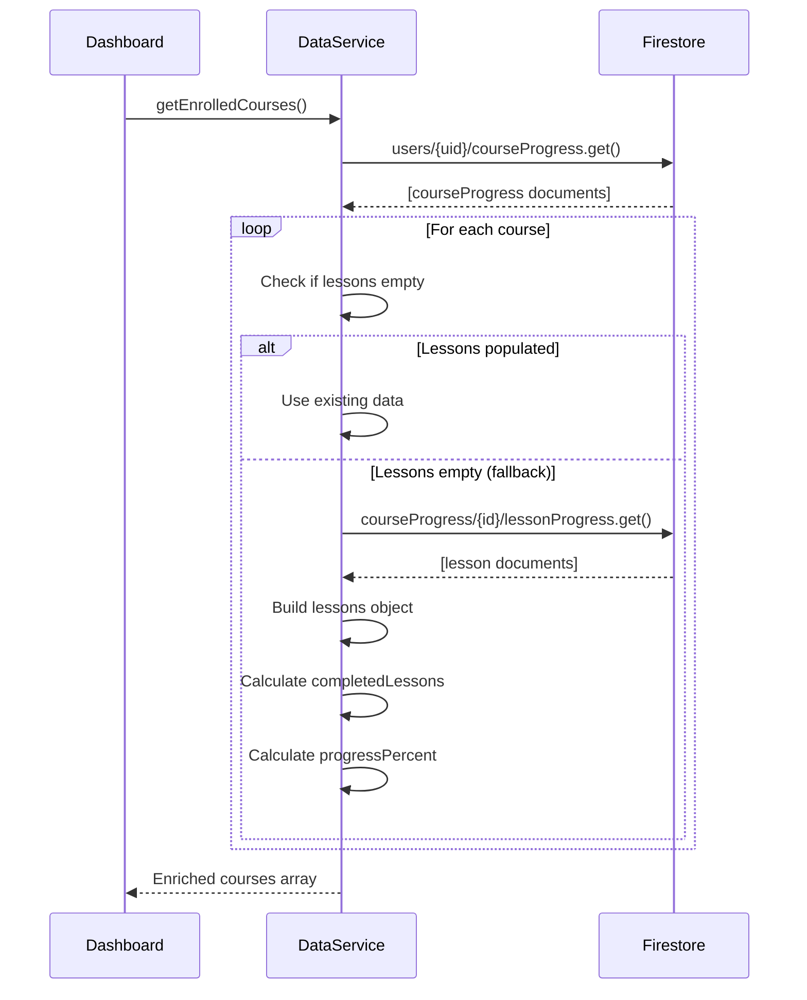

# Firestore Data Model

> **Purpose:** Complete documentation of the Firestore database structure, collections, and data relationships.

## Collection Hierarchy



## Entity Relationship Diagram



---

## Collection: `users`

### Path
`users/{uid}`

### Purpose
Store user profile, settings, and aggregate learning data.

### Schema



### Field Descriptions

| Field | Type | Description | Example |
|-------|------|-------------|---------|
| `uid` | string | Firebase Auth UID | `"abc123xyz"` |
| `email` | string | User's email | `"user@example.com"` |
| `displayName` | string | Display name | `"John Doe"` |
| `photoURL` | string | Avatar URL | `"https://..."` |
| `role` | string | User role | `"user"`, `"enterprise"`, `"admin"` |
| `organizationAccess` | array | Org IDs with access | `["endless-opportunities"]` |
| `courseAccess` | array | Direct course access | `["special-course"]` |
| `currentStreak` | number | Consecutive active days | `7` |
| `longestStreak` | number | All-time longest streak | `14` |
| `lastStreakDate` | timestamp | Last activity date | `2024-01-15T...` |
| `createdAt` | timestamp | Account creation | `2024-01-01T...` |
| `lastLoginAt` | timestamp | Last login time | `2024-01-15T...` |

### Created By
- `AuthService.createUserDocument()` on first login
- `AuthService.register()` after registration

### Updated By
- `AuthService.updateUserProfile()` on each login
- `DataService.updateStreak()` on daily activity
- `RBACService.setUserRole()` for role changes
- `RBACService.grantOrganizationAccess()` for org access

---

## Collection: `users/{uid}/courseProgress`

### Path
`users/{uid}/courseProgress/{courseId}`

### Purpose
Track overall progress for a specific course.

### Schema



### Field Descriptions

| Field | Type | Description |
|-------|------|-------------|
| `courseId` | string | Course identifier |
| `courseName` | string | Display name |
| `courseIcon` | string | Emoji icon |
| `progressPercent` | number | 0-100 completion |
| `completedLessons` | number | Lessons finished |
| `totalLessons` | number | Always 7 |
| `lessons` | object | Per-lesson summaries (keyed by lessonId) |
| `activityStats` | object | Aggregated activity performance |
| `lastLesson` | string | Most recently viewed lesson |
| `enrolledAt` | timestamp | When user enrolled |
| `lastActivity` | timestamp | Last interaction |

### Lessons Object Structure

```javascript
{
  "ch0-origins": {
    completed: true,
    progressPercent: 100,
    viewedSections: 8,
    totalSections: 8,
    totalTimeSpent: 285000,
    lastSection: "section-8",
    lastUpdated: Timestamp,
    completedAt: Timestamp
  },
  "ch1-stone": {
    completed: false,
    progressPercent: 45,
    viewedSections: 3,
    totalSections: 7,
    // ...
  }
}
```

### Created By
- `DataService.enrollInCourse()` when user starts a course

### Updated By
- `DataService.saveLessonProgress()` on lesson interaction
- `DataService.recalculateCourseProgress()` when lesson completes
- `DataService.updateActivityStats()` after activity attempts

---

## Collection: `users/{uid}/courseProgress/{courseId}/lessonProgress`

### Path
`users/{uid}/courseProgress/{courseId}/lessonProgress/{lessonId}`

### Purpose
Detailed per-section progress within a lesson.

### Schema



### Section Array Example

```javascript
{
  lessonId: "ch0-origins",
  courseId: "apprentice",
  sections: [
    {
      id: "section-0",
      title: "In The Beginning...",
      viewed: true,
      completed: true,
      timeSpent: 45000
    },
    {
      id: "section-1", 
      title: "How Electricity Thinks",
      viewed: true,
      completed: true,
      timeSpent: 32000
    },
    // ... more sections
  ],
  viewedSections: 8,
  totalSections: 8,
  progressPercent: 100,
  completed: true,
  totalTimeSpent: 285000,
  lastSection: "section-7"
}
```

### Created By
- `DataService.saveLessonProgress()` on first section view

### Updated By
- `DataService.saveLessonProgress()` on each section view
- `ProgressTracker.saveProgress()` on scroll/interaction

---

## Collection: `users/{uid}/activityAttempts`

### Path
`users/{uid}/activityAttempts/{attemptId}`

### Purpose
Store individual activity attempt records for analytics.

### Schema



### Activity Types

| Type | Response Shape | Score Calculation |
|------|---------------|-------------------|
| `quiz` | `{ selected: string }` | 1.0 if correct, 0.0 if wrong |
| `dragdrop` | `{ placements: {}, correctCount, totalZones }` | correctCount / totalZones |
| `code` | `{ code, testsPassed, totalTests }` | testsPassed / totalTests |
| `demo` | `{ clicks, hovers, completed }` | 0.5 + (engagement bonus up to 0.5) |

### Created By
- `DataService.saveActivityAttempt()` via ActivityTracker

### Queried By
- `DataService.getActivityAttempts()` with filters
- `AnalyticsService.calculateQuizMastery()`

---

## Collection: `users/{uid}/quizAnswers`

### Path
`users/{uid}/quizAnswers/{answerId}`

### Purpose
Legacy quiz answer storage (separate from activity attempts).

### Schema

```javascript
{
  courseId: "apprentice",
  lessonId: "ch1-stone",
  quizId: "quiz-1",
  answer: "B",
  isCorrect: true,
  timestamp: Timestamp
}
```

### Created By
- `DataService.saveQuizAnswer()` (legacy path)

---

## Collection: `users/{uid}/dailyChallenges`

### Path
`users/{uid}/dailyChallenges/{challengeId}`

### Purpose
Track daily challenge completions for streaks.

### Schema

```javascript
{
  challengeId: "challenge-2024-01-15",
  date: Timestamp,
  completed: true,
  result: {
    score: 85,
    timeSpent: 120000
  },
  timestamp: Timestamp
}
```

### Created By
- `DataService.completeDailyChallenge()`

### Queried By
- `DataService.getDailyChallenges()` (last 7 days)

---

## Collection: `users/{uid}/notes`

### Path
`users/{uid}/notes/{noteId}`

### Purpose
User-created notes linked to courses/lessons.

### Schema

```javascript
{
  id: "note-abc123",
  courseId: "apprentice",
  lessonId: "ch1-stone",
  title: "Variables in Python",
  content: "Variables are like boxes...",
  tags: ["python", "basics"],
  userId: "user-uid",
  createdAt: Timestamp,
  updatedAt: Timestamp
}
```

### Created/Updated By
- `DataService.saveNote()`

### Deleted By
- `DataService.deleteNote()`

---

## Collection: `courses`

### Path
`courses/{courseId}`

### Purpose
Course metadata and access configuration (admin-managed).

### Schema

```javascript
{
  courseId: "endless-opportunities",
  displayName: "Endless Opportunities AI Bootcamp",
  description: "Partner course for...",
  visibility: "organization",  // public | authenticated | organization | admin
  organizations: ["endless-opportunities"],
  partnerLogo: "/assets/partners/eo-logo.png",
  createdAt: Timestamp,
  createdBy: "admin-uid"
}
```

### Visibility Types

| Value | Access Rule |
|-------|-------------|
| `public` | Anyone can access |
| `authenticated` | Must be logged in |
| `organization` | Must belong to specified org |
| `admin` | Admin role only |

### Created By
- `RBACService.registerCourse()` (admin only)

### Note
Most course config is in `RBACService.COURSE_REGISTRY` for performance. Firestore lookup is fallback.

---

## Collection: `activities`

### Path
`activities/{activityId}`

### Purpose
Store correct answers and configuration for activities.

### Schema

```javascript
{
  activityId: "quiz-ch1-variables",
  activityType: "quiz",
  courseId: "apprentice",
  lessonId: "ch1-stone",
  correctAnswer: "B",
  points: 10,
  timeLimit: null,  // seconds, or null for no limit
  testCases: null,  // for code challenges
  updatedAt: Timestamp
}
```

### Created By
- `DataService.saveActivityDefinition()` (admin)

### Queried By
- `ActivityTracker.getCorrectAnswer()`
- `DataService.getActivityDefinition()`

---

## Data Flow Diagrams

### Enrollment Flow



### Progress Save Flow



### Dashboard Data Load



---

## Index Requirements

### Composite Indexes Needed

| Collection | Fields | Order |
|------------|--------|-------|
| `activityAttempts` | `courseId`, `lessonId`, `createdAt` | ASC, ASC, DESC |
| `activityAttempts` | `activityType`, `createdAt` | ASC, DESC |
| `dailyChallenges` | `date`, `date` | ASC, DESC |
| `notes` | `courseId`, `updatedAt` | ASC, DESC |

### Query Patterns

```javascript
// Get activity attempts for a lesson
db.collection('users').doc(uid)
  .collection('activityAttempts')
  .where('courseId', '==', 'apprentice')
  .where('lessonId', '==', 'ch0-origins')
  .orderBy('createdAt', 'desc')

// Get recent challenges
db.collection('users').doc(uid)
  .collection('dailyChallenges')
  .where('date', '>=', weekAgo)
  .orderBy('date', 'desc')
  .limit(7)

// Get notes for a course
db.collection('users').doc(uid)
  .collection('notes')
  .where('courseId', '==', 'apprentice')
  .orderBy('updatedAt', 'desc')
```

---

## Security Rules Patterns

### User Data Isolation

```javascript
rules_version = '2';
service cloud.firestore {
  match /databases/{database}/documents {
    // Users can only access their own data
    match /users/{userId} {
      allow read, write: if request.auth != null && request.auth.uid == userId;
      
      // Subcollections inherit same rule
      match /{subcollection}/{document=**} {
        allow read, write: if request.auth != null && request.auth.uid == userId;
      }
    }
    
    // Course configs readable by authenticated users
    match /courses/{courseId} {
      allow read: if request.auth != null;
      allow write: if request.auth != null && 
                     get(/databases/$(database)/documents/users/$(request.auth.uid)).data.role == 'admin';
    }
    
    // Activity definitions readable, writable by admin
    match /activities/{activityId} {
      allow read: if request.auth != null;
      allow write: if request.auth != null && 
                     get(/databases/$(database)/documents/users/$(request.auth.uid)).data.role == 'admin';
    }
  }
}
```

---

## Data Migration Notes

### Legacy Data Handling

1. **Old quiz answers** in `/quizAnswers` → New format in `/activityAttempts`
2. **Lessons object empty** → Fallback to `/lessonProgress` subcollection
3. **Missing `completedLessons`** → Recalculated from lessons object

### Backward Compatibility

The `DataService.getEnrolledCourses()` method includes fallback logic to read from subcollections when the parent `lessons` object is empty, ensuring old user data still displays correctly.
