# Authentication & RBAC Architecture

> **Purpose:** Deep dive into the authentication system and role-based access control for the SWE Hackers platform.

## System Overview


## Authentication Flow

### Registration


### Login (Email/Password)


### Login (Google OAuth)


### Session Restoration


---

## AuthService Architecture

### State Management


### API Reference

| Method | Returns | Description |
|--------|---------|-------------|
| `init()` | void | Start auth state listener |
| `waitForAuthState()` | `Promise<User\|null>` | Resolves when auth determined |
| `register(email, password, name)` | `Promise<{success, user?, error?}>` | Create new account |
| `loginWithEmail(email, password)` | `Promise<{success, user?, error?}>` | Email/password login |
| `loginWithGoogle()` | `Promise<{success, user?, error?}>` | Google OAuth login |
| `logout()` | `Promise<{success}>` | Sign out current user |
| `resetPassword(email)` | `Promise<{success, error?}>` | Send reset email |
| `isAuthenticated()` | boolean | Check if signed in |
| `getUser()` | `User\|null` | Get current user |
| `onAuthStateChanged(cb)` | `() => void` | Subscribe to changes |
| `setRedirectUrl(url)` | void | Store post-login redirect |
| `getRedirectUrl()` | `string\|null` | Get and clear redirect |

### Error Code Mapping


---

## Role-Based Access Control (RBAC)

### Role Hierarchy


### Permission Model


### Course Visibility Types

| Visibility | Who Can Access | Check Method |
|------------|----------------|--------------|
| `public` | Everyone | Always true |
| `authenticated` | Logged-in users | `AuthService.isAuthenticated()` |
| `organization` | Org members | `permissions.organizationAccess.includes(org)` |
| `admin` | Admin role only | `permissions.isAdmin` |

### Course Registry

```javascript
// RBACService.COURSE_REGISTRY
{
  // Public free courses
  'apprentice': { visibility: 'public', organizations: [] },
  'junior': { visibility: 'public', organizations: [] },
  'senior': { visibility: 'public', organizations: [] },
  'undergrad': { visibility: 'public', organizations: [] },
  
  // Partner courses (organization-specific)
  'endless-opportunities': {
    visibility: 'organization',
    organizations: ['endless-opportunities'],
    displayName: 'Endless Opportunities AI Bootcamp',
    partnerLogo: '/assets/partners/eo-logo.png'
  }
}
```

---

## RBAC Access Check Flow

### Course Access Check

```mermaid
flowchart TD
    START[canAccessCourse called]
    START --> PERM[getUserPermissions]
    
    PERM --> ADMIN{Is admin?}
    ADMIN -->|Yes| ALLOW[✅ Allow access]
    ADMIN -->|No| EXPLICIT{Has explicit<br/>course access?}
    
    EXPLICIT -->|Yes| ALLOW
    EXPLICIT -->|No| CONFIG[Get course config]
    
    CONFIG --> VIS{Visibility type?}
    
    VIS -->|public| ALLOW
    VIS -->|authenticated| AUTH{Is authenticated?}
    VIS -->|organization| ORG{Belongs to org?}
    VIS -->|admin| DENY[❌ Deny access]
    
    AUTH -->|Yes| ALLOW
    AUTH -->|No| DENY
    
    ORG -->|Yes| ALLOW
    ORG -->|No| DENY

    style ALLOW fill:#51cf66,stroke:#2f9e44
    style DENY fill:#ff6b6b,stroke:#c92a2a
```



### Permission Loading


### Super Admin Detection

```mermaid
flowchart TD
    CHECK[Check user email]
    CHECK --> SUPER{"Email in SUPER_ADMIN_EMAILS?
    • autonate.ai@gmail.com
    • autonateai@gmail.com"}
    
    SUPER -->|Yes| PROMOTE[Auto-promote to admin]
    SUPER -->|No| NORMAL[Use DB role]
    
    PROMOTE --> PERSIST{Role in DB != admin?}
    PERSIST -->|Yes| UPDATE[Update DB role to admin]
    PERSIST -->|No| RETURN[Return admin permissions]
    UPDATE --> RETURN
    
    NORMAL --> RETURN2[Return DB-based permissions]
```



---

## Route Guard System

### Protected Page Detection

```mermaid
flowchart TD
    PAGE[Current Page URL]
    PAGE --> CHECK{Path contains?}
    
    CHECK -->|"/ch0-" to "/ch6-"| PROTECTED[Protected: Lesson page]
    CHECK -->|"/dashboard/"| PROTECTED2[Protected: Dashboard]
    CHECK -->|Public paths| PUBLIC[Not protected]
    
    subgraph PublicPaths["Public Paths"]
        P1["/index.html"]
        P2["/auth/*"]
        P3["/course/*"]
        P4["/catalog.html"]
        P5["/enterprise.html"]
        P6["/consulting.html"]
        P7["/blog/*"]
        P8["/challenges.html"]
    end
    
    PUBLIC --> PublicPaths
    
    style PROTECTED fill:#ff6b6b,stroke:#c92a2a
    style PROTECTED2 fill:#ff6b6b,stroke:#c92a2a
    style PUBLIC fill:#51cf66,stroke:#2f9e44
```

### Route Guard Initialization


### Access Denial Handling

```mermaid
flowchart LR
    DENY[handleAccessDenied called]
    DENY --> REASON{Reason?}
    
    REASON -->|unauthenticated| LOGIN["Store redirect URL
    → /auth/login.html"]
    REASON -->|unauthorized| CAT["→ /catalog.html?error=unauthorized"]
    REASON -->|organization| ENT["→ /enterprise.html?error=organization"]
    REASON -->|default| HOME["→ /index.html"]

    style LOGIN fill:#ffd93d,stroke:#f59f00
    style CAT fill:#7986cb,stroke:#3949ab
    style ENT fill:#ff6b6b,stroke:#c92a2a
```



---

## Admin Operations

### User Role Management


### Organization Access Management


---

## Security Considerations

### Client-Side vs Server-Side


### Firestore Security Rules

```javascript
rules_version = '2';
service cloud.firestore {
  match /databases/{database}/documents {
    // Helper: Check if user is admin
    function isAdmin() {
      return request.auth != null && 
             get(/databases/$(database)/documents/users/$(request.auth.uid)).data.role == 'admin';
    }
    
    // Helper: Check organization membership
    function belongsToOrg(orgId) {
      return request.auth != null &&
             orgId in get(/databases/$(database)/documents/users/$(request.auth.uid)).data.organizationAccess;
    }
    
    // Users can only access their own data
    match /users/{userId} {
      allow read: if request.auth.uid == userId || isAdmin();
      allow write: if request.auth.uid == userId;
      
      // Admin can modify roles
      allow update: if isAdmin() && 
                      request.resource.data.diff(resource.data).affectedKeys()
                        .hasOnly(['role', 'organizationAccess', 'courseAccess', 'updatedAt', 'updatedBy']);
      
      match /{subcollection}/{document=**} {
        allow read, write: if request.auth.uid == userId;
      }
    }
    
    // Course configs
    match /courses/{courseId} {
      allow read: if request.auth != null;
      allow write: if isAdmin();
    }
  }
}
```

---

## Debugging & Testing

### Console Commands

```javascript
// Check current auth state
AuthService.getUser()

// Get current permissions
await RBACService.debug()
// Output: { role, organizationAccess, courseAccess, isAdmin, isEnterprise }

// Check course access
await RBACService.canAccessCourse('endless-opportunities')

// Check organization membership
await RBACService.belongsToOrganization('endless-opportunities')

// Get accessible courses
await RBACService.getAccessibleCourses()

// Force clear permission cache
RBACService.clearCache()
```

### Common Issues

| Symptom | Likely Cause | Fix |
|---------|--------------|-----|
| Always redirected to login | Auth state race condition | Check `waitForAuthState()` timing |
| Partner course shows access denied | Org not in `organizationAccess` | Admin adds via `grantOrganizationAccess()` |
| Super admin not recognized | Email case mismatch | Check lowercase comparison |
| Permission cache stale | Changes not reflected | Call `clearCache()` |
| Route guard not firing | Script load order | Ensure services load before guard |

### Test Scenarios

```mermaid
flowchart TB
    subgraph Tests["Test Scenarios"]
        T1["1. Guest → Public page ✅"]
        T2["2. Guest → Protected page → Login redirect ✅"]
        T3["3. User → Public course lesson ✅"]
        T4["4. User → Partner course → Denied ✅"]
        T5["5. Enterprise user → Partner course ✅"]
        T6["6. Admin → Any course ✅"]
        T7["7. Session restore → No re-auth ✅"]
    end
```


