# Progress & Activity Tracking Architecture

> **Purpose:** Deep dive into how user learning progress and activity attempts are tracked, stored, and analyzed.

## System Overview


---

## Progress Tracking System

### Component Architecture

```mermaid
flowchart TD
    subgraph PT["🎯 ProgressTracker"]
        INIT[init]
        DISC[discoverSections]
        OBS[setupScrollObserver]
        RENDER[renderTracker]
        SAVE[saveProgress]
        LOAD[loadProgress]
    end

    subgraph State["📦 Internal State"]
        CID[courseId]
        LID[lessonId]
        SECS[sections array]
        CURR[currentSection]
        TIMES[sectionTimes]
        START[startTime]
    end

    subgraph UI["🎨 UI Components"]
        HEADER[Tracker Header]
        BAR[Progress Bar]
        DOTS[Section Indicators]
        STATS[Time/Section Stats]
    end

    INIT --> DISC
    DISC --> OBS
    INIT --> RENDER
    INIT --> LOAD

    PT --> State
    PT --> UI
```

### Section Discovery Algorithm

```mermaid
flowchart TD
    START[discoverSections called]
    START --> QUERY["querySelectorAll(
    '.lesson-section, section[id], 
    section[data-section], section.section, 
    .origin-section'
    )"]

    QUERY --> FOREACH[For each element]
    FOREACH --> SEEN{In seen Set?}
    
    SEEN -->|Yes| SKIP[Skip duplicate]
    SEEN -->|No| ADD[Add to seen]
    
    ADD --> TITLE["Extract title from:
    • .section-title
    • h2, h3
    • .section-header h2
    • data-section attr"]
    
    TITLE --> ID["Get ID from:
    • el.id
    • data-section
    • data-section-id
    • Generate: section-{index}"]
    
    ID --> CREATE["Create Section object:
    { id, title, element, 
      viewed: false, 
      completed: false, 
      timeSpent: 0 }"]
    
    CREATE --> PUSH[Push to sections array]
    PUSH --> NEXT{More elements?}
    SKIP --> NEXT
    NEXT -->|Yes| FOREACH
    NEXT -->|No| LOG[Log discovered sections]
```

### Scroll Observation


### Progress Data Structure


### Save Progress Flow


### Completion Modal

```mermaid
flowchart TD
    COMPLETE[All sections viewed]
    COMPLETE --> SAVE[Save progress immediately]
    SAVE --> CHECK{completionShown?}
    
    CHECK -->|Yes| SKIP[Skip modal]
    CHECK -->|No| SET[Set completionShown = true]
    
    SET --> CREATE["Create modal with:
    • Confetti animation
    • Stats (sections, time, %)
    • Review/Next buttons"]
    
    CREATE --> APPEND[Append to body]
    APPEND --> CONFETTI[Animate 50 confetti pieces]
    
    subgraph Modal["Modal Content"]
        ICON["🎉 Icon"]
        TITLE["Lesson Complete!"]
        STATS["Stats: sections | time | 100%"]
        BTNS["Review Lesson | Next Lesson →"]
    end
```

---

## Activity Tracking System

### Supported Activity Types


### Activity Discovery

```mermaid
flowchart TD
    INIT[ActivityTracker.init]
    INIT --> QUERY["querySelectorAll('[data-activity]')"]
    
    QUERY --> FOREACH[For each element]
    FOREACH --> PARSE["Parse attributes:
    • data-activity (id)
    • data-type (quiz|dragdrop|code|demo)
    • data-points (default: 10)
    • data-time-limit (seconds)"]
    
    PARSE --> CREATE["Create activity object:
    { id, type, points, timeLimit, element }"]
    
    CREATE --> ATTACH[attachActivityListeners]
    
    ATTACH --> SWITCH{Activity type?}
    SWITCH -->|quiz| QUIZ[setupQuizListeners]
    SWITCH -->|dragdrop| DD[setupDragDropListeners]
    SWITCH -->|code| CODE[setupCodeChallengeListeners]
    SWITCH -->|demo| DEMO[setupDemoListeners]
```

### Quiz Activity Flow


### Drag & Drop Activity Flow


### Code Challenge Flow

```mermaid
flowchart TD
    SUBMIT[User clicks Run]
    SUBMIT --> GET[Get code from input]
    GET --> TESTS[getCodeTestCases]
    
    TESTS --> TYPE{Test type?}
    
    TYPE -->|keywords| KW["Check each keyword
    in lowercase code"]
    TYPE -->|testCases| TC["Run each test case
    Check expected output"]
    TYPE -->|none| BASIC["Check code.length > 10"]
    
    KW --> SCORE
    TC --> SCORE
    BASIC --> SCORE
    
    SCORE["Calculate score:
    passed / total tests"]
    
    SCORE --> SAVE[saveAttemptWithCache]
    SAVE --> FEEDBACK[showCodeFeedback]
    
    FEEDBACK --> UI["Show test results:
    ✅ Test 1: passed
    ❌ Test 2: failed"]
```

### Demo Activity Flow

```mermaid
flowchart TD
    INIT[setupDemoListeners]
    INIT --> TRACK["Initialize tracking:
    clicks: 0, hovers: 0, 
    interacted: Set()"]
    
    INIT --> LISTEN[Attach listeners to [data-interact]]
    
    subgraph Interaction["User Interaction"]
        CLICK[Click element]
        CLICK --> CHECK{Already interacted?}
        CHECK -->|No| ADD[Add to interacted Set]
        ADD --> INC[Increment clicks]
        INC --> VISUAL[Visual feedback]
        VISUAL --> DOT[Update progress dot]
    end
    
    DOT --> THRESHOLD{clicks >= threshold?}
    THRESHOLD -->|Yes| AUTO[Auto-complete]
    THRESHOLD -->|No| WAIT[Wait for more]
    
    AUTO --> SUBMIT[submitDemoInteraction]
    SUBMIT --> SCORE["Calculate engagement:
    0.5 + (clicks/threshold×2) × 0.5"]
    SUBMIT --> COMPLETE[Mark demo complete]
```

---

## Offline Support

### Cache-First Save Pattern

```mermaid
flowchart TD
    ATTEMPT[saveAttemptWithCache called]
    ATTEMPT --> LOCAL[Generate localId]
    LOCAL --> CACHE[Cache to localStorage]
    
    CACHE --> ONLINE{navigator.onLine?}
    
    ONLINE -->|Yes| TRY[Try Firestore write]
    ONLINE -->|No| QUEUE[Keep in queue]
    
    TRY --> SUCCESS{Success?}
    SUCCESS -->|Yes| REMOVE[Remove from cache]
    SUCCESS -->|No| KEEP[Keep for retry]
    
    QUEUE --> TOAST["Show toast:
    '📴 Saved offline'"]
    
    style CACHE fill:#ffd93d,stroke:#f59f00
    style REMOVE fill:#51cf66,stroke:#2f9e44
    style QUEUE fill:#ff6b6b,stroke:#c92a2a
```

### Sync on Reconnect

```mermaid
sequenceDiagram
    participant W as Window
    participant AT as ActivityTracker
    participant LS as LocalStorage
    participant DS as DataService
    participant FS as Firestore

    W->>AT: 'online' event
    AT->>LS: Get queue
    LS-->>AT: [queued attempts]

    loop For each queued item
        AT->>DS: saveActivityAttempt(attemptData)
        DS->>FS: Write attempt
        
        alt Success
            FS-->>DS: Confirmed
            AT->>LS: Remove from queue
        else Failure
            FS-->>DS: Error
            Note over AT: Keep in queue for retry
        end
    end

    alt Any synced
        AT->>DS: recalculateActivityStats()
        AT->>W: Show toast "✅ Synced X activities"
    end
```

### LocalStorage Structure

```javascript
// Queue key: 'activityTracker_queue'
[
  {
    localId: 'local-1705320000000-abc123',
    attemptData: {
      activityId: 'quiz-ch1-vars',
      activityType: 'quiz',
      courseId: 'apprentice',
      lessonId: 'ch1-stone',
      attemptNumber: 1,
      correct: true,
      score: 1.0,
      timeSpentMs: 45000,
      response: { selected: 'B' }
    },
    queuedAt: '2024-01-15T10:00:00Z'
  }
]

// Answer cache key: 'activityTracker_answerCache'
{
  'quiz-ch1-vars': 'B',
  'quiz-ch1-types': 'C'
}
```

---

## Activity State Restoration

### Load Attempt Counts


### Visual State Restoration

```mermaid
flowchart TD
    RESTORE[restoreCompletedActivities]
    RESTORE --> FOREACH[For each best attempt]
    
    FOREACH --> TYPE{Activity type?}
    
    TYPE -->|quiz| QUIZ["If correct:
    • Mark option selected+correct
    • Show feedback '✅ Already completed'
    • Disable submit button"]
    
    TYPE -->|dragdrop| DD["If score = 1:
    • Mark all zones correct
    • Show feedback
    • Disable submit"]
    
    TYPE -->|code| CODE["If all tests passed:
    • Show submitted code
    • Show feedback
    • Disable input"]
    
    TYPE -->|demo| DEMO["Always restore:
    • Add demo-complete class
    • Update status '✅ Completed'
    • Fill progress dots"]
    
    QUIZ --> MARK[Add activity-completed class]
    DD --> MARK
    CODE --> MARK
    DEMO --> MARK
```

---

## Analytics Calculation

### Learning Velocity

```mermaid
flowchart TD
    CALC[calculateLearningVelocity]
    CALC --> FETCH[getEnrolledCourses]
    
    FETCH --> LOOP[For each course]
    LOOP --> EARLIEST[Track earliest enrolledAt]
    LOOP --> LESSONS[Get all lesson progress]
    
    LESSONS --> COUNT["Count completed lessons:
    • Total completed
    • Last 7 days (recent)
    • 8-14 days ago (prior)"]
    
    COUNT --> WEEKS["Calculate weeksActive:
    (now - earliestEnrollment) / 7 days"]
    
    WEEKS --> VELOCITY["velocity = 
    totalCompleted / weeksActive"]
    
    VELOCITY --> TREND["trend:
    recent vs prior comparison
    up/down/neutral"]
    
    TREND --> COMPARE["comparison:
    velocity >= 2 ? on_track : behind"]
```

### Quiz Mastery

```mermaid
flowchart TD
    CALC[calculateQuizMastery]
    CALC --> FETCH[getActivityAttempts type=quiz]
    
    FETCH --> GROUP[Group by activityId]
    
    GROUP --> FIRST["For each activity:
    Find first attempt (attemptNumber=1)"]
    
    FIRST --> COUNT["Count:
    • totalQuizzes
    • correctFirstTry
    • totalScore"]
    
    COUNT --> TOPIC["Group by topic:
    Extract from activityId
    quiz-ch1-{topic}"]
    
    TOPIC --> MASTERY["mastery = 
    (correctFirstTry / totalQuizzes) × 100"]
    
    MASTERY --> ANALYSIS["Find:
    • strongestTopic (highest mastery)
    • weakestTopic (lowest mastery)"]
```

### Cognitive Score

```mermaid
flowchart LR
    subgraph Inputs["Raw Metrics"]
        V[Velocity]
        M[Mastery]
        S[Streak]
        C[Completion]
    end

    subgraph Normalize["Normalize to 0-100"]
        VN["V: (lessons/week ÷ 3) × 100"]
        MN["M: firstTryAccuracy"]
        SN["S: (days ÷ 7) × 100"]
        CN["C: (done ÷ total) × 100"]
    end

    subgraph Weight["Apply Weights"]
        VW["× 0.30"]
        MW["× 0.40"]
        SW["× 0.20"]
        CW["× 0.10"]
    end

    subgraph Final["Cognitive Score"]
        SUM["Sum weighted values"]
        ROUND["Round to integer"]
        LEVEL["Determine level"]
    end

    V --> VN --> VW --> SUM
    M --> MN --> MW --> SUM
    S --> SN --> SW --> SUM
    C --> CN --> CW --> SUM
    SUM --> ROUND --> LEVEL
```

### Score Levels

| Score Range | Level | Message |
|-------------|-------|---------|
| 80-100 | Expert | "Outstanding! Mastering efficiently." |
| 60-79 | Proficient | "Great progress! Keep it up!" |
| 40-59 | Developing | (Context-specific advice) |
| 20-39 | Beginner | "Set a goal to learn daily." |
| 0-19 | Starting | "Begin your journey!" |

---

## Dashboard Integration

### Course Card Data Flow

```mermaid
flowchart TD
    DASH[Dashboard loads]
    DASH --> DS[DataService.getEnrolledCourses]
    
    DS --> EACH[For each course]
    EACH --> CHECK{lessons empty?}
    
    CHECK -->|No| USE[Use parent data]
    CHECK -->|Yes| FALLBACK[Fetch lessonProgress subcollection]
    
    FALLBACK --> BUILD[Build lessons object]
    BUILD --> COUNT[Count completed]
    COUNT --> CALC[Calculate progressPercent]
    
    USE --> CARD[createCourseCard]
    CALC --> CARD
    
    CARD --> RENDER["Render:
    • Progress bar
    • Chapter dots
    • Continue button"]
```

### Chapter Dots Rendering

```mermaid
flowchart LR
    DATA[course.lessons]
    DATA --> LOOP[For each chapter ID]
    
    LOOP --> CHECK{lessons[chId]?.completed?}
    CHECK -->|true| GREEN[Green dot ✓]
    CHECK -->|false/undefined| GRAY[Gray dot ○]
    CHECK -->|current lesson| BLUE[Blue dot →]
    
    GREEN --> DOT
    GRAY --> DOT
    BLUE --> DOT
    
    subgraph DOT["Chapter Dot"]
        CLASS["CSS classes:
        .completed → green
        .current → blue pulse
        default → gray"]
    end
```

---

## Time Tracking

### Session Time Tracking

```mermaid
sequenceDiagram
    participant LI as LessonIntegration
    participant DS as DataService
    participant FS as Firestore

    Note over LI: Page load
    LI->>LI: startTime = Date.now()

    Note over LI: Every 60 seconds
    LI->>LI: Calculate seconds elapsed
    LI->>LI: Reset startTime
    
    alt seconds > 0 && seconds < 300
        LI->>DS: trackTimeSpent(courseId, lessonId, seconds)
        DS->>FS: Increment totalTimeSpent
    end

    Note over LI: Page unload
    LI->>LI: trackTimeSpent() final save
```

### Per-Section Time Tracking

```mermaid
sequenceDiagram
    participant PT as ProgressTracker
    participant S as Section

    Note over PT: Enter section A
    PT->>PT: sectionTimes[A] = Date.now()

    Note over PT: User scrolls...

    Note over PT: Enter section B
    PT->>PT: elapsed = now - sectionTimes[A]
    PT->>S: section[A].timeSpent += elapsed
    PT->>PT: currentSection = B
    PT->>PT: sectionTimes[B] = Date.now()
```

### Visibility Tracking

```mermaid
flowchart TD
    VIS[visibilitychange event]
    VIS --> CHECK{document.hidden?}
    
    CHECK -->|true| PAUSE["Pause timing:
    • Save elapsed to section
    • Save progress to Firestore"]
    
    CHECK -->|false| RESUME["Resume timing:
    • Reset section start time"]
```

---

## Debugging

### Console Commands

```javascript
// Check ProgressTracker state
ProgressTracker.sections
ProgressTracker.currentSection
ProgressTracker.sectionTimes

// Check ActivityTracker state
ActivityTracker.activities
ActivityTracker.attemptCounts
ActivityTracker.correctAnswers

// Check offline queue
JSON.parse(localStorage.getItem('activityTracker_queue'))

// Clear analytics cache
AnalyticsService.clearCache()

// Get dashboard summary
await AnalyticsService.getDashboardSummary()

// Get chapter analytics
await AnalyticsService.getChapterAnalytics('apprentice')
```

### Common Issues

| Symptom | Likely Cause | Fix |
|---------|--------------|-----|
| Progress not saving | Auth not ready | Check `loadProgress()` timing |
| Sections not discovered | Wrong selectors | Verify section HTML attributes |
| Activity not tracking | Missing `data-activity` | Check element attributes |
| Quiz shows wrong answer | Cached stale answer | Clear `answerCache` in localStorage |
| Completion toast showing twice | `completionShown` not set | Check completion flag logic |
| Time not tracking | Page hidden | Check visibility tracking setup |
