# Frontend Patterns & CSS Architecture

> **Purpose:** Documentation of CSS architecture, UI component patterns, and frontend conventions used across the SWE Hackers platform.

## CSS File Organization

```mermaid
flowchart TB
    subgraph CSS["🎨 shared/css/"]
        MK[marketing.css]
        AUTH[auth.css]
        DASH[dashboard.css]
        CD[course-dashboard.css]
        CDT[course-detail.css]
        LS[lesson.css]
        BG[blog.css]
    end

    subgraph Pages["📄 Page Types"]
        P1[Marketing Pages]
        P2[Auth Pages]
        P3[Dashboard]
        P4[Course Dashboard]
        P5[Course Details]
        P6[Lesson Pages]
        P7[Blog]
    end

    MK --> P1
    AUTH --> P2
    DASH --> P3
    CD --> P4
    CDT --> P5
    LS --> P6
    BG --> P7

    style CSS fill:#7986cb,stroke:#3949ab,color:#fff
```



## Design System Variables

### Color Palette

```mermaid
flowchart LR
    subgraph Primary["🎨 Primary Colors"]
        BG1["--bg-primary: #0a0a0f"]
        BG2["--bg-secondary: #12121a"]
        BG3["--bg-tertiary: #1a1a2e"]
        CARD["--bg-card: #16162a"]
    end

    subgraph Accents["✨ Accent Colors"]
        ACC1["--accent-primary: #7986cb"]
        ACC2["--accent-secondary: #4db6ac"]
        SUCCESS["--accent-success: #66bb6a"]
        WARN["--accent-warning: #ffd54f"]
        ERR["--accent-error: #ef5350"]
    end

    subgraph Chapter["📚 Chapter Colors"]
        STONE["--accent-stone: #8d6e63"]
        LIGHT["--accent-lightning: #ffca28"]
        MAG["--accent-magnetism: #ab47bc"]
        ARCH["--accent-architect: #42a5f5"]
    end
```



### CSS Variables Reference

```css
:root {
  /* Backgrounds */
  --bg-primary: #0a0a0f;
  --bg-secondary: #12121a;
  --bg-tertiary: #1a1a2e;
  --bg-card: #16162a;
  
  /* Text */
  --text-primary: #e8e8f0;
  --text-secondary: #a8a8b8;
  --text-muted: #6a6a80;
  
  /* Accents */
  --accent-primary: #7986cb;    /* Indigo */
  --accent-secondary: #4db6ac;  /* Teal */
  --accent-success: #66bb6a;    /* Green */
  --accent-warning: #ffd54f;    /* Amber */
  --accent-error: #ef5350;      /* Red */
  
  /* Chapter Themes */
  --accent-stone: #8d6e63;
  --accent-lightning: #ffca28;
  --accent-magnetism: #ab47bc;
  --accent-architect: #42a5f5;
  
  /* Gradients */
  --gradient-primary: linear-gradient(135deg, #7986cb, #4db6ac);
  --gradient-stone: linear-gradient(135deg, #8d6e63, #a1887f);
  --gradient-lightning: linear-gradient(135deg, #ffca28, #ffd54f);
  
  /* Borders */
  --border-color: rgba(255, 255, 255, 0.08);
  --border-light: rgba(255, 255, 255, 0.12);
  
  /* Shadows */
  --shadow-sm: 0 2px 4px rgba(0, 0, 0, 0.2);
  --shadow-md: 0 4px 12px rgba(0, 0, 0, 0.3);
  --shadow-lg: 0 8px 24px rgba(0, 0, 0, 0.4);
  --shadow-glow: 0 0 20px rgba(121, 134, 203, 0.3);
  
  /* Spacing */
  --spacing-xs: 0.25rem;
  --spacing-sm: 0.5rem;
  --spacing-md: 1rem;
  --spacing-lg: 1.5rem;
  --spacing-xl: 2rem;
  --spacing-2xl: 3rem;
  
  /* Border Radius */
  --radius-sm: 4px;
  --radius-md: 8px;
  --radius-lg: 12px;
  --radius-xl: 16px;
  --radius-full: 9999px;
  
  /* Typography */
  --font-sans: 'Inter', -apple-system, sans-serif;
  --font-display: 'Space Grotesk', sans-serif;
  --font-mono: 'JetBrains Mono', monospace;
  
  /* Transitions */
  --transition-fast: 150ms ease;
  --transition-medium: 300ms ease;
  --transition-slow: 500ms ease;
}
```

---

## Component Patterns

### Button Variants


```css
/* Button Base */
.btn {
  display: inline-flex;
  align-items: center;
  gap: 0.5rem;
  padding: 0.75rem 1.5rem;
  border-radius: var(--radius-md);
  font-weight: 500;
  cursor: pointer;
  transition: var(--transition-medium);
}

/* Primary */
.btn-primary {
  background: var(--gradient-primary);
  color: white;
  border: none;
}

.btn-primary:hover {
  transform: translateY(-2px);
  box-shadow: var(--shadow-glow);
}

/* Secondary */
.btn-secondary {
  background: transparent;
  border: 1px solid var(--accent-primary);
  color: var(--accent-primary);
}

.btn-secondary:hover {
  background: rgba(121, 134, 203, 0.1);
}
```

### Card Component


```css
.card {
  background: var(--bg-card);
  border: 1px solid var(--border-color);
  border-radius: var(--radius-lg);
  overflow: hidden;
  transition: var(--transition-medium);
}

.card:hover {
  border-color: var(--accent-primary);
  box-shadow: var(--shadow-md);
  transform: translateY(-2px);
}

.card-header {
  padding: var(--spacing-lg);
  border-bottom: 1px solid var(--border-color);
  display: flex;
  align-items: center;
  gap: var(--spacing-md);
}

.card-content {
  padding: var(--spacing-lg);
}

.card-footer {
  padding: var(--spacing-lg);
  border-top: 1px solid var(--border-color);
  display: flex;
  justify-content: flex-end;
  gap: var(--spacing-sm);
}
```

### Progress Bar


```css
.progress-bar {
  height: 8px;
  background: var(--bg-tertiary);
  border-radius: var(--radius-full);
  overflow: hidden;
}

.progress-fill {
  height: 100%;
  background: var(--gradient-primary);
  border-radius: var(--radius-full);
  transition: width var(--transition-slow);
}

/* Animated variant */
.progress-fill.animated {
  background: linear-gradient(
    90deg,
    var(--accent-primary),
    var(--accent-secondary),
    var(--accent-primary)
  );
  background-size: 200% 100%;
  animation: shimmer 2s linear infinite;
}

@keyframes shimmer {
  0% { background-position: 200% 0; }
  100% { background-position: -200% 0; }
}
```

---

## Layout Patterns

### Dashboard Layout


```css
.dashboard {
  display: flex;
  min-height: 100vh;
}

.sidebar {
  width: 240px;
  background: var(--bg-secondary);
  border-right: 1px solid var(--border-color);
  position: fixed;
  height: 100vh;
  overflow-y: auto;
}

.main-content {
  flex: 1;
  margin-left: 240px;
  padding: var(--spacing-2xl);
}

/* Mobile collapse */
@media (max-width: 768px) {
  .sidebar {
    transform: translateX(-100%);
    z-index: 1000;
  }
  
  .sidebar.open {
    transform: translateX(0);
  }
  
  .main-content {
    margin-left: 0;
  }
}
```

### Lesson Layout


```css
.lesson-container {
  max-width: 900px;
  margin: 0 auto;
  padding: var(--spacing-2xl);
  padding-top: 80px; /* Account for fixed header */
  padding-right: 280px; /* Account for progress tracker */
}

.lesson-header-bar {
  position: fixed;
  top: 0;
  left: 0;
  right: 0;
  height: 60px;
  background: rgba(10, 10, 15, 0.95);
  backdrop-filter: blur(10px);
  z-index: 1000;
}

.progress-tracker {
  position: fixed;
  right: 20px;
  top: 50%;
  transform: translateY(-50%);
  width: 240px;
  z-index: 1000;
}

@media (max-width: 1200px) {
  .lesson-container {
    padding-right: var(--spacing-2xl);
  }
  
  .progress-tracker {
    display: none;
  }
}
```

### Grid Layouts

```css
/* Card Grid */
.card-grid {
  display: grid;
  grid-template-columns: repeat(auto-fill, minmax(300px, 1fr));
  gap: var(--spacing-lg);
}

/* Feature Grid */
.feature-grid {
  display: grid;
  grid-template-columns: repeat(3, 1fr);
  gap: var(--spacing-xl);
}

@media (max-width: 1024px) {
  .feature-grid {
    grid-template-columns: repeat(2, 1fr);
  }
}

@media (max-width: 768px) {
  .feature-grid {
    grid-template-columns: 1fr;
  }
}
```

---

## Animation Patterns

### Anime.js Integration


### Scroll Animation Pattern

```javascript
// Initialize scroll animations
function initScrollAnimations() {
  const observer = new IntersectionObserver((entries) => {
    entries.forEach(entry => {
      if (entry.isIntersecting) {
        entry.target.classList.add('visible');
        animateSection(entry.target);
      }
    });
  }, {
    threshold: 0.1,
    rootMargin: '-50px'
  });

  document.querySelectorAll('.section').forEach(section => {
    observer.observe(section);
  });
}

// Animate section elements
function animateSection(section) {
  anime({
    targets: section.querySelectorAll('.fade-in'),
    opacity: [0, 1],
    translateY: [20, 0],
    duration: 800,
    easing: 'easeOutExpo',
    delay: anime.stagger(100)
  });
}
```

### CSS Animation Classes

```css
/* Base state for animated elements */
.fade-in,
.slide-in-left,
.slide-in-right,
.scale-in {
  opacity: 0;
}

/* Visible state (added by JS) */
.section.visible .fade-in {
  opacity: 1;
}

/* CSS-only animations */
@keyframes fadeIn {
  from { opacity: 0; transform: translateY(20px); }
  to { opacity: 1; transform: translateY(0); }
}

@keyframes pulse {
  0%, 100% { transform: scale(1); }
  50% { transform: scale(1.05); }
}

@keyframes spin {
  to { transform: rotate(360deg); }
}

/* Loading spinner */
.spinner {
  width: 40px;
  height: 40px;
  border: 3px solid var(--border-color);
  border-top-color: var(--accent-primary);
  border-radius: 50%;
  animation: spin 0.8s linear infinite;
}
```

---

## Interactive Component Patterns

### Quiz Component


```css
.quiz-container {
  background: var(--bg-tertiary);
  border-radius: var(--radius-lg);
  padding: var(--spacing-xl);
  margin: var(--spacing-xl) 0;
}

.quiz-option {
  display: flex;
  align-items: center;
  gap: var(--spacing-md);
  padding: var(--spacing-md) var(--spacing-lg);
  background: var(--bg-secondary);
  border: 2px solid var(--border-color);
  border-radius: var(--radius-md);
  cursor: pointer;
  transition: var(--transition-fast);
}

.quiz-option:hover {
  border-color: var(--accent-primary);
}

.quiz-option.selected {
  border-color: var(--accent-primary);
  background: rgba(121, 134, 203, 0.1);
}

.quiz-option.correct {
  border-color: var(--accent-success);
  background: rgba(102, 187, 106, 0.1);
}

.quiz-option.incorrect {
  border-color: var(--accent-error);
  background: rgba(239, 83, 80, 0.1);
}

.quiz-feedback {
  display: none;
  margin-top: var(--spacing-md);
  padding: var(--spacing-md);
  border-radius: var(--radius-md);
}

.quiz-feedback.show {
  display: block;
  animation: fadeIn 0.3s ease;
}

.quiz-feedback.correct {
  background: rgba(102, 187, 106, 0.1);
  color: var(--accent-success);
}

.quiz-feedback.incorrect {
  background: rgba(239, 83, 80, 0.1);
  color: var(--accent-error);
}
```

### Drag & Drop Component

```css
.drag-drop-container {
  display: grid;
  grid-template-columns: 1fr 1fr;
  gap: var(--spacing-xl);
}

.drag-items {
  display: flex;
  flex-wrap: wrap;
  gap: var(--spacing-sm);
}

.drag-item {
  padding: var(--spacing-sm) var(--spacing-md);
  background: var(--bg-tertiary);
  border: 2px solid var(--accent-primary);
  border-radius: var(--radius-md);
  cursor: grab;
  transition: var(--transition-fast);
}

.drag-item:active {
  cursor: grabbing;
}

.drag-item.dragging {
  opacity: 0.5;
  transform: scale(0.95);
}

.drag-item.placed {
  opacity: 0.5;
}

.drop-zone {
  min-height: 60px;
  background: var(--bg-secondary);
  border: 2px dashed var(--border-light);
  border-radius: var(--radius-md);
  display: flex;
  align-items: center;
  justify-content: center;
  transition: var(--transition-fast);
}

.drop-zone.drag-over {
  border-color: var(--accent-primary);
  background: rgba(121, 134, 203, 0.1);
}

.drop-zone.filled {
  border-style: solid;
}

.drop-zone.correct {
  border-color: var(--accent-success);
  background: rgba(102, 187, 106, 0.1);
}

.drop-zone.incorrect {
  border-color: var(--accent-error);
  background: rgba(239, 83, 80, 0.1);
}
```

---

## Code Block Styling


```css
.code-block {
  background: #0d1117;
  border-radius: var(--radius-lg);
  overflow: hidden;
  margin: var(--spacing-lg) 0;
}

.code-header {
  display: flex;
  justify-content: space-between;
  align-items: center;
  padding: var(--spacing-sm) var(--spacing-md);
  background: #161b22;
  border-bottom: 1px solid var(--border-color);
}

.code-language {
  font-size: 0.75rem;
  color: var(--text-muted);
  text-transform: uppercase;
  letter-spacing: 0.05em;
}

.code-copy {
  background: transparent;
  border: none;
  color: var(--text-muted);
  cursor: pointer;
  padding: var(--spacing-xs) var(--spacing-sm);
  border-radius: var(--radius-sm);
  transition: var(--transition-fast);
}

.code-copy:hover {
  background: rgba(255, 255, 255, 0.1);
  color: var(--text-primary);
}

.code-block pre {
  margin: 0;
  padding: var(--spacing-lg);
  overflow-x: auto;
}

.code-block code {
  font-family: var(--font-mono);
  font-size: 0.875rem;
  line-height: 1.6;
}
```

---

## Mermaid Diagram Theming

```javascript
mermaid.initialize({
  startOnLoad: true,
  theme: 'dark',
  themeVariables: {
    primaryColor: '#7986cb',
    primaryTextColor: '#e8e8f0',
    primaryBorderColor: '#3f51b5',
    lineColor: '#6a6a80',
    secondaryColor: '#1a1a2e',
    tertiaryColor: '#12121a',
    background: '#16162a',
    mainBkg: '#16162a',
    nodeBorder: '#3f51b5',
    clusterBkg: '#1a1a2e',
    clusterBorder: '#3f51b5',
    titleColor: '#e8e8f0',
    edgeLabelBackground: '#1a1a2e',
    fontFamily: 'Inter, sans-serif',
    fontSize: '14px'
  },
  flowchart: {
    useMaxWidth: false,
    htmlLabels: true,
    curve: 'basis',
    padding: 20
  }
});
```

---

## Responsive Breakpoints

```mermaid
flowchart LR
    subgraph Breakpoints["📱 Breakpoints"]
        XS["< 480px
        Phone portrait"]
        SM["480-768px
        Phone landscape"]
        MD["768-1024px
        Tablet"]
        LG["1024-1280px
        Laptop"]
        XL["> 1280px
        Desktop"]
    end

    XS --> SM --> MD --> LG --> XL
```



```css
/* Mobile First Approach */

/* Base: Mobile */
.container {
  padding: var(--spacing-md);
}

/* Tablet */
@media (min-width: 768px) {
  .container {
    padding: var(--spacing-lg);
  }
}

/* Desktop */
@media (min-width: 1024px) {
  .container {
    padding: var(--spacing-xl);
    max-width: 1200px;
    margin: 0 auto;
  }
}

/* Large Desktop */
@media (min-width: 1280px) {
  .container {
    max-width: 1400px;
  }
}

/* Common responsive patterns */
@media (max-width: 768px) {
  /* Stack navigation */
  .nav-links { display: none; }
  .mobile-menu-btn { display: block; }
  
  /* Full-width cards */
  .card-grid {
    grid-template-columns: 1fr;
  }
  
  /* Hide sidebar */
  .sidebar {
    transform: translateX(-100%);
  }
  
  /* Hide progress tracker */
  .progress-tracker {
    display: none;
  }
}
```

---

## Accessibility Patterns

### Focus States

```css
/* Visible focus for keyboard navigation */
:focus-visible {
  outline: 2px solid var(--accent-primary);
  outline-offset: 2px;
}

/* Remove outline for mouse users */
:focus:not(:focus-visible) {
  outline: none;
}

/* Custom focus ring */
.btn:focus-visible,
.card:focus-visible {
  box-shadow: 
    0 0 0 2px var(--bg-primary),
    0 0 0 4px var(--accent-primary);
}
```

### Reduced Motion

```css
@media (prefers-reduced-motion: reduce) {
  *,
  *::before,
  *::after {
    animation-duration: 0.01ms !important;
    animation-iteration-count: 1 !important;
    transition-duration: 0.01ms !important;
  }
  
  .progress-fill.animated {
    animation: none;
  }
}
```

### Screen Reader Text

```css
.sr-only {
  position: absolute;
  width: 1px;
  height: 1px;
  padding: 0;
  margin: -1px;
  overflow: hidden;
  clip: rect(0, 0, 0, 0);
  white-space: nowrap;
  border: 0;
}
```

---

## Dark Mode (Default)

The platform uses a dark theme by default. All colors are designed for dark backgrounds:

```css
/* Color contrast ratios (WCAG AA) */
/* text-primary (#e8e8f0) on bg-primary (#0a0a0f) = 15.2:1 ✓ */
/* text-secondary (#a8a8b8) on bg-primary (#0a0a0f) = 8.5:1 ✓ */
/* text-muted (#6a6a80) on bg-primary (#0a0a0f) = 4.6:1 ✓ (large text) */
/* accent-primary (#7986cb) on bg-primary (#0a0a0f) = 6.8:1 ✓ */

/* Ensure sufficient contrast for interactive elements */
.btn-primary {
  /* White text on gradient background */
  color: white;
  text-shadow: 0 1px 2px rgba(0, 0, 0, 0.2);
}

/* Link styling */
a {
  color: var(--accent-primary);
}

a:hover {
  color: var(--accent-secondary);
  text-decoration: underline;
}
```

---

## Utility Classes

```css
/* Spacing utilities */
.mt-0 { margin-top: 0; }
.mt-sm { margin-top: var(--spacing-sm); }
.mt-md { margin-top: var(--spacing-md); }
.mt-lg { margin-top: var(--spacing-lg); }
.mt-xl { margin-top: var(--spacing-xl); }

/* Similar for mb, ml, mr, mx, my, p*, etc. */

/* Display utilities */
.d-none { display: none; }
.d-block { display: block; }
.d-flex { display: flex; }
.d-grid { display: grid; }

/* Flexbox utilities */
.flex-center { 
  display: flex; 
  align-items: center; 
  justify-content: center; 
}
.flex-between { 
  display: flex; 
  justify-content: space-between; 
  align-items: center; 
}
.flex-column { flex-direction: column; }
.flex-wrap { flex-wrap: wrap; }
.gap-sm { gap: var(--spacing-sm); }
.gap-md { gap: var(--spacing-md); }
.gap-lg { gap: var(--spacing-lg); }

/* Text utilities */
.text-center { text-align: center; }
.text-left { text-align: left; }
.text-right { text-align: right; }
.text-primary { color: var(--text-primary); }
.text-secondary { color: var(--text-secondary); }
.text-muted { color: var(--text-muted); }
.text-accent { color: var(--accent-primary); }
.text-success { color: var(--accent-success); }
.text-error { color: var(--accent-error); }

/* Font utilities */
.font-sans { font-family: var(--font-sans); }
.font-display { font-family: var(--font-display); }
.font-mono { font-family: var(--font-mono); }
.font-bold { font-weight: 600; }
.font-normal { font-weight: 400; }

/* Sizing utilities */
.w-full { width: 100%; }
.h-full { height: 100%; }
.max-w-md { max-width: 600px; }
.max-w-lg { max-width: 900px; }
.max-w-xl { max-width: 1200px; }
```
