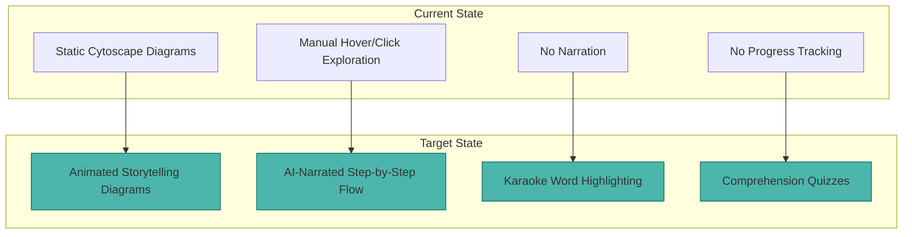
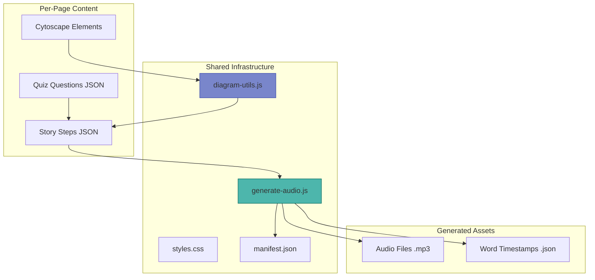
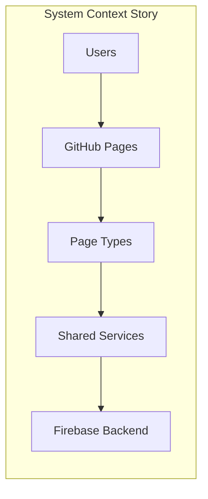
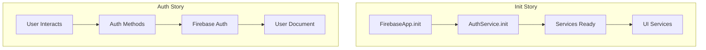
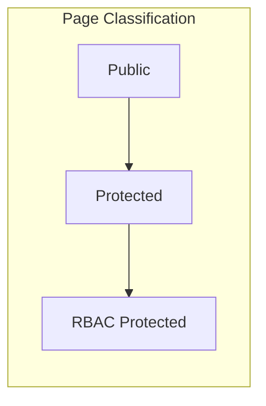
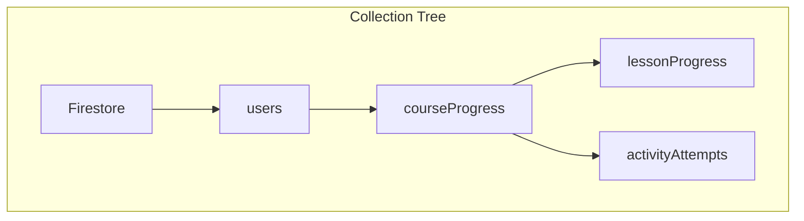
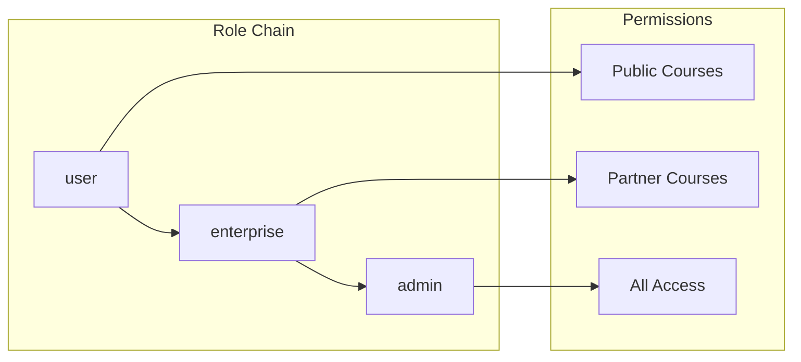
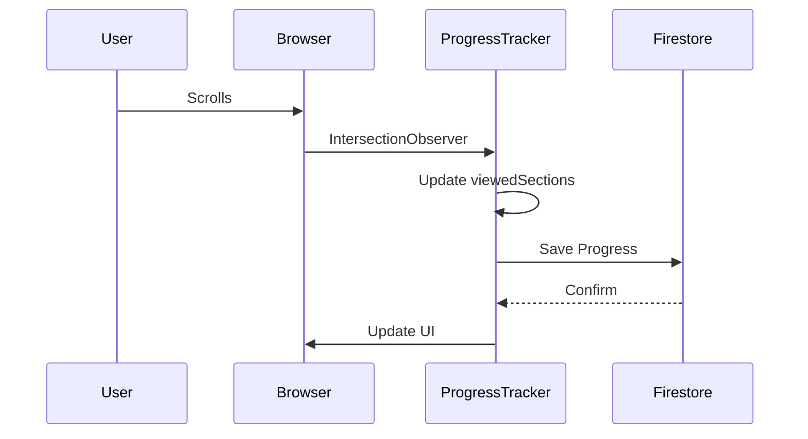
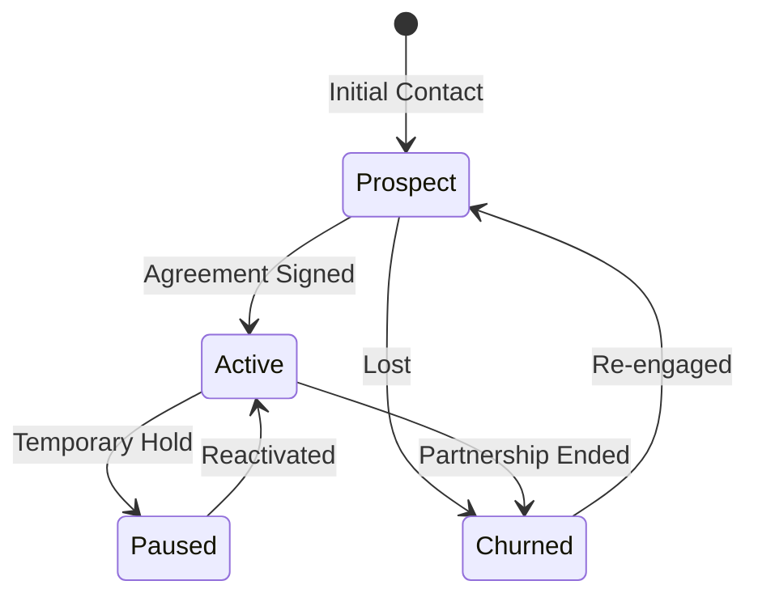
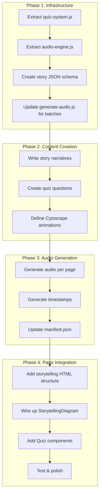

# 🎬 Interactive Docs Storytelling Upgrade Plan

> **Goal**: Transform all 8 interactive documentation pages into engaging, self-narrating lessons with AI-powered audio, word-level highlighting, animated diagrams, and comprehension quizzes.

---

## Executive Summary

We've proven the concept with `demo-storytelling-diagram.html`. Now we need to systematically upgrade each existing page. This document provides the full roadmap with diagrams, content requirements, and effort estimates.



---

## 📊 Pages to Upgrade

| # | Page | Diagrams | Est. Stories | Quiz Questions | Priority |
|---|------|----------|--------------|----------------|----------|
| 1 | `00-overview.html` | 4 | 4 | 16 | 🔴 High |
| 2 | `01-service-layer.html` | 7 | 4-5 | 16-20 | 🔴 High |
| 3 | `02-page-types.html` | 7 | 3-4 | 12-16 | 🟡 Medium |
| 4 | `03-data-model.html` | 6 | 3-4 | 12-16 | 🔴 High |
| 5 | `04-authentication-rbac.html` | 7 | 4-5 | 16-20 | 🟡 Medium |
| 6 | `05-progress-tracking.html` | 8 | 4-5 | 16-20 | 🟡 Medium |
| 7 | `06-frontend-patterns.html` | 8 | 3-4 | 12-16 | 🟢 Low |
| 8 | `07-partnership-portal.html` | 9 | 4-5 | 16-20 | 🟢 Low |

**Total Effort**:
- ~55 diagrams to upgrade
- ~30-35 storytelling narratives to write
- ~120-140 quiz questions
- ~60-70 audio files per voice (120-140 total)

---

## 🏗️ Architecture Overview



---

## 📁 Proposed File Structure

```
diagrams_and_docs/interactive-docs/
├── shared/
│   ├── diagram-utils.js          # Existing + StorytellingDiagram class
│   ├── styles.css                # Existing + storytelling CSS
│   ├── quiz-system.js            # NEW: Extracted quiz component
│   └── audio-engine.js           # NEW: Extracted AudioNarrationEngine
│
├── audio/
│   ├── generate-audio.js         # Audio generation script
│   ├── stories/                  # Story definitions (input to generator)
│   │   ├── overview-stories.json
│   │   ├── service-layer-stories.json
│   │   └── ... (one per page)
│   │
│   ├── manifest.json             # Master audio manifest
│   │
│   ├── ballad/                   # Female storyteller voice
│   │   ├── overview/
│   │   │   ├── system-context/step-0.mp3
│   │   │   └── ...
│   │   └── ...
│   │
│   └── echo/                     # Male UK storyteller voice
│       └── ... (mirror structure)
│
├── 00-overview.html
├── 01-service-layer.html
└── ... (upgraded pages)
```

---

## 🎯 Page-by-Page Breakdown

### 1. `00-overview.html` - System Overview

**Current Diagrams:**
1. System Context (system-context)
2. Service Dependencies (service-dependencies)
3. Data Flow (data-flow)
4. Page Type Services (page-services)

**Proposed Stories:**



| Story ID | Steps | Key Learning |
|----------|-------|--------------|
| `system-context-story` | 5-6 | How users flow through the system |
| `service-deps-story` | 6-8 | Why services depend on each other |
| `data-flow-story` | 6-8 | How data moves from click to database |
| `page-services-story` | 5-6 | Which services each page type needs |

**Quiz Topics:**
- Foundation service (FirebaseApp)
- Service initialization order
- Data flow direction
- Page type requirements

---

### 2. `01-service-layer.html` - Service Layer

**Current Diagrams:**
1. Initialization Sequence (init-sequence)
2. FirebaseApp Detail (firebase-config-detail)
3. AuthService Detail (auth-service-detail)
4. DataService Detail (data-service-detail)
5. Tracking Services (tracking-services)
6. Analytics Pipeline (analytics-pipeline)
7. Access Control (access-control)

**Proposed Stories:**



| Story ID | Steps | Key Learning |
|----------|-------|--------------|
| `init-sequence-story` | 5-6 | Boot order and why it matters |
| `firebase-app-story` | 4-5 | What FirebaseApp provides |
| `auth-flow-story` | 6-8 | Complete auth lifecycle |
| `data-ops-story` | 6-8 | DataService operation categories |
| `tracking-story` | 5-6 | How progress & activity work together |

**Quiz Topics:**
- Init order dependencies
- AuthService methods
- DataService dual-write pattern
- IntersectionObserver role

---

### 3. `02-page-types.html` - Page Types

**Current Diagrams:**
1. Page Type Hierarchy (page-hierarchy)
2. Marketing Flow (marketing-flow)
3. Auth Flow (auth-flow)
4. Dashboard Flow (dashboard-flow)
5. Lesson Architecture (lesson-architecture)
6. Partner Flow (partner-flow)
7. Admin Flow (admin-flow)

**Proposed Stories:**



| Story ID | Steps | Key Learning |
|----------|-------|--------------|
| `page-hierarchy-story` | 4-5 | Three access tiers |
| `dashboard-journey-story` | 6-8 | Full dashboard load sequence |
| `lesson-experience-story` | 6-8 | Lesson page complexity |
| `partner-access-story` | 5-6 | RBAC decision path |

**Quiz Topics:**
- Public vs protected pages
- RouteGuard checks
- RBAC enforcement layers
- Dashboard data sources

---

### 4. `03-data-model.html` - Data Model

**Current Diagrams:**
1. Collection Hierarchy (collection-hierarchy)
2. Entity Relationships (entity-relations)
3. User Schema (user-schema)
4. Progress Flow (progress-flow)
5. Activity Schema (activity-schema)
6. Dashboard Data (dashboard-data)

**Proposed Stories:**



| Story ID | Steps | Key Learning |
|----------|-------|--------------|
| `collection-tree-story` | 5-6 | Subcollection nesting |
| `entity-web-story` | 5-6 | How entities relate |
| `progress-save-story` | 4-5 | Dual-write pattern |
| `dashboard-data-story` | 6-8 | What data feeds dashboard |

**Quiz Topics:**
- Subcollection paths
- Entity relationships
- Dual-write locations
- Dashboard data sources

---

### 5. `04-authentication-rbac.html` - Auth & RBAC

**Current Diagrams:**
1. Auth Architecture (auth-architecture)
2. Registration Flow (registration-flow)
3. Login Flow (login-flow)
4. Role Hierarchy (role-hierarchy)
5. Access Check (access-check)
6. RouteGuard (route-guard)
7. Organization Access (org-access)

**Proposed Stories:**



| Story ID | Steps | Key Learning |
|----------|-------|--------------|
| `registration-journey-story` | 5-6 | New user onboarding |
| `login-journey-story` | 4-5 | Auth state changes |
| `role-hierarchy-story` | 5-6 | Permission inheritance |
| `access-decision-story` | 6-8 | Complete RBAC check flow |
| `org-membership-story` | 4-5 | How orgs grant access |

**Quiz Topics:**
- Registration vs login flow differences
- Role permissions
- RBAC check order
- Client vs server security

---

### 6. `05-progress-tracking.html` - Progress Tracking

**Current Diagrams:**
1. Tracking Overview (tracking-overview)
2. Section Discovery (section-discovery)
3. Scroll Observation (scroll-observation)
4. Progress Calculation (progress-calc)
5. Activity Types (activity-types)
6. Offline Flow (offline-flow)
7. Analytics Metrics (analytics-metrics)
8. Completion Flow (completion-flow)

**Proposed Stories:**



| Story ID | Steps | Key Learning |
|----------|-------|--------------|
| `tracking-system-story` | 5-6 | Two trackers working together |
| `scroll-tracking-story` | 5-6 | IntersectionObserver magic |
| `activity-tracking-story` | 5-6 | Different activity types |
| `offline-sync-story` | 4-5 | LocalStorage queue |
| `analytics-calc-story` | 5-6 | Metric formulas |

**Quiz Topics:**
- IntersectionObserver threshold
- Progress calculation formula
- Activity types
- Offline queue sync

---

### 7. `06-frontend-patterns.html` - Frontend Patterns

**Current Diagrams:**
1. CSS Mapping (css-mapping)
2. Design Tokens (design-tokens)
3. Component Hierarchy (component-hierarchy)
4. Animation Flow (animation-flow)
5. Layout Patterns (layout-patterns)
6. Quiz Structure (quiz-structure)
7. Breakpoints (breakpoints)
8. Color Contrast (color-contrast)

**Proposed Stories:**

| Story ID | Steps | Key Learning |
|----------|-------|--------------|
| `css-organization-story` | 4-5 | File per page type |
| `design-system-story` | 5-6 | CSS variables cascade |
| `animation-system-story` | 5-6 | Anime.js vs CSS transitions |
| `responsive-story` | 4-5 | Mobile-first approach |

**Quiz Topics:**
- CSS file mapping
- Design token categories
- Animation trigger types
- Breakpoint values

---

### 8. `07-partnership-portal.html` - Partnership Portal

**Current Diagrams:**
1. Feature Overview (feature-overview)
2. Data Model (data-model)
3. Entity Relations (entity-relations)
4. Partner Schema (partner-schema)
5. Status Flow (status-flow)
6. Interaction Flow (interaction-flow)
7. Service Layer (service-layer)
8. Analytics Flow (analytics-flow)
9. Page Structure (page-structure)

**Proposed Stories:**



| Story ID | Steps | Key Learning |
|----------|-------|--------------|
| `portal-overview-story` | 5-6 | What the portal does |
| `partner-data-story` | 5-6 | Collection structure |
| `status-flow-story` | 5-6 | Partner lifecycle |
| `interaction-story` | 4-5 | Recording touchpoints |
| `analytics-story` | 5-6 | Time-series tracking |

**Quiz Topics:**
- Partner types
- Status transitions
- Interaction types
- Analytics events

---

## 🔧 Implementation Workflow



---

## 📝 Story JSON Schema

Each page will have a JSON file defining its stories:

```json
{
  "pageId": "00-overview",
  "stories": [
    {
      "id": "system-context-story",
      "diagramId": "system-context",
      "title": "System Context",
      "steps": [
        {
          "icon": "👤",
          "title": "Users Enter",
          "narration": "Every journey begins with a user. Students and admins access the platform through their web browsers.",
          "highlightNodes": ["user", "admin"],
          "highlightEdges": [],
          "zoomTo": "user"
        },
        {
          "icon": "🌐",
          "title": "GitHub Pages Serves",
          "narration": "All static HTML is served from GitHub Pages CDN. This gives us lightning-fast load times with zero server costs.",
          "highlightNodes": ["github"],
          "highlightEdges": ["user-github", "admin-github"],
          "zoomTo": "github"
        }
      ]
    }
  ],
  "quizzes": [
    {
      "storyId": "system-context-story",
      "questions": [
        {
          "question": "Where is static HTML served from?",
          "options": ["AWS S3", "GitHub Pages", "Vercel", "Firebase Hosting"],
          "correct": 1,
          "explanation": "GitHub Pages serves all static HTML via CDN for free."
        }
      ]
    }
  ]
}
```

---

## 🎤 Audio Generation Updates

The `generate-audio.js` script needs these enhancements:

1. **Batch Processing**: Process all stories from JSON files
2. **Page Organization**: Output to `audio/{voice}/{pageId}/{storyId}/`
3. **Parallel Generation**: Generate all voices in parallel
4. **Manifest Updates**: Auto-update manifest.json with new entries
5. **Incremental Mode**: Only regenerate changed stories

```bash
# Usage
node generate-audio.js                    # Generate all
node generate-audio.js --page 00-overview # Generate one page
node generate-audio.js --story system-context-story # Generate one story
node generate-audio.js --incremental      # Only changed
```

---

## ⏱️ Effort Estimates

| Phase | Tasks | Est. Hours |
|-------|-------|------------|
| **Infrastructure** | Extract modules, update scripts | 4-6 |
| **Content per page** | Stories + Quizzes + Testing | 3-4 each |
| **Audio generation** | ~5min per story × 2 voices | Automated |
| **Integration** | HTML updates + polish | 2-3 per page |

**Total Estimate**: 40-50 hours of active work

---

## ✅ Success Criteria

Each upgraded page should have:

- [ ] At least 2 storytelling diagrams with 4+ steps each
- [ ] Animated node/edge reveals with glowing effects
- [ ] AI narration with word-level highlighting
- [ ] Voice selection (Female + Male UK)
- [ ] Quiz with 4+ questions per story
- [ ] Quiz answers stored in localStorage
- [ ] Mobile-responsive layout
- [ ] Controls: Play/Pause, Speed, Progress dots

---

## 🚀 Recommended Order

1. **`00-overview.html`** - Highest traffic, foundational concepts
2. **`03-data-model.html`** - Critical for understanding the platform
3. **`01-service-layer.html`** - Core technical documentation
4. **`04-authentication-rbac.html`** - Security is important
5. **`05-progress-tracking.html`** - Explains key user-facing feature
6. **`02-page-types.html`** - Good context for developers
7. **`06-frontend-patterns.html`** - Useful but less critical
8. **`07-partnership-portal.html`** - Admin-focused, lowest priority

---

## 📋 Next Steps

1. Review this plan and approve approach
2. Extract shared modules (`quiz-system.js`, `audio-engine.js`)
3. Create story JSON schema and first page's stories
4. Update `generate-audio.js` for batch processing
5. Upgrade `00-overview.html` as the template
6. Systematically upgrade remaining pages

---

*Document created: January 13, 2026*
*Based on: `demo-storytelling-diagram.html` proof of concept*
