# Instagram Post System Architecture 📸

A systems-thinking breakdown of how an Instagram post flows through the platform.

---

## 🔭 Zoom Level 1: Organization View

How users and major product areas interact:

---

## 🔍 Zoom Level 2: System/Service Architecture

How services communicate when a user creates and views a post:

---

## 📤 Creating a Post: Data Flow

What happens when you tap "Share":

---

## 📥 Viewing the Feed: Data Flow

What happens when you open Instagram:

```mermaid
sequenceDiagram
    autonumber
    participant U as 📱 User
    participant App as Instagram App
    participant CDN as CDN
    participant GW as API Gateway
    participant Feed as Feed Service
    participant Cache as Redis Cache
    participant Social as Social Graph
    participant Post as Post Service
    participant ML as Ranking ML Model
    
    U->>App: Open Instagram
    App->>GW: GET /api/feed?cursor=0
    GW->>Feed: Fetch personalized feed
    
    alt Cache Hit
        Feed->>Cache: Get cached feed
        Cache-->>Feed: Cached post IDs
    else Cache Miss
        Feed->>Social: Get following list
        Social-->>Feed: user_ids[]
        Feed->>Post: Get recent posts from users
        Post-->>Feed: Raw posts[]
    end
    
    Feed->>ML: Rank posts for user
    Note over ML: Considers:<br/>- Engagement history<br/>- Recency<br/>- Relationship strength<br/>- Content type preference
    ML-->>Feed: Ranked post_ids[]
    
    Feed-->>GW: Feed response (post metadata)
    GW-->>App: JSON feed data
    
    loop For each visible post
        App->>CDN: GET image/video
        CDN-->>App: Media bytes
    end
    
    App-->>U: Render beautiful feed ✨
```

---

## 💔 When Things Break: Failure Modes

```mermaid
flowchart TB
    subgraph Failures["🔥 What Can Fail?"]
        F1["CDN Down"]
        F2["Media Service Down"]
        F3["Database Overloaded"]
        F4["Feed Service Slow"]
        F5["Notification Service Down"]
    end
    
    subgraph Impact["💥 User Impact"]
        I1["Images won't load<br/>(skeleton placeholders)"]
        I2["Can't upload new posts<br/>(queue for later)"]
        I3["Posts disappear temporarily<br/>(serve from cache)"]
        I4["Feed loads slowly<br/>(show cached/stale)"]
        I5["No push notifications<br/>(silent failure OK)"]
    end
    
    subgraph Mitigation["🛡️ How It's Handled"]
        M1["Multiple CDN providers<br/>Edge failover"]
        M2["Retry queue<br/>Client-side retry"]
        M3["Read replicas<br/>Aggressive caching"]
        M4["Precomputed feeds<br/>Fallback to chronological"]
        M5["Fire-and-forget<br/>Not critical path"]
    end
    
    F1 --> I1 --> M1
    F2 --> I2 --> M2
    F3 --> I3 --> M3
    F4 --> I4 --> M4
    F5 --> I5 --> M5
```

---

## 🔬 Zoom Level 3: Inside the Post Service

Component-level architecture:

---

## 📊 Key Data Objects

---

## 🧠 Key Insights

### Inputs, Outputs & Side Effects

| Component | Inputs | Outputs | Side Effects |
|-----------|--------|---------|--------------|
| **Media Service** | Raw image/video bytes | Processed media URLs | Writes to Object Storage, warms CDN |
| **Post Service** | User ID, caption, media refs | Post ID, confirmation | Writes to DB, emits events |
| **Feed Service** | User ID, cursor | Ranked post list | Cache updates |
| **Notification Service** | Event (post.created) | Push notification | External API calls (APNs/FCM) |

### Design Principles Observed

1. **Async where possible** - Post creation returns fast, fan-out happens in background
2. **Cache aggressively** - Feed pre-computation, CDN for media
3. **Graceful degradation** - Notifications failing doesn't break posting
4. **Event-driven** - Services communicate via events, not direct calls
5. **Read/Write separation** - Optimized paths for each use case

---

*Diagram created as part of Systems Thinking challenge*

