# Team Meeting Agenda

**Date:** Monday, January 6, 2025  
**Time:** 45-60 minutes  
**Attendees:** Nathan, Marcus, Tammye, Brian, Brittany

---

## 🎯 Meeting Objectives

1. Close the loop on consulting pipeline updates (Jonathan ✅, Gerald 🔄, Foundation Lead 🔥)
2. Introduce the Cursor Rules system and the paradigm shift we just unlocked
3. Align on content creation, marketing outreach, and platform development priorities
4. Get everyone energized—we're in the game now, it's time to execute

---

## 📋 Agenda

### 1. 🔥 Pipeline Updates (10 min)

#### Jonathan Hubbard - SOW Stage ✅

**Status:** 🟢 Ready for Signature

- NDA: **Signed** ✓
- Discovery: **Complete** ✓
- SOW: **Sent** - Awaiting confirmation
- **Next:** Down payment → Development begins

**The Win:** Full pipeline complete. First paying consulting client through our new system.

---

#### Gerald - NDA Stage 🔄

**Status:** 🟡 In Review

- Gerald is an attorney, taking time to review NDA thoroughly
- Being patient with the process
- **Next:** Follow up mid-week if no response

---

#### Foundation Lead - NEW 🔥

**Status:** 🟢 Warm Lead

- Community foundation in the pipeline
- **They need tech, they're ready to spend**
- Great opportunity for our mission alignment
- **Next:** Schedule discovery call

**Discussion:** What do we know? What's our approach?

---

### 2. 💡 The Cursor Rules Breakthrough (15 min)

#### The Insight We Captured Today

> **"The rule IS the documentation. The script IS the actual documentation. Because the rule reads that script and runs."**

**Key Realization:** Cursor rules are not just helper scripts—they're an operating system for the business.

**What We Built:**

| Rule Category                           | What It Does                                    |
| --------------------------------------- | ----------------------------------------------- |
| `consulting-client-workflow`            | Full pipeline: NDA → Discovery → SOW → Kickoff  |
| `client-presentation-*`                 | Branded HTML presentations for every touchpoint |
| `meeting-prep` + `meeting-presentation` | Meeting agendas → Animated slideshows           |
| `capture-insight`                       | Capture breakthroughs into knowledge base       |
| `platform-development`                  | SWE Hackers architecture with Mermaid diagrams  |

---

#### Sharing Rules with the Team

**The Plan:**

1. Push `autonateai-cursor-rules` to a **GitHub repo** you all have access to
2. You clone/pull to your local machine
3. Add to your Cursor workspace
4. Now you can produce presentations, documents, legal templates—all from conversation

```mermaid
flowchart LR
    subgraph Source["📦 GitHub Repo"]
        R["autonateai-cursor-rules"]
    end

    subgraph Team["👥 Team Members"]
        M["Marcus"]
        B["Brian"]
        T["Tammye"]
        Br["Brittany"]
    end

    Source -->|"git pull"| M
    Source -->|"git pull"| B
    Source -->|"git pull"| T
    Source -->|"git pull"| Br

    M --> P1["Produces presentations"]
    B --> P2["Produces docs"]
    T --> P3["Creates assets"]
    Br --> P4["Builds workflows"]

    style Source fill:#6366f1,stroke:#4f46e5,color:#fff
    style Team fill:#1a1a2e,stroke:#22d3ee,color:#fff
```

**Action Items:**

- [ ] Nathan: Push rules repo to GitHub
- [ ] Team: Clone repo, add to Cursor workspace
- [ ] Team: Test by generating a sample presentation

---

### 3. 📢 Content & Marketing (10 min)

```mermaid
flowchart LR
    subgraph Creation["🎬 Create"]
        V1["📹 Video"]
        V2["🤖 AI Video"]
        V3["🎙️ NotebookLM"]
        V4["📊 Cursor"]
    end

    subgraph Distribution["📤 Distribute"]
        D1["Social"]
        D2["Email"]
        D3["DMs"]
    end

    subgraph Goals["🎯 Result"]
        G1["Leads"]
        G2["Awareness"]
        G3["Growth"]
    end

    Creation --> Distribution --> Goals

    style Creation fill:#6366f1,stroke:#4f46e5,color:#fff
    style Distribution fill:#22d3ee,stroke:#0891b2,color:#fff
    style Goals fill:#10b981,stroke:#059669,color:#fff
```

**Our Content Arsenal:**

- **Video:** Nathan's quick-turn video setup at home
- **AI Video:** Generated videos for reach
- **NotebookLM:** Podcasts, summaries, presentations
- **Cursor:** Presentations, documents, assets

**Context Engineering Advantage:**

- Data pooling on prospects
- Psychological/multidimensional understanding
- Personalized outreach at scale

**Discussion:** What content should we prioritize this week?

---

### 4. 🖥️ Platform Development (10 min)

```mermaid
flowchart LR
    subgraph Platform["🎓 SWE Hackers"]
        Free["4 Free Courses ✅"]
        Paid["Paid Courses 🔜"]
        Challenges["Challenges 🔜"]
    end

    subgraph Purpose["🎯 Purpose"]
        P1["Awareness"]
        P2["Community"]
        P3["Leads"]
        P4["Revenue"]
    end

    Platform --> Purpose

    style Platform fill:#6366f1,stroke:#4f46e5,color:#fff
    style Purpose fill:#10b981,stroke:#059669,color:#fff
```

**Current State:**

- Nathan laid foundation, coded everything with AI
- 4 free courses live
- Platform is functional

**What's Needed:**

| Area                 | Who      | Priority |
| -------------------- | -------- | -------- |
| Backend/Architecture | Marcus   | High     |
| Data/Testing         | Brian    | High     |
| Frontend/UX          | Tammye   | Medium   |
| Features/Modules     | Brittany | Medium   |

**Upcoming Features:**

- Paid modules
- Daily challenges
- More course content

**Discussion:**

- What can you each pick up this week?
- Where do you need clarity on the codebase?

---

### 5. 🚀 The Energy Check (5 min)

**Where We Are:**

- Nathan: Senior consultant at Atomic Object + Teacher + Founder
- Team: Learning, growing, building together
- AutoNateAI: Systems in place, pipeline flowing, ready to scale

**The Reality:**

- It's January. New year energy.
- We have clients in the pipeline.
- We have the tools (Cursor rules, presentation engine, templates).
- We have the platform (SWE Hackers).
- We have the team.

**The Question:** Are you ready to execute?

---

## ⏰ Time Allocation

| Topic                       | Duration   | Lead   |
| --------------------------- | ---------- | ------ |
| Pipeline Updates            | 10 min     | Nathan |
| Cursor Rules Breakthrough   | 15 min     | Nathan |
| Content & Marketing         | 10 min     | All    |
| Platform Development        | 10 min     | All    |
| Energy Check & Action Items | 5 min      | Nathan |
| **Total**                   | **50 min** |        |

---

## 📝 Pre-Meeting Prep

**Before this meeting, please:**

- [ ] Review your GitHub notifications (you may have repo invites)
- [ ] Have Cursor open and ready
- [ ] Think about: What can I contribute this week?
- [ ] Come with energy—we're building something real

---

## 🔗 Relevant Links

- [SWE Hackers Board](https://github.com/users/nathanbaker-ao/projects/1)
- [Jonathan Project Board](https://github.com/users/nathanbaker-ao/projects/3)
- Cursor Rules Repo: (to be shared)

---

## 📊 Reference: Nathan's Positioning

**The Play:** Consulting funds the operation. Teaching builds the community. The platform scales both.

---

## 📝 Post-Meeting: Action Items Template

| Action                                 | Owner                        | Due    | Status |
| -------------------------------------- | ---------------------------- | ------ | ------ |
| Push cursor rules to GitHub            | Nathan                       | Jan 7  | ⬜     |
| Clone rules repo, test presentation    | All                          | Jan 8  | ⬜     |
| Follow up with Gerald (if no response) | Nathan                       | Jan 8  | ⬜     |
| Schedule discovery with Foundation     | Nathan                       | Jan 7  | ⬜     |
| Pick up first dev task on platform     | Marcus/Brian/Tammye/Brittany | Jan 10 | ⬜     |
| Create first piece of outreach content | TBD                          | Jan 10 | ⬜     |

---

_Let's get it. 🚀_
